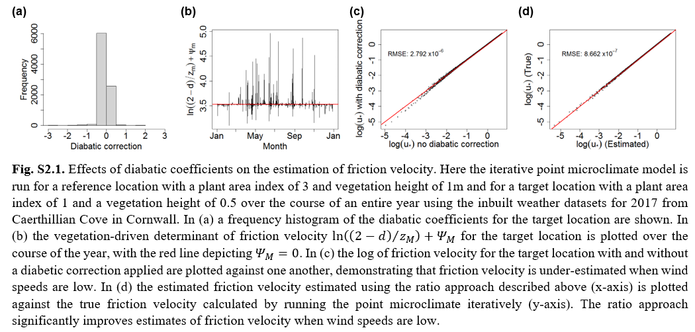
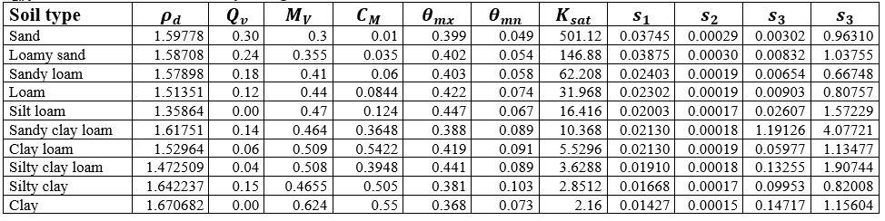
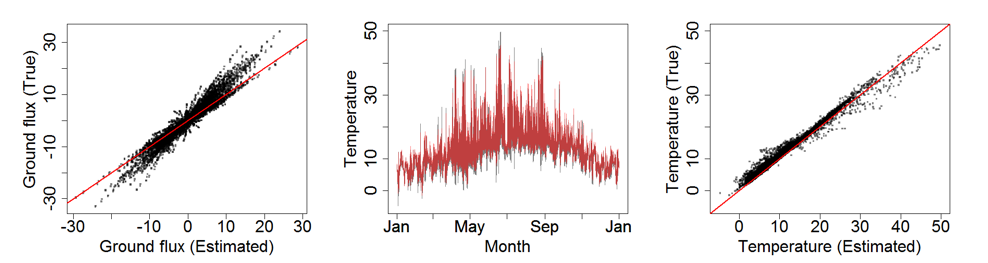
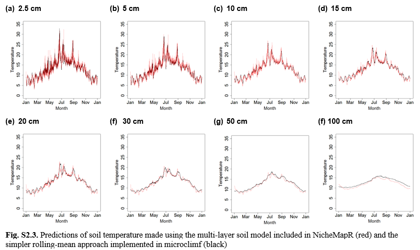
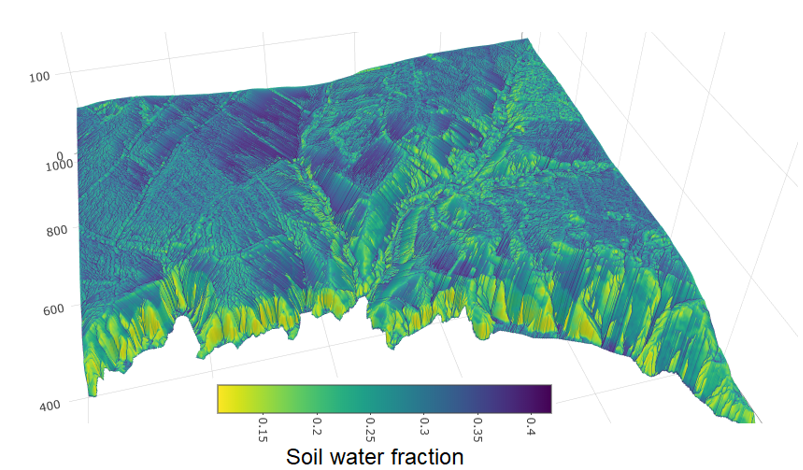
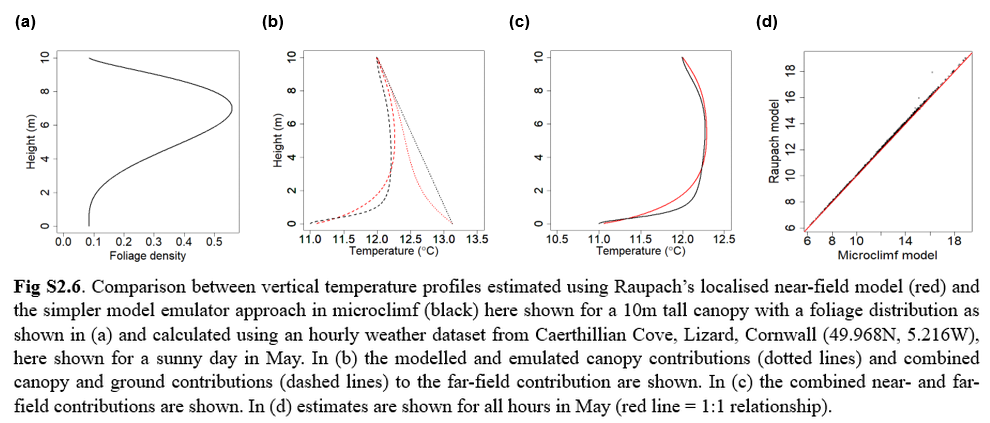
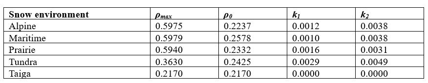
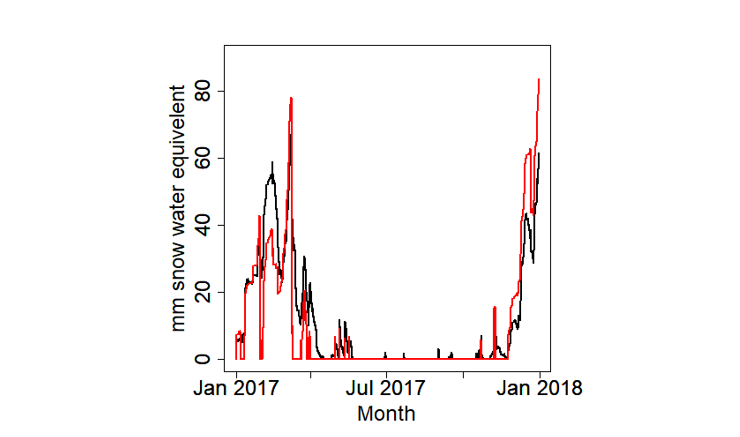
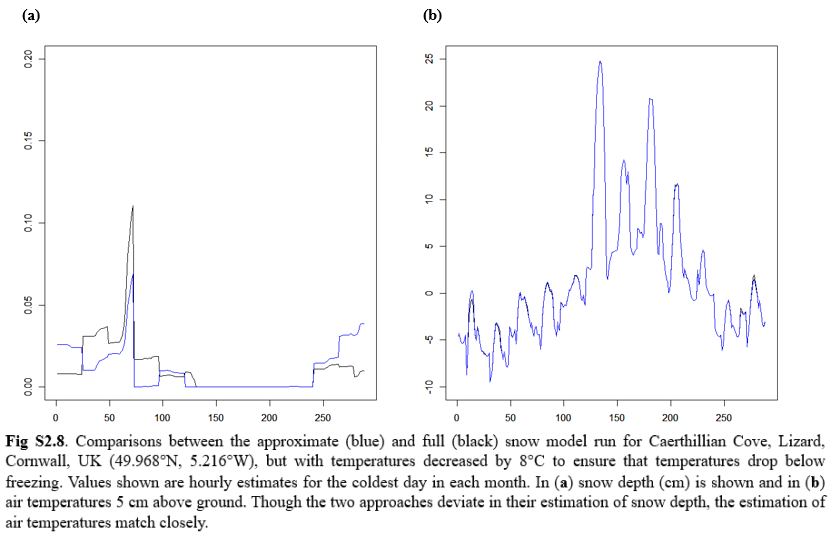

```{r, include = FALSE}
knitr::opts_chunk$set(
  collapse = TRUE,
  comment = "#>"
)
```
<style>
  body {
    text-align: justify;
  }
  
  .col2 {
    columns: 2 200px;         /* number of columns and width in pixels */
    -webkit-columns: 2 200px; /* chrome, safari */
    -moz-columns: 2 200px;    /* firefox */
  }
  
  .leg {
    font-size: 12px;
  }

  img {
    display: block;
    margin-left: auto;
    margin-right: auto;
    max-width: 100%;
    height: auto;
  }

  .figure {
    text-align: center;
    margin: 20px 0;
  }

  .figure img {
    display: inline-block;
    vertical-align: middle;
  }

  .figure figcaption {
    font-size: 12px;
    text-align: center;
  }
</style>

* [Overview](#overview)
* [Radiation and albedo](#radiation-and-albedo)
  + [Downward direct radiation](#downward-direct-radiation)
  + [The position of the sun](#the-position-of-the-sun)
  + [Diffuse radiation](#diffuse-radiation)
  + [Longwave and emitted radiation](#longwave-and-emitted-radiation)
  + [Leaf and ground radiation absorption](#leaf-and-ground-radiation-absorption)
  + [Radiation adjustments in the grid model](#radiation-adjustments-in-the-grid-model)
* [Sensible Heat](#sensible-heat)
  + [Diabatic effects](#diabatic-effecs)
  + [Heat grid model simplifications](#heat-grid-model-simplifications)
* [Latent Heat](#latent-heat)
* [The soil model](#the-soil-model)
  + [Ground heat flux](#ground-heat-flux)
  + [Soil grid model simplifications](#soil-grid-model-simplifications)
  + [Temperatures below ground](#temperatures-below-ground)
  + [Soil water point model](#soil-water-point-model)
  + [Soil water spatial model](#soil-water-spatial-model)
* [Below canopy model](#below-canopy-model)
  + [Conceptual overview](#conceptual-overview)
  + [The Langrangian timescale problem](#the-langrangian-timescale-problem)
  + [Ground heat flux below canopy](#ground-heat-flux-below-canopy)
  + [Assumptions in grid model](#assumptions-in-grid-model)
* [The snow model](#the-snow-model)
  + [Snowpack energy balance](#snowpack-energy-balance)
  + [Radiation budget](#radiation-budget)
  + [Sensible heat fluxes](#sensible-heat-fluxes)
  + [Latent heat fluxes](#latent-heat-fluxes)
  + [Rate of heat storage by snowpack](#rate-of-heat-storage-by-snowpack)
  + [Snowpack mass balance](#snowpack-mass-balance)
  + [Canopy interception](#canopy-interception)
  + [Modelling snow depth spatially](#modelling-snow-depth-spatially)
  + [Approximating snow depth with snapshot data](#approximating-snow-depth-with-snapshot-data)
  + [Microclimate model with snow](#microclimate-model-with-snow)
* [References](#references)

## Overview
The starting point for modelling is use to standard Monin-Obukhov Similarity Theory (MOST, Foken 2006) to derive the energy balance of a vegetated surface. Thus, vegetation and the underlying ground surface are treated as  single vertically homogeneous layer of phytomass -- essentially a 'big leaf'. Components of the energy balance have a temperature dependence, and the temperature of the surface is then derived by assuming the energy fluxes, all expressed in $\small W·m^2$, reach steady state such that

$$R_{abs}-R_{lw}^\uparrow=H+L+G$$

where $\small R_{abs}$ is absorbed radiation, $\small R_{lw}^\uparrow$  is emitted radiation, $\small H$ sensible heat, $\small L$ latent heat and $\small G$ the rate of heat storage by the ground. Radiation absorbed by the canopy $\small R_{abs}$ is given by

$$R_{abs}=(1-\alpha)R_{sw}^\downarrow+\varepsilon R_{lw}^\downarrow$$

where $\small R_{sw}^\downarrow$ is downward shortwave radiation,
$\small R_{lw}^\downarrow$ is downward longwave radiation, $\small \alpha$ is the combined canopy and ground albedo, calculated following Sellers (1985) -- see below, and $\small \varepsilon$ the emissivity of the canopy surface, set at 0.97. Emitted radiation is given by

$$R_{lw}^\uparrow=\varepsilon_v\sigma T_C^4$$ 

where $\small T_C$ the temperature of the canopy surface ($\small K$). Sensible heat is a function of the difference in temperature between the canopy heat exchange surface ($\small T_c$) and the air ($\small T_A$) at reference height ($\small z_R$):

$$\small H=\frac{\tilde{\rho}c_p}{r_{Ha}}(T_C-T_A)$$ 
where $\small \tilde{\rho}$ and $\small c_p$ are the density and specific heat of air respectively ($\small J·m^{-3}·K^{-1}$) and $\small r_{Ha}$ is
the resistance to heat transfer ($s·m^{-1}$) given by

$$r_{Ha}=\frac{\ln\frac{z_R-d}{z_H}+\psi_H(z_R)}{\kappa u_*}$$
where $\small u_*$ is the friction velocity of wind ($\small m·s^{-1}$) given by 

$$u_*=\frac{κu_{z_R}}{\ln\frac{z_R-d}{z_M}+\psi_M(z_R)}$$
where $\small u_{z_R}$ ($\small m·s^{-1}$) is the wind speed at reference height. Here $\small \kappa$ is the Von Kármán constant (taken as 0.4) and $\small \psi_H(z_R)$ and $\small \psi_M(z_R)$ the diabatic correction coefficient for heat and momentum calculated following Businger *et al* (1971). The zero plane displacement height $\small d$ and the roughness lengths for momentum ($\small z_M$) and heat ($\small z_H=0.2z_M$) are calculated from vegetation height and the total plant area index for the canopy following Raupach (1994). Latent heat is given by

$$L=\frac{\lambda\tilde{\rho}}{r_Vp_A}(e_C-e_A)$$
where $\small \lambda$ is the latent heat of vapourization ($\small J·mol^{-1}$), $\small p_A$ atmospheric pressure ($\small kPa$), $\small e_C$ and $\small e_a$ are the effective vapour pressure of the canopy exchange surface and air respectively ($\small kPa$). The resistance to vapour exchange ($\small r_v$) is given by $\small r_v=r_Ha+r_c$  where $\small r_c$ is bulk surface stomatal resistance ($\small s·m^{-1}$), calculating following Kelliher *et al* (1995) from solar radiation and a user-specified minimum stomatal resistance (see below). 

Following van Wijk & de Vries (1963) and Campbell and Norman (2012), a closed-form equation for the ground heat flux is derived by assuming that the diurnal and annual cycles in ground surface temperature are approximately sinusoidal and that soil properties, including heat conductance are moderately uniform within the soil profile. The flux is then proportional to the amplitude of these cycles in manner dictated by soil physical properties and water content, but exhibits a phase shift, with the maximum heat flux density occurring 1/8 cycle before the maximum temperature. This means that soil surface temperatures peak later in the day or year than the peak in solar radiation. The method is elaborated on below. 

The energy balance of the canopy is then solved for  temperature by linearising the emitted radiation and latent heat terms using the Penman-Monteith equation 

$$T_c=T_A+\frac{R_{abs}-\varepsilon_C\sigma T_A^4-\tilde{\rho}\lambda\theta_C\frac{D}{p_Ar_V}-G}{\tilde{\rho}\left(c_pK_{H_R}+\frac{\lambda}{r_V}s\theta_C\right)}$$
where $\small D$ is the vapour pressure deficit of the atmosphere ($\small kPa$), $\small s=\Delta/p_A$ where $\small \Delta$ is the slope of the saturated vapour pressure curve calculated using Tetens equation, $\small \theta_C$ is an effective relative humidity of the canopy surface to accomodate drought conditions and 

$$K_{Hr}=\frac{4\varepsilon_C\sigma T_A^4}{\tilde{\rho}c_p+1/r_{Ha}}$$
is radiative conductance. To derive the ground heat flux, the temperature ($\small T_G$) of the ground surface is also derived using the Penman-Monteith equation

$$T_G=T_A+\frac{R_{abs}^G-\varepsilon_G\sigma T_A^4-\tilde{\rho}\lambda\theta_G\frac{D}{p_Ar_{Ha}}-G}{\tilde{\rho}\left(c_pK_{H_R}+\frac{\lambda}{r_{Ha}}s\theta_G\right)}$$
where $\small R_{abs}^G$ is radiation absorbed by the ground surface, $\small \varepsilon_G$ the emissivity of the ground surface and $\small \theta_G$ is the effective relative humidity of the ground surface calculated from soil moisture. 

Temperature ($\small T_Z$), vapour pressure ($\small e_Z$) and wind speed ($\small u_Z$) at any given height $\small z$ above canopy are then computed as

$$T_z=T_A+(T_C-T_A)\left(1-\frac{\log_e\frac{z-d}{z_H}}{\log_e\frac{z_R-d}{z_H}}\right)$$
$$e_z=T_A+(\theta_C e_C-e_A)\left(1-\frac{\log_e\frac{z-d}{z_H}}{\log_e\frac{z_R-d}{z_H}}\right)$$
$$u_z=\frac{u_*}{\kappa}\left(\ln\frac{z-d}{z_M}+\psi_M(z)\right)$$
where 

$$\psi_M(z)=\psi_M(Z_R)\frac{\ln\frac{z-d}{z_M}}{\ln\frac{z_R-d}{z_M}}$$
Following Raupach (1989a,b), the air temperature $\small T_z$  at height $\small z$ below canopy is given $\small \tilde{\rho}c_pT_z=C_f(z)+C_n(z)$ where $\small C_f(z)$ is a far-field component and $\small C_n(z)$ a near-field component. Assuming the canopy to comprise $\small i$ layers each at height $\small z_i$, the far field component at height $\small z$ is given by

$$C_f(z)=C(h)-C_n(h)+\int_{z}^{h}\frac{H(z_i)}{K_H(z_t)}dz$$
where $\small C(h)=\tilde{\rho}c_pT_H$ is the heat concentration at the top of the canopy at height $\small h$, with $\small T_h$ being temperature at the top of the canopy,  $\small C_n(h)$ is the near field-component at the top of the canopy (see below), $\small K_H(z_i)$ is the thermal diffusivity at height $\small z_i$  given by $\small K_H=\sigma_\omega^2T_L$ and $H(z_i)$ is the sensible heat flux at height $\small z_i$ approximated by $\small H(z_i)=\tilde{\rho}c_p/r_L(T_{c_i}-T(z_i))+F_G$ where $\small F_G$ is the heat flux from the ground. Here $\small T_{c_i}$ is the temperature of canopy elements such as leaves derived using the Penman-Monteith equation by considering the energy balance of the leaf and $\small r_L=$ is the boundary layer resistance of the leaf given by $\small 318\sqrt{0.71L_w/u_z}$, where $\small L_w$ is leaf width ($\small m$) and $\small u_z$ is wind speed given, from Harman & Finnigen (2008) as

$$u_z=u_h\exp\left(\frac{\beta}{L_M}(z-h)\right)$$
Here $\small u_h$ is wind speed at the top of the canopy at height $\small h$, $\small \beta=u_*/u_h$ and $\small L_M$ is a mixing length given by $\small L_M=2\beta^3L_C$ where $\small L_C=(c_da)^{-1}$ with $\small a=P_{AI}/h$ and $\small c_d=0.25$  

The near field component at height $\small z$ is given by

$$C_n(z)=\int_{0}^{\infty}\frac{S(z_i)}{\sigma_\omega(z)}k_n\left[\frac{z-z_i}{\sigma_\omega(z_i)T_L}+\frac{z+z_i}{\sigma_\omega(z_i)T_L}\right]dz_i$$
where $\small S(z_i)$ is the source concentration given by $\small f_d(z_i)H(z_i)$ where $\small f_d(z_i)$ is foliage density for layer $\small z_i$ ($\small m^3/m^3$) and $\small k_n$ is a kernal function given by $\small k_n(\zeta)=-0.39894\ln(1-e^{|\zeta|})-0.152623e^{|\zeta|}$ where $\zeta=(z-z_i)/\sigma_\omega(z_i)T_L$.

No precise formulations for $\small T_L$ and $\small \sigma_\omega(z_i)$ are given by Raupach, but a plausible profile is proposed as 

$$T_L=\frac{a_2h}{u_*}$$
$$ \sigma_\omega(z_i)=u_*\left[0.75+0.5\cos\left(\pi\left(1-\frac{z}{h}\right)\right)\right]$$
Following Ogée *et al* (2003), a value for $\small a_2$ can be derived by making thermal diffusivity equivalent to its above canopy formulation at height $\small z=h$ such that

$$a_2=\frac{\kappa\left(1-\frac{d}{h}\right)}{1.5625}\phi_H$$
where $\small \phi_H$ is a diabatic correction for stability. 

Owing to several inter-dependances in the model -- e.g. between $\small G$ and $\small T_G$, between leaf and air temperature and between the diabatic coefficients and sensible heat fluxes, the model needs to be run iteratively to convergence. This is computationally intensive when seeking to model microclimate over large areas at high resolution. Thus when running the grid model, a point model is run iteratively first and outputs from the point model used as basis for running the grid model without iteration. Individual components of the model and methods for avoiding iteration when applying the grid model, are now described in more detail.

## Radiation and albedo
The albedo of the vegetated surface can be defined as the proportion of shortwave radiation that is reflected -- i.e. total downward flux less that absorbed. It is dependent upon both the fraction absorbed by the canopy and by underlying ground surface. Whereas the reflectance of a surface - the ratio of the radiant flux reflected from a material to the incident radiant flux is an innate property of the surface, the albedo of a vegetated surface depends both the properties of the vegetation and the underlying ground surface, but also changes in relation to the transmission of radiation through the vegetation and hence also on the angle of the reflecting surfaces relative to the solar beam. It therefore changes as a function of both the sun's position and the fraction of direct radiation relative to diffuse radiation.

From Sellers (1985) and Yuan *et al* (2017), but with adaptation allowing
for radiation to pass through larger gaps in the canopy, albedos are
derived using a two-stream radiative transfer model. The two-stream
model is also used to derive the radiative flux within the canopy and the energy balance of foliage elements within the canopy. The model is therefore described in full.

The underpinning assumption of a two-stream model is that solar
radiation arrives at the top of the canopy in the form of either diffuse
or direct radiation. Because the leaves are partially reflective and
translucent, a portion of the direct radiation at any given point within
the canopy is scattered in either an upward or downward direction.A portion of the diffuse radiation is likewise scattered both upward and downward. Consequently
there are several radiation streams that need to be derived: (i)
Downward direct, (ii) downward diffuse, (iii) upward diffuse, (iv) the
contribution of downward direct to downward diffuse and (v), the
contribution of downward direct to upward diffuse. There is is no upward
direct, as any radiation upward is assumed to be scattered isotropically
and therefore diffuse. The albedo is determined from the
upward and downward streams at the top of the canopy, but it is also
possible to derive upward and downward streams within the canopy.

### Downward direct radiation
It is convenient to envisage the canopy as being divided into multiple
layers, each with a series of nodes $\small i$ situation at the top of
each layer and numbered sequentially downward from the top of the
canopy. Let us combine the effects of leafs and other canopy elements
such as branches and tree trunks and let $\small P_i$ be the cumulative
area of these canopy constituents per unit ground area (from the top of
the canopy) to node $\small i$ and let $\small P_{i+1}$ be the
cumulative area at the node below. From e.g. Campbell (1985), the
attenuation of radiation at node $\small i$ is then described as
$\small  R_i^{\downarrow b}=R_0^{\downarrow b}\exp(-KP_i)$ where
$\small R_i^{\downarrow b}$ is the downward flux of direct radiation
that would be intercepted by a surface perpendicular to the solar beam
at node $\small i$, $\small \downarrow R_0^{\downarrow b}$ the is the
downward flux of direct radiation intercepted perpendicular to the solar
beam at the top of the canopy, and $\small K$ is a radiation extinction
coefficient, which depends on the inclination angle of canopy elements
relative to the solar beam (vertically orientated leaves will block out
more sunlight when the sun is low above the horizon).

However, rather than defining each canopy element individually, it is
more convenient to characterise the canopy as comprising surfaces that
have a continuous distribution of inclinations. From Campbell (1986) and
Campbell (1990), it is reasonable to assume that the real distribution
of inclinations can be approximated by assuming they conform to a
prolate or oblate spheroid distribution. By adjusting the ratio of
horizontal to vertical axes of the spheroid, canopy element angle
distributions of any canopy from erectophile to planophile can be
simulated. Defining $\small x$ as the ratio of average projected
elements on horizontal surfaces, such that $\small x=0$ for a vertical
distribution, $\small x=\infty$ for a horizontal distribution and
$\small x=1$ for a spherical distribution, $\small K$ is approximated as

$$K\approx\frac{\sqrt{x^2+\tan^2Z}}{x+1.774(x+1.182)^-0.733}$$

where $\small Z$ is the solar zenith angle (see below). In the special
case where $\small x=1$, the equation can be simplified to
$\small 1/(2\cos Z)$ and when $\small x=0$,
$\small K=2/(\pi\tan(0.5\pi-Z))$. When $\small x\to\infty$,
$\small K\to1$ and therefore does not depend on the sun’s position.

This assumes canopy elements are small and randomly distributed. In
reality, canopy elements are non-randomly distributed and radiation can
penetrate through larger gaps in the canopy unimpeded. We thus define a
gap fraction ($\small F_G$) representing the fraction of the canopy that
is unobscured by vegetation when the sun is at its zenith. The
probability of the sunbeam's path through the canopy being unobscured
diminishes as the optical path length increases, but the extent to which
it does depends on the shape of the vegetation clumps. It is assumed
that the shape of the clumps is dictated by the inclination angles of
leaves such that canopies with planophile leafs will typically have
planophile clumps of vegetation.

A correction must also be applied when the canopy overlies an inclined
ground surface. While it can be assumed, for a given habitat type, that
the inclination of canopy elements is unaffected by ground surface
inclination, the optical path length through the canopy will be shorter
for ground surfaces facing in the direction of the sun. A full equation
for the transmission of direct radiation through the canopy is thus
given by

$$R_i^{\downarrow b}=R_0^{\downarrow b}\left[{\tau_i}^b+(1-{\tau_i}^b)\exp(-\tilde{K}\tilde{P_i})\right]$$
where $\small {\tau_i}^b=g_i^{K_c}$ is the fraction of direct radiation transmitted through larger canopy gaps $\small K_C=\tilde{K}/K(0)$ and $\small \tilde{K}=K(Z)\cos Z/s_c$, where $\small K(Z)$ and $\small K(0)$ are the values of $\small K$ derived using the equation above, when the solar zenith angles are $\small Z$ and $\small 0$ respectively, $\small g_i=g_n^{P_i/P_{AI}}$ is the gap fraction at node $\small i$, and $\small g_n$ the user-specified gap fraction for the entire canopy. Here 
$\small\tilde{P_i}$ is the cumulative canopy element area now
concentrated into 'non-gaps' given by $\small\tilde{P_i}=P_i/(1-g_n)$
and $\small s_c$ is the fraction of direct beam radiation intercepted by an inclined surface given by

$$s_c=\cos Z \cos s+\sin Z\sin s\cos(\Lambda_s-\Lambda)$$ 

where $\small s$ the slope angle of the surface measured from horizontal, $\small \Lambda_s$ the solar azimuth (direction from north) and $\small \Lambda$ the aspect of the surface (relative to north). Slopes and aspects are calculated from digital elevation data, but set to zero when running the point model. 

### The position of the sun
To calculate radiation absorption in real environments, it is necessary
to calculate the solar zenith and azimuth. The solar zenith ($\small Z$)
depends on latitude $\small \phi_y$ and time as follows

$$\cos Z=\sin\delta\sin \phi_y+\cos\delta\cos\phi_y\cos h_s$$ where
$\small h_s$ is the hour angle in solar time ($\small t_s$) given by

$$h_s=(\pi⁄12)(t_s-12)$$ and $\small \delta$ is the current declination
angle of the sun calculated from the Astronomical Julian day
($\small j$) as

$$\delta=\frac{\pi 23.5}{180} \cos\left(2\pi\frac{j-159.5}{365.25}\right)$$
The Astronomical Julian day is the continuous count of days since the
beginning of the Julian period. The date 1^st^ Jan 2022 has an
Astronomical Julian day of 2459581. The solar time is calculated from
longitude ($\small \phi_x$) and local time ($\small t_l$) as

$$t_s=t_l+\frac{4(\phi_x-\phi_m)-\Delta_t}{60}$$ where $\small \phi_m$
is the longitude of the local time zone meridian (e.g. 0 for Greenwich
Mean Time) and $\small \Delta_t$ is the equation of time – a correction
applied to account obliquity due to tilt of the Earth's rotational axis
and for the east-west component of the analemma, namely the angular
offset of the Sun from its mean position on the celestial sphere due the
eccentricity of the Earth's orbit. These two factors have different
wavelengths, amplitudes and phases that vary over geological timescales.
From Milne (1921)

$$\Delta_t=-7.659\sin(M+9.683)\sin(2M-3.5932)$$ where $\small M$ is the
mean anomaly given by $\small 6.24004077+0.01720197(j-2451545)$.

The solar azimuth ($\small \Lambda_s$) is calculated as

$$\sin\Lambda_s=-\frac{\sin h_s\cos\delta}{\sin Z}$$ \

### Diffuse radiation 
The diffuse radiation streams can be written using two sets of differential equations:

$$-\frac{dR_i^{d\uparrow}}{dP}=-(a+\gamma)R_i^{d\downarrow}+sR_i^{b\downarrow}$$
$$\frac{dR_i^{d\downarrow}}{dP}=-(a+\gamma)R_i^{d\downarrow}+\gamma R_i^{d\uparrow}+s^,R_i^{b\downarrow}$$
Here $\small R_i^{d\uparrow}$ is upward diffuse radiation (i.e. that
reflected upward by canopy elements and the ground surface,
$\small R_i^{d\downarrow}$ is downward diffuse radiation (analogous to
the processes described for direct radiation above) and
$\small R_i^{b\downarrow}$ is downward direct radiation.

Each of the equation's components describes a different physical
process. In both equations, the left hand term describes the overall
attenuation of upward or downward radiation through the canopy. The
first right hand term in the top equation describes the fraction of
upward diffuse radiation that is re-scattered in upward direction and
the equivalent in the bottom equation describes the fraction of downward
diffuse radiation that is re-scattered downward. $\small a$ is the
absorption coefficient for incoming diffuse radiation per unit leaf area
and $\small \gamma$ is the backward scattering coefficient. The second
term on the right hand side in the top equation describes the fraction
of the downward diffuse radiation that is converted into an upward
diffuse flux by back-scattering and the equivalent in the bottom
equation describes the fraction of the upward diffuse radiation that is
converted into an downward diffuse flux by back-scattering.The final
term on the right hand side of the top equation refers to the contribution to the
upward diffuse flux by the scattering of direct radiation penetrating
into the canopy to $\small i$. The equivalent in the bottom equation is the contribution from scattering of direct radiation to the downward diffuse flux. $\small s$ and $\small s^,$ are thus the backward and forward scattering coefficient for direct radiation respectively.

The term $\small a$ is given by $\small a=(1-\omega)$, where $\small \omega$ is
the single scattering albedo of individual canopy elements given by
$\small \omega=\alpha_P+\tau_P$ where $\small \alpha_P$ is canopy
element reflectance and $\small \tau_P$ is canopy element transmittance,
both provided as user inputs.

The term $\small \gamma$ is given by $\small \gamma=0.5(\omega+J\delta)$ where
$\small \delta$ is given by $\small \delta=\alpha_P-\tau_P$ and
$\small J$ is an integral function of the inclination distribution of
canopy elements approximated by $\small J=\cos^2 \hat{\Theta}_P$ where
$\small \hat{\Theta}_P$ is the mean inclination angle of canopy elements
in the zenith direction. From Campbell (1990)
$\small \hat{\Theta}_P=9.65(3+x)^{1.65}$ and from Verhoef (1984) and
Pinty *et al* (2006) $\small s=0.5(\omega+\frac{J\delta}{K})K$. The
forward scattering coefficient for incident direct radiation,
$\small s^,$ is given by $\small s^,=\omega K-s$.

Solving the differential equations for a two-stream model is not
entirely straightforward, but is achieved by setting boundary conditions
at the bottom and the top of the canopy. A full explanation of their
derivation is given in Sellers (1985) and Yuan *et al* (2017). Only the
final equations are presented here. These are as follows:

$$R_i^{d\uparrow}=R_0^{d\downarrow}\left[(1-\tau_i^{d\uparrow})(p_1\exp(-h\tilde{P_i})+p_2\exp(h\tilde{P_i}))+\tau_i^{d\uparrow}\alpha_G\right]+R_b^{d\uparrow}$$
$$R_i^{d\downarrow}=R_0^{d\downarrow}\left[(1-\tau_i^d)(p_3\exp(-h\tilde{P_i})+p_4\exp(h\tilde{P_i}))+\tau_i^d\right]+R_b^{d\downarrow}$$
where $\small R_i^{d\uparrow}$ is upward diffuse radiation and
$\small R_i^{d\downarrow}$ is downward diffuse at $\small i$,
$R_0^{d\downarrow}$ is downward diffuse at the top of the canopy,
$\small \alpha_G$ is ground reflectance. Here $\small \tau_d=g_i^2$
and $\small \tau_d=g_i^2$ is the downward and $\small \tau_d={g_i^{'}}^2$
the upward transmission of diffuse radiation through larger gaps in the canopy, 
where  $\small g_i^{'}=g_n^\frac{P_{AI}-P_i}{P_{AI}}$. Here $\small R_i^{db\uparrow}$ and $\small R_i^{db\downarrow}$ are the contribution of direct radiation to the diffuse upward and downward flux respectively given by


$$R_i^{db\uparrow}=R_0^{b\downarrow}\left[(1-\tau_i^b\tau_i^{d\uparrow})\left(\frac{p_5}{\sigma_p}\exp(-K\tilde{P_i})+p_6\exp(-h\tilde{P_i})+p_7\exp(h\tilde{P_i})\right)+\tau_i^b\tau_i^{d\uparrow}\alpha_G\right]$$
and

$$R_i^{db\downarrow}=R_0^{b\downarrow}\left[\left(1-\tau_i^b\right)\left(\frac{p_8}{\sigma_p}\exp(-K\tilde{P_i})+p_9\exp(-h\tilde{P_i})+p_{10}\exp(h\tilde{P_i})\right)\right]$$
where $\small {\tau_i}^d=F_G^{m_z2}$ is the fraction of diffuse radiation transmitted through larger canopy gaps, and the derivation of the terms $p_{1..10}$ is given below.

::: col2
**Diffuse components**:<br>
$\small p_1=\frac{\gamma}{D_1S_1}(u_1-h)$<br>
$\small p_2=\frac{-\gamma S_1}{D_1}(u_1+h)$<br>
$\small p_3=\frac{1}{D_2S_1}(u_2+h)$<br>
$\small p_4=-\frac{S_1}{D_2}(u_2-h)$<br>
$\small D_1=\frac{1}{S_1}(a+\gamma+h)(u_1-h)-S_1(a+\gamma-h)(u_1-h)$<br>
$\small D_2=\frac{1}{S_1}(u_2+h)-S_1(u_2-h)$<br>
$\small S_1=\exp(-hP_{AI})$<br>
$\small S_2=\exp(-\tilde{K}\tilde{P_{AI}})$<br>
$\small u_1=a+\gamma\left(1-\frac{1}{\alpha_G}\right)$<br>
$\small u_2=a+\gamma(1-\alpha_G)$<br>
$\small h=\sqrt{a^2+2a\gamma}$<br>

**Direct components**:<br>
$\small p_5=-s(a+\gamma-\tilde{K})-\gamma s'$<br>
$\small p_6=\frac{1}{D_1}\left[\frac{v_1}{S_1}(u_1-h)-S_2v_2(a+\gamma-h)\right]$<br>
$\small p_7=-\frac{1}{D_1}\left[v_1S_1(u_1+h)-S_2v_2(a+\gamma+h)\right]$<br>
$\small p_8=s'(a+\gamma+\tilde{K})-\gamma s$<br>
$\small p_9=-\frac{1}{D_2}\left[\frac{p_8}{-\sigma_pS_1}(u_2+h)+v_3\right]$<br>
$\small p_{10}=-\frac{1}{D_2}\left[\frac{p_8S_1}{-\sigma_p}(u_2-h)+v_3\right]$<br>
$\small v_1=s-\frac{p_5(a+\gamma+\tilde{K})}{\sigma_p}$<br>
$\small v_2=s-\gamma-\frac{p_5}{\sigma_p}(u_1+\tilde{K})$<br>
$\small v_3=S_2\left( s'+\gamma\alpha_G-\frac{p_8}{\sigma_p}(u_2-\tilde{K}) \right)$<br>
$\small \sigma_p=\tilde{K}^2+a^2-(a+\gamma)^2$<br>
:::

A more formal equation for absorption of radiation of the combined canopy and ground surface accomodating canopy gaps and inclined ground surfaces is then given weighted by the fraction of direct radiation intercepted by the canopy relative to the ground surface such that

$$R_{abs}^{b\downarrow}=(1-\alpha_b)\tilde{R}_0^b$$
where

$$\tilde{R}_0^{b\downarrow}=\left(\tau_n^b+\exp(-K_g\tilde{P}_{AI})s_c+\left(1-\tau_n^b-\exp(-K_g\tilde{P}_{AI})\right)\cos Z\right)R_0^{b\downarrow}$$
### Longwave and emitted radiation
Leaves and other elements of the canopy typically have very low
reflectance to longwave radiation so there is limited scattering of
longwave radiation. In consequence, the longwave radiation streams
within the canopy can be thought of as originating from three sources.
Firstly from the ground surface, where incident longwave radiation at
any given height below canopy is determined by ground temperature and
the transmission of radiation from the ground surface. The second is from
all the individual canopy elements, which in turn is determined by the
temperature of those surfaces and transmission from those surfaces. The
third is downward from the sky, which is determined by the effective sky
temperature and transmission from the sky.

Dividing the canopy into $\small n$ layers and defining
$\small \Delta P_i$ as the total one sided plant area within a layer
$\small i$, the downward flux of radiation $\small R_j^{\downarrow lw}$
at $\small j$ is given by

$$R_j^{\downarrow lw}=\tau_{j,h}^dR_{lw}^\downarrow+\sum_{i=j}^{i=n}\left(\Delta \tilde{P}_i \tau_{i,j}\varepsilon_i\sigma T_i^4\right)$$
and the upward flux $\small R_j^{\uparrow lw}$ is given by

$$R_j^{\uparrow lw}=\tau_{0,j}^d\varepsilon_G\sigma T_G^4+\sum_{i=0}^{i=j}\left(\Delta \tilde{P}_i \tau_{i,j}^d\varepsilon_i\sigma T_i^4\right)$$
where $\small \tau_{i,j}^d$ is the transmission of longwave radiation between $\small i$ and $\small j$ given by

$$\tau_{i,j}^d={g_{i,j}}^2+\exp\left(-\tilde{P}_{i,j}\right)$$
where $\small g_{i,j}=g_n^{P_{i,j}/P_{AI}}$, where $\small P_{i,j}=|P_i-P_j|$ is the the total one sided plant area between $\small i$ and $\small j$ and 
$\small \tilde{P}_{i,j}=|\tilde{P}_i-\tilde{P}_j|$ is the equivelent plant area concentrated into non-gaps. Here $\small \varepsilon_G$ and $\small \varepsilon_i$ are the emissivities of the ground surface and canopy elements respectively (both set at 0.97), $\small \sigma$ the Stefan–Boltzmann constant and $\small T_G$ and $\small T_i$ are
absolute temperatures of the ground surface and canopy elements
respectively in Kelvin. 

In order to calculate the longwave radiation incident on a canopy
element one must know the vertical temperature profile of canopy
elements, but in order to calculate this, one must know the longwave
radiation absorbed by that element. Consequently, he model is run
iteratively.

Emitted radiation is given by

$$R_{lw}^\uparrow=\varepsilon_C\sigma T_C^4$$ 

The linearisation of emitted radiation, required to solve for temperature in the Penman-Monteith equation assumes

$$\varepsilon_C\sigma T_C^4\approx\varepsilon_C\sigma\left(T_A^4+4T_A^3(T_C-T_A)\right) =\varepsilon_C\sigma T_A^4+\frac{\tilde{\rho}c_p}{r_R}(T_L-T_A)$$
where the radiative resistance $\small r_R$ is given by 

$$r_R=\frac{\tilde{\rho}c_p}{4\varepsilon_C\sigma T_A^3}$$

### Leaf and ground radiation absorption
The two-stream model also used to calculate radiation absorbed by the
ground surface ($\small R_{abs}(G)$), given by:

$$R_{abs}(G)=(1-\alpha_G)\left(R_{i=0}^{d\downarrow}+s_cR_{i=0}^{b\downarrow}\right)+\varepsilon_GR_{j=0}^{\downarrow lw}$$ 
where $\small \varepsilon_G$ is the emissivity of the ground surface. 

Radiation absorption by canopy elements at height
$\small i$, averaged over the upward and downward-facing surfaces, is given by

$$R_{abs}(L_i)=(1-\alpha_L)\left(0.5(R_i^{d\downarrow}+R_i^{d\uparrow})+0.5s_L(R_i^{\downarrow b}+R_i^{\uparrow b})+0.5\varepsilon_L(R_{j=i}^{\downarrow lw}+R_{j=i}^{\uparrow lw})\right)$$
where $\small \varepsilon_L$ is the emissivity of canopy elements and
$\small s_L = K\cos Z$

### Radiation adjustments in the grid model
In the grid model, downward radiation is adjusted for terrain such that $\small R_0^{\downarrow b}$ is set to zero if solar altitude is less than the horizon angle ($\small \theta_h(\Lambda_s)$) in azimuth direction $\small \Lambda_s$, and $\small R_0^{\downarrow d}$ and $\small R_0^{\downarrow lw}$ are adjusted by sky view factor $\small s_v$

The horizon angle is computed for each grid cell as

$$\theta_h(\Lambda_s) = \max\limits_{i} \left( \tan^{-1} \left( \frac{z_i - z_0}{d_i} \right) \right)$$
where $\small z_0$ is the elevation of the focal grid cell $\small z_i$ is the elevation of the grid cell in direction $\small i$  and $\small d_i$ the horizontal distance from the focal grid cell to grid cell $\small i$. The maximum is taken over 10 points of increasing distance from the focal grid cell along a given solar azimuth direction $\small \Lambda_s$.

The sky view factor is computed as

$$s_v=0.5\cos(\tilde h)$$

where

$$\tilde h=\frac{1}{24}\sum_{i=1}^{24}\theta_h \left(\frac{2\pi i}{24}\right)$$

## Sensible Heat
From Fourier’s and Fick’s laws, the diffusive eddy transport of heat is
described by $\small H=\tilde{\rho}c_p(dT/dz)$ where
$\small \tilde{\rho}$ is the molar density of air ($\small mol·m^{-3}$),
$\small dT⁄dz$ the rate of change in temperature $\small T$ ($\small K$)
with height $\small z$ ($\small m$) and $\small K_H$ is eddy thermal
diffusivity ($\small m^2·s^{-1}$). However, in practical terms, as
reference air temperature (i.e. that recorded by a weather station) is
measured at some height above canopy, it is more convenient to describe
the sensible flux in the form
$\small H=(\tilde{\rho}c_p⁄r_{Ha})(T_H-T_A)$ where $\small r_{Ha}$ is
the resistance to heat transfer ($s·m^{-1}$), the average of the inverse
of thermal diffusivity derived by integration between two heights.

Treating the vegetated surface as a single vertically homogeneous layer of phytomass, eddy thermal diffusivity is given by $K_H=\kappa u_*(z-d)\phi_H(z)$ where $\small \kappa$ is the Von Kármán constant (~0.4), $\small \phi_H(z)$ is a diabatic influencing factor for heat and $\small u_*$ is the friction velocity of wind ($\small m·s^{-1}$) given by 

$$u_*=\frac{κu_{z_R}}{\ln\frac{z_R-d}{z_M}+\psi_M(z_R)}$$
where $\small u_{z_R}$ is the wind speed ($\small m·s^{-1}$) at height $\small z_R$ (that at which provided wind speed is measured), $\small d$ is the zero plane displacement height ($\small m$) – the height at which the wind profile above canopy extrapolates to zero, $\small z_M$ is a roughness length ($\small m$) for momentum and $\small \phi_M(z_R)$ is a diabatic correction coefficient for momentum (see below). From Raupach (1994)

$$d=h\frac{1-(1-\exp(-\sqrt{7.5P_{AI}}))}{\sqrt{7.5P_{AI}}}$$
and

$$z_M=(h-d)\exp\left(\frac{-\kappa}{\beta}-\psi_H(z_R)\right)$$
where $\small h$ is the height of the canopy ($\small m$), $\small \beta$ is given by $\small \sqrt{0.003+0.1P_{AI}}$, where $\small P_{AI}$ is the total one side plant area (living + dead vegetation) per unit ground area and $\psi_H(z_R)$ is a diabatic correction factor for heat.

Substituting the equation for thermal diffusivity into that for eddy transport of heat, and integrating the resulting equation from the canopy heat exchange surface to the height at which air temperature is measured, gives the equation for the bulk surface aerodynamic resistance:

$$r_{Ha}=\frac{\ln\frac{z_R-d}{z_H}+\psi_H(z_R)}{\kappa u_*}$$
where $\small z_H=0.2z_M$ is a roughness length for heat. 

### Diabatic effects
From Harman & Finnigen (2008) the diabatic influencing factors and coefficients feature when the canopy surface is strongly heated or cooled and are given by

$$\psi_M(z)=\psi_M\frac{z_M}{L_O}-\psi_M\frac{z-d}{L_O}$$
$$\psi_H(z)=\psi_H\frac{z_H}{L_O}-\psi_H\frac{z-d}{L_O}$$

where from Businger *et al* (1971)

$$\psi_M(\zeta)=\ln\left[\left(\frac{1+x}{2}\right)^2\left(\frac{1+x^2}{2}\right)\right]-2\arctan x+\frac{\pi}{2}$$
with $\small x=(1-15\zeta)^{1/4}$ under unstable conditions ($\small H>0$) and 

$$\psi_M(\zeta)=-4.7\zeta$$
under stable conditions ($\small H<0$). The equivalent formulae for heat are given by

$$\psi_H(\zeta)=\ln\left[\left(\frac{1+y}{2}\right)^2\right]$$
With $\small y=1⁄\phi_H =\sqrt{1-9\zeta}$ under unstable conditions and $\small \psi_H(\zeta)=-4.7\zeta/0.74$ under stable conditions. Here $\small L_0$ is the Obukhov length given by

$$L_O=-\frac{\tilde{\rho}c_pu_*^3\overline{T}}{\kappa gH}$$
where $\small g$ is the gravitational constant (~9.81) and $\small \overline{T}$ is the average temperature of the height profile ($\small K$), taken as the average of the canopy and the air. 

From Yasuda (1988)

$$\sqrt{\phi_H}=\frac{1}{(1-16\zeta)^{1/4}}$$
under unstable conditions and 

$$\phi_H=1+\frac{6\zeta}{1+\zeta}$$
under stable conditions. To avoid unrealistic reversals of the temperature profiles caused by an extreme diabatic influence, the diabatic coeffcients are capped such that

$$|\psi_M|<0.9\ln\frac{z_R-d}{z_M},\space\space\space |\psi_H|<0.9\ln\frac{z_R-d}{z_H}$$
Additionally, to avoid the diabatic influencing factor for heat resulting in a negative roughness length for momentum, it is capped to

$$\psi_H<0.9\frac{\kappa}{\beta}$$

### Heat grid model simplifications
The issue with deriving the sensible heat flux in a computationally efficient manner is that the wind friction velocity ($\small u_*$), needed to derive $\small H$, depends on the diabatic coefficients, but these in turn depend on $\small H$ and $\small u_*$. It is therefore necessary to run the model iteratively until convergence. This is computationally intensive if seeking to do so over numerous grid cells. The approach  in `microclimf` is therefore to run point model iteratively to convergence for a flat reference location $\small R$ at the centre of the study area with mean soil and vegetation  properties (or modal for soil type) . The wind friction velocity of this reference location ($\small u_*^R$) can then be directly related to the friction velocity of any other location ($\small u_*$) such that

$$u_*=\mu_u\mu_*^R$$
where $\small \mu u$ is given by

$$\mu_u=\frac{u_*}{\mu_*^R}=\frac{\left(\kappa u_{z_r}\right)/\left(\ln\frac{z_r-d}{z_M}+\psi_M(z_r)\right)}{\left(\kappa u_{z_r}\right)/\left(\ln\frac{z_r-d_R}{z_{M_R}(z)}+\psi_{M_R}(z_r)\right)}w_c=\frac{\ln\frac{z_r-d_R}{z_{M_R}}+\psi_{M_R}(z_r)}{\ln\frac{z_r-d}{z_M}+\psi_M(z_r)}w_c$$
where here $\small u_{z_r}$ is wind speed at some reference height $\small z_r$ such that it is near identical at all locations, $\small d$ and $\small d_T$ the zero-plane displacement heights for the target and reference locations respectively, $\small z_M$ and $\small z_M^R$ the roughness lengths for the target and reference and target locations respectively $\small \psi_M(z_r)$ and $\small \psi_{M_R}(z_r)$ the respective diabatic coefficients. 

It can be shown empirically (Fig. S2.1) that effects of the diabatic coefficients on this ratio are relatively minor and therefore

$$\mu_u\approx\frac{\ln\left(z_r-d_R\right)-\ln z_{M_R}}{\ln\left(z_r-d\right)-\ln z_M}w_c$$
Thus, once $\small u_*^R$ has been derived iteratively, the friction velocity for any other location can be derived from the roughness lengths and zero-plane displacement heights (and hence from plant area and vegetation height), without the need to run the model iteratively across the entire landscape. The final term, $\small w_c$ is a terrain wind shelter coefficient that is applied to target locations computed, following Ryan (1977) as

$$w_c=1-\frac{\arctan0.17H_W}{1.65}$$
where $\small H_W$ is the horizon angle in an upwind direction computed using digital elevation data.



A small issue is that the diabatic coefficient for momentum ($\small \psi_M$) is needed to compute wind speeds at user-specified above canopy ($\small z$). A similar ratio approach is used for doing so such that

$$\psi_M(z)=\psi_{M_R}(z)\frac{\ln(z)-\ln(d-z_M)}{\ln(z)-\ln(d_R-z_M^R)}$$
where $\small \psi_{M_R}(z)$ is the diabatic correction coefficient for the reference location. This eliminates the need to derive $\small \psi_M$ iteratively. 


## Latent Heat
A full expression for the latent heat flux from the canopy is given by

$$L=\frac{\lambda\tilde{\rho}}{p_ar_v}(\theta_Ce_C-e_a)$$
where $\small \lambda$, the latent heat of vaporisation is given by

$$\lambda =  45068.7-42.8428T,\space T\ge0;\space\space \lambda=51078.69-4.338T-0.06367T^2,\space T<0$$
where here $\small T$ is the average of the surface and air temperature measured in degrees: $\small T=\left((T_a+T_c)\right)/2+273.15$

$\small p_A$ is atmospheric pressure (kPa), $\small θ_C$ is the effective relative humidity of the surface and $\small e_c$ the temperature-dependent effective relative humidity of the surface (kPa) given from Tetens equation by

$$e_c=0.61078\exp\left(\frac{17.27(T_c-273.15)}{T_C-35.85}\right)$$
where $\small T_C$ is measured in Kelvin or

$$e_c=0.61078\exp\left(\frac{17.27T_c}{T_C+237.3}\right)$$
where $\small T_C$ is measured in degrees. When $\small T_c$ measured in degrees is below zero

$$e_c= 0.61078\exp\left(\frac{21.875T_c}{t_c+265.5}\right)$$
In `microclimf`, $\small θ_C$ is set to 1.0 immediately following rain and 0.8 at other times. In application of this formula in the Penman-Monteith equation, air temperatures are capped to not drop below dewpoint. The resistance to vapour exchange is given by $\small r_v=r_{Ha}+r_c$ where $\small r_c$ is bulk surface stomatal resistance.

To a reasonable approximation (Raupach 1994; Kelliher *et al* 1995), $\small r_c$  is the inverse parallel sum of the stomatal resistances of individual leaves and the soil combined, the former, which under ample root water supply, non-extreme temperatures and low humidity deficit, varies only in response to variation in photosynthetically active radiation. Self-shading by leaves largely compensates for the presence of additional foliage contributing to the parallel sum under densely foliated canopies and under sparse canopies, evaporation from soil surface largely compensates for lack of evapotranspiration from foliage. Thus, following (Kelliher *et al* 1995), a simple relationship between bulk surface stomatal conductance and photosynthetically active radiation (PAR) can be derived as

$$\frac{\tilde{\rho}}{r_c}=3g_{mx}\frac{Q_a}{Q_a+3Q_{50}}$$
where $\small Q_a=4.6R_{sw}^\downarrow$ is an estimate of PAR absorption in $\small \mu mol·m^{-2}·s^{-1}$, $\small R_{sw}^\downarrow$ is downward shortwave radiation ($\small W·m^{-2}$), $\small Q_{50}=100$ is the value of Q, when stomatal conductance is at 50 percent of its maximum and $\small g_{mx}$ is a user provided maximum stomatal conductance, provided as molar conductance ($\small mol·m^{-2}·s$) to ensure conformance with Körner (1995) who gives values for major vegetation types of the globe. The `vegpfromhab` function built into the package derives these for user-specified vegetation types. The formulation $\small r_c=\tilde{\rho}/g_c$ converts between stomatal resistance ($\small s·m^{-1}$) and stomatal conductance.

To derive stomatal resistance for individual canopy elements ($\small r_L$), the formulation is

$$\frac{\tilde{\rho}}{r_L}=g_{mx}\frac{Q_a}{Q_a+Q_{50}}$$
For the soil, there is no stomatal resistance, and conductance for vapour is given by $\small r_v-r_Ha$. The effective relative humidity of the soil is approximated by $\small \theta_G=(S_M-S_{mn})/(S_{mx}-S_{mn})$ where $\small S_M$ is the volumetric soil moisture fraction, $\small S_{mx}$ the saturated water fraction and $\small S_{mn}$ the residual soil moisture fraction. The later to are provided as user inputs, though an inbuilt dataset allows one to estimate them from soil type.

The linearisation of the latent heat term to solve for temperature in the Penman-Monteith equation assumes that

$$\frac{\lambda\tilde{\rho}}{r_Vp_A}(e_c-e_a)=\frac{\lambda\tilde{\rho}}{r_Vp_A}(e_c-e_s)+\frac{\lambda\tilde{\rho}}{r_Vp_A}(e_s-e_A)\approx\frac{\lambda\tilde{\rho}}{r_Vp_A}\left(\Delta(T_C-T_A)+D\right)$$
where $\small D=e_s-e_a$ is the vapour deficit of the atmosphere where $\small e_s$ is saturated vapour pressure and $\small \Delta$ is the slope of the saturated vapour pressure curve given by $\small \Delta=de_s/dT$

## The soil model
### Ground heat flux
Following van Wijk & de Vries (1963) and Campbell and Norman (2012), the rate of heat storage by the ground$\small G$ at time $\small t$ (in seconds) is deriving by assuming that the diurnal and annual cycles in ground surface temperature are approximately sinusoidal such that

$$G=\frac{\sqrt{2}A_D(0)k_s\sin\left[\omega_D(t-t_0(D))+\pi/4\right]}{D_D}+\frac{\sqrt{2}A_A(0)k_s\sin\left[\omega_A(t-t_0(A))+\pi/4\right]}{D_A}$$

where $\small A_D$  and $\small A_A$ are the amplitude in the diurnal and annual temperature cycles, $\small k_s$ thermal conductivity ($\small W·m^{-1}·K^{-1}$), $\small \omega_D$ and $\small \omega_A$ are the angular frequencies, given by 
$\small \omega_D=2\pi/(24 \times 3600)$ and $\small \omega_D=2\pi/(24 \times 3600 \times n)$ where $\small n$ is the number of days in the year. Here $\small D_D$ and $\small D_A$ are the diurnal and annual damping depths given by $\small D_D=\sqrt{2\kappa/\omega_D}$ and $\small D_A=\sqrt{2\kappa/\omega_A}$ where $\small \kappa$ is thermal diffusivity given by $\small \kappa=k_s/\rho_sc_s$ where $\small \rho_s$ and $\small c_s$ are the volumetric density and specific heat of the soil respectively. 

From Campbell (1986), thermal conductivity ($\small k_s$) is given by

$$k_s=c_1+c_2S_M-(c_1-c_4)\exp(-c_3S_M^4)$$
where 

$$c_1=\frac{0.57+1.73Q_v+0.93M_v}{1-0.74Q_v-0.49M_v}-2.8(Q_v+M_v)(1-(Q_v-M_v))$$
$$c_2=1.06\rho_DS_M,\space\space c_3=1+2.6C_M^{-1/2}, \space\space c_4=0.03+0.7(M_v+Q_V)^2$$
where $\small \rho_D$ is the bulk density of soil ($\small Mg·m^{-3}$), $\small Q_v$ and $\small M_v$ the volumetric quartz and mineral content of the soil respectively, $\small C_M$ the mass fraction of clay and $\small S_M$ the volumetric water fraction of the soil.

The volumetric density ($\small \rho_s$) and specific heat ($\small c_s$) of the soil are then given as follows

$$\rho_s=1000(\rho_D(1-S_M)+S_M),\space\space c_s=\frac{2400\rho_D}{2.64}+4180S_M$$
Typical values of $\small \rho_D$, $\small Q_v$, $\small M_V$ and $\small C_M$ for given soil types are shown in Table S2.1.



### Soil grid model simplifications
When running the model as a point model, because the ground heat flux depends on ground surface temperature and vis-versa, a solution is found by iteration. To avoid the need to iterate the model over all grid cells, it assumed that the ground heat flux ($\small G$) at any given target location scales to the ground heat flux ($\small G_R$) at a reference location by a parameter $\small \mu_G$ such that

$$G=\mu_GG_R,\space \mu_G=\frac{G}{G_R}$$
Further, it is assumed that because the ground heat flux associated with daily temperature cycles is much greater than that associated with annual cycles

$$\mu_G\approx\frac{\sqrt{2}A_D(0)k_s\sin\left[\omega_D(t-t_0(D))+\pi/4\right]/D_D}{\sqrt{2}A_D^R(0)k_s^R\sin\left[\omega_D(t-t_0(D))+\pi/4\right]/D_D^R}\approx\frac{A_D(0)^{'}k_sD_D^R}{A_D^R(0)^{'}k_s^RD_D}$$
where  $\small k_s$, $\small k_s^R$, $\small D_D$ and $\small D_D^R$ are the thermal conductivities and damping depths for the target and reference location respectively. The remaining challenge is then to calculate the approximate diurnal temperature amplitudes  $\small A_D^R(0)^{'}$ and $\small A_D(0)^{'}$. This is achieved by using the Penman-Monteith equation, but with $\small G$ and $\small G_R$ set to zero and diabatic corrections ignored. This avoids inter-dependencies and hence the need to derive values iteratively. The accuracy of this approximation method is shown in Fig S2.2.




### Temperatures below ground
In the soil, heat storage is significant, and both the annual and diurnal temperature cycles are attenuated and occur later in the day or year. Assuming that the annual and diurnal cycles are approximately sinusoidal, that the soil layer is infinitely deep and with uniform thermal properties, from Campbell & Norman (2012) and de Vries (1963), the temperature at depth $\small z$ and time $\small t$ is given by

$$T_z(t)=\overline{T_G}+A_D(0)\exp\left(\frac{z}{D_D}\right)\sin\left[\omega(t-t_0(D))+\frac{z}{D_D}\right]+A_A(0)\exp\left(\frac{z}{D_A}\right)\sin\left[\omega(t-t_0(A))+\frac{z}{D_A}\right]$$
where $\small \overline{T_G}$ is mean annual temperature of the ground surface (K), $\small z$ is depth below ground (m) and negative, $\small A_D$  and $\small A_A$ are the amplitude in the diurnal and annual temperature cycles and $\small D_D$ and $\small D_A$ are the diurnal and annual damping depths.  It can be shown empirically, that the above relationship is approximated well by the following relationship:

$$T_z(t)=\frac{1}{n}\sum_{i=t-n+1}^{i=t}T_G(i)$$
where $\small \sum_{i=t-n+1}^{i=t}T_G(i)$ is the rolling mean of the ground surface temperature over the last $\small n$ hours. The number of hours over which the rolling mean is calculated is contingent on depth and is given by

$$n=-118.35\frac{z}{D_D}$$

The assumption of vertically uniform soil properties and an approximately sinusoidal diurnal cycle in ground surface temperature is necessary in order to get a computationally efficient closed-form solution to the ground heat flux equation and to the estimation of below-ground temperatures. An alternative approach, following e.g. Campbell (1985) is to divide the soil into multiple layers and to compute fluxes and temperatures seperately for each layer. This is the approach adopted by the NicheMapR package as described by Kearney & Porter (2017). Comparisons of the simplified approach adopted by `microclimf` with those obtained by the multi-layer soil model in NicheMapR are shown in Fig. S2.3. The two methods produce remarkably similar results. 



Where the model input data encompass a full year, but don't match a given calander year, the annual cycle in temperatures is simply recycled to accommodate $\small i<1$. I.e. to compute temperatures below ground in early January, data from late December are used. However, the `microclimf` package allows for the microclimate model to be run for periods of time that extend for less than a year or for select days only, making it impossible to calculate a rolling mean of ground surface temperatures than extends back further than the period for which ground surface temperatures have been calculated. It is recommended that a complete time sequence for a year or more is modelled when seeking to derive temperatures below ground. However, when this is not the case, the following approximation method is used: 

$$T_z(t)=T_G,\space n\le1$$
$$T_z(t)=\omega_1 T_G+(1-\omega_1)\tilde{T_z}(D),\space 1<n\le24$$


$$T_z(t)=\omega_2 \tilde{T_z}(D)+(1-\omega_2)\tilde{T_z}(A),\space 24<n<h_y$$
$$T_z(t)=\tilde{T_z}(A),\space n\ge h_y$$

where where $\small h_y$ is the number of hours in a year, $\small \tilde{T_z}(A)$ is mean annual air temperature computed if data for an entire year are available or alternatively provided as a user input, and

$$\omega_1=\frac{1}{1+n^2/24},\space \omega_2=\frac{24}{24+n^2/h_y}$$
and $\small \tilde{T_z}(D)$ is an estimate of the mean daily temperature given by

$$\tilde{T_z}(D)=\omega_3(T_z^R-\tilde{T_z^R}(D))+\tilde{T_G}(D)-\tilde{T_G^R}(D)$$

where $\small \tilde {T_z}^R(D)$ and $\small \tilde{T_G}^R(D)$ are daily  mean temperature at depth $\small -z$ and the gorund surface respectively derived for a reference location using the point model and

$$\omega_3=\frac{A_D(0)}{A_D^R(0)}$$
where $\small A_D(0)$ and $\small A_D^R(0)$ are the amplitude of the diurnal cycles in ground surface temperature derived from the grid model and point model respectively.

### Soil water point model
An estimate of soil water content is required to estimate the thermal heat capacity and conductivity of the ground. In the point version of the model, `microclimf` implements a modified version of the Mahrt and Pan (1984) two-layer model of soil hydrology. The volumetric soil moisture fraction at each daily time-increment $\small j$ in a top shallow soil layer is computed as

$$\theta_j=\theta_{j-1}-s_1 P-s_2 R_{netp}$$
where $\small \theta_{j-1}$ is soil moisture in the previous time increment, $\small P$ is daily precipitation, $\small R_{netp}$ is the daily mean of hourly positive net radiation. Soil moistures are capped so that $\small θ_j$ cannot exceed the volumetric water fraction at saturation ($\small S_{mx}$) or drop below the residual volumetric water fraction for a given soil type ($\small S_{mn}$).The assumption is thus that daily evaportransporation is linearly related to $\small R_{netp}$ and thus that the Bowen ratio remains relative constant during the day when net radiation budget is positive.    

At each daily time increment, water is then exchanged with an underlying deeper soil layer of 10 times the volume as follows:

$$\theta_j=\theta_{j-1}+s_3 k\left(\theta_j^d-\theta_j\right)$$
$$\theta_j^d=\theta_{j-1}^d+0.1s_3 k\left(\theta_j-\theta_j^d\right)$$
where $\small \theta_j^d$ is the soil moisture in underlying deeper soil layer at time $\small j$ and $\small k$ is the hydraulic conductivity given by

$$k=k_{sat}\left(\frac{\overline{\theta_j}}{\theta_{mx}}\right)^{s_4}$$
where $\small k_{sat}$ is saturated hydraulic conductivity, $\small \overline{\theta_j}$ is the mean volumetric water content of the two soil layers given by $\small (\theta_j+\theta_j^d)/2$. The terms $\small s_{1..4}$ are coefficients estimated by iteration for given soil types using the outputs of the more complex multi-layer hydrological model given in Campbell (1986) and included in the NicheMapR package (Kearney & Porter 2017). Examples of the model output in comparison to a more complex multi-layer model in NicheMapR are shown in Fig. S2.4.

Typical values of $\small S_{mx}$, $\small S_{mn}$ and $\small k_{sat}$ and estimated values for $\small s_{1..4}$ for given soil types are shown in Table S2.1.


### Soil water spatial model
To avoid the need to evoke a spatially explicit hydrological model, soil moisture derived from the point model is simply distributed spatially using the Beven & Kirkby (1979) topographic wetness index when running the grid model. Thus soil moisture $\small \theta_{i,j}$ in each time increment $\small i$ and grid cell $\small j$ is thus computed as

$$\theta_{i,j}=\left(\frac{1}{1+\exp\left(-\ln\frac{\theta_{i,j}^{'}}{1-\theta_{i,j}^{'}}+w_j-\tilde{w}\right)}+\theta_{mn}\right)\left(\theta_{mx}-\theta_{mn}\right)$$

where $\small \theta_{i,j}^{'}=(\theta_{i,j}-\theta_{mn})/(\theta_{mx}-\theta_{mn})$ rescales $\small \theta_{i,j}$ by the soil water fraction at saturation ($\small \theta_{mx}$) and wilting point ($\small \theta_{mn}$), $\small \tilde{w}$ is mean topographic wetness across the study area and $\small w_j$ is the topographic wetness of grid cell $\small j$ given by

$$w_j=\ln\frac{a}{\tan S}s$$
where, following Beven and Kirkby (1979), $\small a$ is the contributing area, essentially accumulated flow, $\small S$ is the slope angle and $\small s$ is a user-defined scaling factor controlling the sensitivity of spatial variation in soil moisture to topographic wetness, by default set to 2/3. An example of the output obtained using this approach, is shown in Fig. S2.5.



## Below canopy model

### Conceptual overview
In contrast to above canopy, it is now widely recognised that the transfer of heat and vapour below canopy cannot be predicted using a MOST approach (e.g. Bonan, et al. 2021). To replace MOST in this context, Raupach (1989a,b) developed an analytic Lagrangian theory, which predicts the concentration heat and vapour emanating from a spatially extensive source downwind of the point of interest. In this ‘localized near-field’ theory (LNZT), the mean concentrations of heat or vapour are expressed as the sum of a diffusive far-field contribution that obeys MOST, and a non-diffusive near-field contribution, which is determined from local sources by assuming the turbulence to be locally homogeneous. 

To recap formulae presented above:

$$\tilde{\rho}c_pT_z=C_f(z)+C_n(z)$$
$$C_f(z)=\tilde{\rho}c_pT_h-C_n(h)+\int_{z}^{h}\frac{H(z_i)}{K_H(z_i)}dz$$
$$H(z_i)=\frac{\tilde{\rho}c_p}{r_L}\left(T_{c_i}-T(z_i)\right)+F_G$$
where $\small C_f(z)$ and $\small C_n(z)$ are the far-field and near-field contributions, $T_h$ is air temperature at the top of the canopy ($\small C_f(h)=\tilde{\rho}c_pT_h$ scales the source concentration to temperature), $\small K_H$ is thermal diffusivity, $\small r_K$ resistance to heat loss by canopy elements such as leaves with temperature $\small T_{c_i}$ and $\small F_G$ is the ground heat flux. 

The formulae can seem quite confusing, but essentially capture four processes. First, near the top of the canopy temperatures will closely match temperatures at the top of the canopy because $\small \sum_{z}^{h}\frac{H(z_i)}{K_H(z_t)}dz\to0$ as $\small z_i\to h$ (i.e. there is nothing to sum over). Second, as one descends through the canopy, temperatures will typically increase if the sensible heat flux from canopy elements is positive as would typically be the case when the net radiation budget is strongly positive. This is because $\small \sum_{z}^{h}\frac{H(z_i)}{K_H(z_t)}dz$ increases as $\small z\to0$. This seems a bit counter-intuitive as one typically imagines increased shading to result in cooler temperatures, but the key point is that heat arriving at height $\small z_i$ is emanating from canopy elements at all heights. However, near the top of the canopy, temperatures are more closely coupled to the air above it. The cooling effect of canopies is the result of two processes: lower down in the canopy, negative sensible heat flux from individual canopy elements that are shaded is possible even if the total flux from the canopy is positive. More importantly though, the ground heat flux comes into play: if the ground surface is cooler than the leaves at the top of the canopy there is a strong cooling effect simply because $\small F_g\to\infty$ as $\small z\to0$ (see below). The last effect arises due the near-field contribution given by  

$$C_n(z)=\int_{0}^{\infty}\frac{S(z_i)}{\sigma_\omega(z)}k_n\left[\frac{z-z_i}{\sigma_\omega(z_i)T_L}+\frac{z+z_i}{\sigma_\omega(z_i)T_L}\right]dz_i$$
where $\small S(z_i)$ is the source concentration given by $\small f_d(z_i)H(z_i)$ where $\small f_d(z_i)$ is foliage density for layer $\small z_i$ and $\small k_n$ is a kernal function, approximated by

$$k_n=-0.39894\ln(1-e^{\zeta})-0.15623e^{\zeta}$$
where 

$$ \zeta=\frac{\lvert h-z\rvert}{\sigma_\omega(z_i)T_L}$$
The important take homes from these formulae is canopy elements heated by the sun will warm the air immediately surrounding the elements with the effect influenced strongly by the density of canopy foliage, and diminishing very sharply with distance (as dictated by the shape of the kernal function).

### The Langrangian timescale problem
The term Langrangian essential means that the heat or vapour in a canopy can be considered as being emitted from (or absorbed by) a large number of point sources (or sinks), namely the individual leaves and other canopy elements. The spread of the plume from each canopy element is determined by the motion of heat or vapour ‘particles’ emanating from the canopy element in question. Of key importance is the effect of the persistence of the motions within the canopy on the dispersion properties of these particles, ultimately determined by two parameters: the particle position variance ($\small \sigma_\omega^2$) and the Lagrangian time scale $\small T_L$, both of which appear in the formulae above, but neither of which are actually known.

However, plausable vertical profiles are proposed by Raupach (1989b) as:

$$T_L=\frac{a_2h}{u_*}$$
$$\sigma_\omega(z_i)=u_*\left[0.5(a_1+a_0)+0.5(a_1-a_0)\cos\left(\pi\left(1-\frac{z_i}{h}\right)\right)\right]$$
with $\small a_1=1.25$ (the value of $\small \sigma_\omega(z_i)/u_*$ at the top of the canopy at height $\small h$) and $\small a_0=0.25$. The parameter $\small a_2$, though generally taken to be vertically constant within the canopy is effectively unknown.  Although it is questionable whether conventional MOST and LNZT theory can be reconciled in this way, following several authors (e.g. Ogée *et al* 2003) a solution to the problem is found by making thermal diffusivity equivalent to its above canopy formulation at height $\small z=h$. Since above canopy

$$K_H=\kappa u_*(z-d)/\phi_H$$
and below canopy

$$K_H=\sigma_\omega(z_i)^2T_L$$
Setting $\small a_1=1.25$ and $\small a_0=0.25$, it follows that

$$\sigma_\omega(z_i)=\frac{a_2h}{u_*}\left[u_*(0.75+0.5\cos(0))\right]^2$$
Thus

$$a_2=\frac{\kappa(1-\frac{d}{h})}{1.25^2}\phi_H$$
Thus, to derive below-canopy microclimate, the above canopy component of the model, in which the canopy is treated as a single homogeneous layer of phytomass, is run first. This allows $\small T_L$ and $\small \sigma_\omega(z_i)$ and the temperature and humidity at the top of the canopy to be calculated, which then enables derivation of below canopy microclimate.  

### Ground heat flux below canopy
Ground surface temperature $\small T_G$ is inferred prior to running the below canopy model and thus, from Fick's law:

$$F_G=\tilde{\rho}c_p\bar{K}_{z,o}(T_G-T_z)$$
where $\small T_z$ is air temperature at height $\small z$ and $\small \bar{K}_{z,o}$ is the mean thermal diffusivity between the ground and height $\small z$ given by

$$\frac{1}{\bar{K}_{z,0}}=z\int_{0}^{z}\frac{1}{K_H}dz$$

### Assumptions in grid model
The method described above requires that the canopy is divided into numerous layers each with known foliage density. Since this is both computationally intensive and relies on explicit knowledge of canopy structure, when applying the grid model, the following simplifying assumptions are made. 

First, it is assumed that the effects of vertical variation in $\small H$ and $\small K_H$ on hte far-field contribution are small, relative to the effects of thermal (or hydric) coupling to the air above canopy. Thus, the canopy contribution to the far-field component can be approximated as

$$\int_{z}^{h}\frac{H(z_i)}{K_H(z_i)}dz\approx\frac{H_c}{\bar{K}_{h,0}}\left(1-\frac{z}{h}\right)$$
where $\small H_c$ is the total combined heat flux from canopy elements and $\small \bar{K}_{h,0}$ is the average thermal diffusivity within the canopy given by 


$$\frac{1}{\bar{K}_{h,0}}=h\int_{0}^{h}\frac{1}{K_H}dz=$$ 
The effects of this assumption are shown in Fig. S6b (dotted lines).

Next, recalling that the vegetated surface is initially treating as a 'big leaf' -- effectively a single vertically homogeneous layer of phytomass, it should be noted that *sensu stricto*, this layer comprises both the vegetated canopy *and* the underlying ground surface and that therefore the sensible heat flux $\small H$ from the entire surface can be broken down into the component fluxes from the canopy ($\small H_C$) and underlying ground surface $\small H_G$ such that $\small H=H_C+H_G$. To a first approximation it can be assumed that the fraction $\small H_G/H$ is approximately equal the portion of the ground surface unobscured by canopy elements such that 

$$H_G=H\exp(-P_{AI}),\space H_C=H(1-\exp\left(-P_{AI})\right)$$
An energy balance equation for air temperature below canopy $\small T_z$ at height $\small z$ can then be written as

$$\tilde{\rho}c_p\bar{K}_{z,0}\left(T_G-T_z\right)+\tilde{\rho}c_p\bar{K}_{h,z}\left(T_H-T_z\right)+\tilde{\rho}c_p\bar{K}_{h,0}\left(T_C-T_z\right)=0$$
yielding

$$T_z=\frac{\bar{K}_{z,0}T_G+\bar{K}_{h,z}T_H+\bar{K}_{h,0}T_C}{\bar{K}_{z,0}+\bar{K}_{h,z}+\bar{K}_{h,0}}$$
where $\small T_H$ is air temperature at the top of the canopy and $\small T_C$ is given by

$$T_C=T_H+\frac{H_c}{\tilde{\rho}c_p\bar{K}_{h,0}}$$
The mean thermal diffusivities $\small \bar{K}_{h,z}$, $\small \bar{K}_{h,0}$ and $\small \bar{K}_{h,z}$ are derived by integration:

$$\frac{1}{\bar{K}_{z,0}}=z\int_0^z\frac{1}{K_H(z)}dz=z\frac{2}{a_2\pi u_*}(p_1+p_2)$$
where

$$p_1=\frac{48\tan\frac{\sqrt{5}f_1}{f_2}}{5^{\frac{3}{2}}},\space p_2=\frac{32f_1}{f_2\left(\frac{25f_1}{f_2^2}+5\right)}$$

with

$$f_1=\sin x, \space f_2=\cos x+1, x=\frac{\pi z}{h}$$
In the case where $\small z=h$, this simplifies to

$$\int_0^h\frac{1}{K_H(h)}dz=\frac{4.293251}{a_2u_*}$$
The effects of these assumptions on the temperatures are shown in Fig S6b (dashed lines) 


To compute the near-field contribution, it is recognised that the effects of $\small k_n$ are such that the near-field concentration at height $\small z$ are far more influenced by the local source concentration $\small S(z)$, and the contribution at heights $\small z_i$  are negligible when $\small \lvert z-z_i\rvert>>0$. Thus $\small C_n(z)$ is determined solely from $\small S(z)$ with a minor empirically-derived adjustment made to scale $\small C_n(z)$ to $\small S(z)$ based on total leaf area such that

$$C_n(z)=S(z)(3.05+0.129\ln P_{AI})$$

The accuracy of all of these approximation methods is shown in Fig S2.6. 


A near-identical procedure is used for estimated vapour pressure profiles, but with sensible heat fluxes and temperatures substituted for latent heat fluxes and vapour pressure such that

$$e_z=\frac{\bar{K}_{z,0}e_G+\bar{K}_{h,z}e_H+\bar{K}_{h,0}e_C}{\bar{K}_{z,0}+\bar{K}_{h,z}+\bar{K}_{h,0}}$$
where $\small e_z$, $\small e_G$, $\small e_C$ and $\small e_H$ and are the effective vapour pressures at height $\small z$, of the ground, of the canopy and at the top of the canopy respectively, and 

$$\small e_c=e_H+\frac{p_ALc}{\tilde{\rho}\lambda}$$

where $\small L_C$ is the total latent heat flux for the canopy.

## The snow model
The modelling of snow generally follows Kearney (2020) and a comparison of outputs obtained using the  two approaches is shown in Fig. S2.7. The key differences are in that the energy and mass budget of the snowpack are computed separately for the canopy and underlying ground surface and that the simpler approach outlined above are used for computing the rate of heat-storage in place of a multi-layer model.

### Snowpack energy balance
The energy balance of both the ground and canopy ground layer are given by

$$R_{abs}-R_{lw}^\uparrow-H_S-L_S-G_s-F_M=0$$
where $\small R_{abs}$ is radiation absorbed by the snowpack, $\small R_{lw}^\uparrow$ is radiation emitted by the snowpack, $\small H_S$ is the sensible heat flux, $\small L_S$ is the latent heat flux due to sublimation, $\small G_S$ is the rate of heat storage by the snowpack and $\small F_M$ is the energy flux removed from the pack during melt.

### Radiation budget
Radiation absorbed by the canopy is given by

$$R_{abs}=(1-\alpha_s)R_{sw}^\downarrow+0.97 R_{lw}^\downarrow$$
where $\small a_s$ is snow surface albedo calculated as

$$\alpha_s=-9.874\ln(d_s+78.3434)$$

where $\small d_s$ is the number of decimal days since he last snowfall. 

To calculate the temperature of the snow-covered ground surface, the radiation budget must accommodate the presence of the canopy. The shortwave component of absorption is calculated using the two-stream model described above, but with the following adjustments made. First, snow is assumed to absorb direct radiation isotropically and in consequence is assumed independent of ground slope and aspect. The coefficient $\small x$ is also set to one irrespective of leaf inclination angles. Second, both ground ($\small \alpha_G$) and leaf ($\small \alpha_P$) reflectance are set to snow albedo ($\small \alpha_S$). Third, canopy element transmittance ($\small \tau_P$) is adjusted to accommodate the additional presence of snow such that

$$\tau=\tau_P\tau_S,\space\space \tau_s=\exp(-k_{S}z_{i_s})$$
where from Warren *et al* (2006) $\small k_s=0.1$ in an optical extinction coefficient for radiation transmitted through snow and $\small z_{i_s}$ is the average snow water equivalent thickness of snow within each canopy layer given by

$$z_{i_s}=\frac{h_{sc}\rho_s}{(h-h_{sg})\rho_w}$$
where $\small h_sG$ is the depth of ground snow (m) and $\small h_sC$ is the depth of canopy snow (m). 

Lastly, the plant area  index is adjusted to accommodate both the presence of both snow lying on the ground and distributed through the canopy as follows

$$P_{AI}^S=\frac{h-g_Fh_s}{h}P_{AI}+\frac{(1-g_F)h_s}{h-g_Fh_s}$$
The absorption of longwave radiation is given by 

$$R_0^{\downarrow lw}=\tau_c0.97R_{lw}^\downarrow+(1-\tau_c)0.97^2\sigma{T_s}^4$$
where $\small \tau_c$ is calculated as for the plant canopy, but with $\small P_{AI}$ and $\small h$ adjusted for snow. Transmission of longwave radiation through the canopy given by

$$R_0^{\downarrow lw}=\tau_0^d0.97R_{lw}^\downarrow+(1-\tau_0^d){0.97}^2\sigma T_s^4$$
where $\small \tau_0^d$ is calculated as for the canopy without snow, but with $\small P_{AI}$ and $\small h$ adjusted for snow.

Where $\small h_s>h$, i.e. snow height exceed vegetation height, canopy attenuation is ignored. 

Radiation emitted by the snowpacks is given by

$$R_{lw}^\uparrow=0.97\sigma {T_{S_C}}^4$$ 

and

$$R_{lw}^\uparrow=0.97\sigma {T_{S_G}}^4$$ 

where $\small T_{S_C}$ and $\small T_{S_G}$ are snow surface temperatures for the ground and canopy derived by solving the energy balance equation using the Penman-Monteith equation.

### Sensible heat fluxes
The sensible heat fluxes are  given by

$$ H_S=\frac{\tilde{\rho}c_p}{r_{Ha}}(T_{S}-T_A)$$
where, as for the canopy $\small T_s=T_{S_c}$ and for the ground $\small T_S=T_{S_G}$ and $\small r_{Ha}$ is the bulk surface aerodynamic resistance of the snow pack given by

$$r_{Ha}=\frac{\ln\frac{z_R-d}{z_H}+\psi_H(z_R)}{\kappa u_*}$$
where $\small u_*$ is the friction velocity of wind given by  $\small u_*=κu_{z_R}/[\ln\frac{z_R-d}{z_M}+\psi_M(z_R)]$. The key distinctions are that the zero plane displacement height and roughness lengths accommodate the presence of snow and are thus given by

$$d=h\frac{1-\left[1-\exp\left(-\sqrt{7.5P_{AI}^S}\right)\right]}{\sqrt{7.5P_{AI}^S}},\space\space h_s<h$$
$$d=h_s,\space\space,h_s\ge h$$
where $\small h$ is vegetation height (m), $\small h_s$ is snow depth given by $\small h_s=S\rho_w/\rho_s$ where $\small S$ is snow water equivalent (m), $\small \rho_w=1000 \space kg·m^{-3}$ is the density of water and $\small \rho_s$ is the density of snow. Here $\small P_{AI}^S$ is the snow-covered plant area index above the snow calculated as described above. Following Sturm *et al* (2010) and Kearney (2020), snow density is computed as

$$\rho_s=(\rho_{max}-\rho_0)(1-\exp(-k_1h_s-k_2a_s)+\rho_0$$

where $\small \rho_{max}$ is the maximum allowable density, $\small \rho_0$ is the initial density, $\small a_s$ is snow age (in decimal days) and $\small k_1$ and $\small k_2$ are fitting parameters, derived from the snow environment (Table S2.2).

**Table S2.2. Snow density parameters for different snow environments.**



The roughness length for momentum is computed as 

$$z_M=(h-d)\exp\left(\frac{-\kappa}{\beta}-\psi_H(z_R)\right),\space\space h>h_s$$
$$z_M=0.0005,\space\space h_s\ge h$$
where $\small Be=\sqrt{0.003+0.1P_{AI}^S}$

### Latent heat fluxes
Latent heat fluxes are given by

$$L_S=\frac{\lambda\tilde{\rho}}{r_{Ha}p_A}(e_S-e_A)$$
where $\small e_S$ is the effective vapour pressure of either the canopy or ground surfaces calculated from snow temperatures using Tetens equation and $\small \lambda$ is the latent heat of sublimation of the snow pack. 

### Rate of heat storage by snowpack
As for the diurnal ground heat flux cycle, the rate of heat storage by the canopy and ground snow packs are given by 

$$G_s=\frac{\sqrt{2}A_{T_S}(0)k_s\sin\left[\omega(t-t_0)+\pi/4\right]}{D_S}$$
where $\small A_{T_S}$  is the amplitude of the diurnal snow surface temperature cycles, $\small k_s$ is snow thermal conductivity ($\small W·m^{-1}·K^{-1}$), $\small \omega$ is the angular frequency given by 
$\small \omega_D=2\pi/(24 \times 3600)$ and $\small D_S$ is the damping depth given by $\small D_S=\sqrt{2\kappa/\omega}$ where $\small \kappa$ is thermal diffusivity given by $\small \kappa=k/\rho_sc_s$ where $\small \rho_s$ and $\small c_s$ are the volumetric density and specific heat of the snow pack. Snow thermal conductivity is estimated from Djachkova's formula, following Anderson (2006) and Kearney (2020)

$$k_s=0.0442\exp(5.181\rho_s)$$
The Energy Balance equation, excluding $\small F_M$ is then solved for temperature using the Penman-Monteith equation. If snow surface temperature exceeds zero, the snow pack is then assumed  to melt until temperatures attain zero, so snow pack temperature is set to zero. The energy flux removed from the pack during melt is thus given by:

$$F_M=\frac{(T_s-273.15)c_s\rho_wS}{\Delta_t}$$ 

where $\small c_s\approx 2100 J·kg^{-1}·K^{-1}$ is the specific heat of ice and $\small \Delta_t=3600\space s$ is the time-step of the model. Since $\small \rho_w$ is also approximately constant, the equation simplifies to

$$F_M=583.3(T_s-273.15)S$$
The relevance of explicit calculation of $\small F_M$ is in the calculation of the mass balance.

### Snowpack mass balance
The mass balance of the canopy and ground snow models are given by

$$\Delta S_C=I_C-(1-f_G)M_R-((1-f_G)\frac{L_s}{\rho_w\lambda_s}+\frac{F_M}{\rho_w\lambda_f})\Delta_t$$
$$\Delta S_G=(P_s-I_C)-f_GM_R-(f_G\frac{L_s}{\rho_w\lambda_s}+\frac{F_M}{\rho_w\lambda_f})\Delta_t$$
where $\small \Delta S_C$ and $\small \Delta S_G$ are the change in canopy and ground snow balance (m snow-water equivelent), $\small P_S$ is precipitation (m) falling as snow (assumed to do so when air temperature is below freezing), $\small I_C$ is canopy interception of snow, $\small \lambda_s$ and $\small \lambda_f$ are the latent heat of sublimation and fusion respectively here measured in $\small J·kg^{-1}$ where the conversion is given by $\small \lambda(J·kg^{-1})=\lambda(J·mol^{-1})/M_w$  where $\small M_w=18.015×10^{-3} kg·mol$ is the molar mass of water. Here $\small M_R$ is rain melt calculated following Anderson (2006) and Kearney (2020) as

$$R_M=0.0125(T_A-273.15)P,\space\space T_s>273.15$$
$$R_M=0,\space\space T_A\le273.15$$
$\small f_G\approx\exp(-P_{AI}^S)$ partitions sublimation and rain melt between the canopy and the underlying round layer (the portioning of melt is handled explicitly as it is contingent on mass balance of the snowpacks). A comparison of modelled outputs obtained the approach in `microclimf`, with that using `NicheMapR` for a short (5 cm) grass surface in which canopy snow interception is negligible is shown in Fig S2.7. In `NicheMapR` canopy interception must be provided as a user input.



### Canopy interception
Following Hedstrom & Pomeroy (1998) snow interception by the canopy is given by

$$I_c=0.678(L^*-L_{t-1}(1-\exp(-\frac{C_f(0)}{L^*} P))$$
where $\small L^*$ is the maximum canopy snow load (mm snow water equivalent), $\small L_{t-1}$ the snow load in the previous time-step and $\small C_f(0)$ is effective canopy cover perpendicular to the direction of snow fall given by $\small C_p(0)=1-\exp(-KP_{AI}^A)$ where
$\small K=1/2\cos(Z_s)$ where $\small Z_s$ is the zenith angle of the direction of snow fall given by $\small \arctan(\overline{u_c}/0.8)$ where 0.8 m/s is the terminal velocity of snow fall and $\small \overline{u_c}$ is mean canopy wind speed derived by integrating the wind speed profile below canopy such that

$$\overline{u_c}=\frac{8u_h\beta^2}{P_{AI}^A}(1-\exp(-\frac{P_{AI}^A}{8\beta^2}))$$
where $\small u_h$ the wind speed at the top of the canopy is given by $\small u_h=u_*/\beta$.

### Modelling snow depth spatially
By default, the snow model is run in hourly time intervals over every grid cell. To accommodate wind-driven snow accumulation into hollows and crevices in the landscape, every five days snow depth is restributed as follows

$$\tilde{S_G}(z)=\omega_{p}S_G(z)$$
where $\small \tilde{S_G}(z)$ is redistributed ground snow depth, $\small S_G(z)$ is modelled snow depth prior to redistribution and

$$\omega_p=\frac{\omega_T}{\tilde{\omega_T}}$$
where 

$$\omega_T=\tilde{z_e}(r)-z_e(p)$$
and $\small \tilde{\omega_T}$ is mean $\small \omega_T$ across the study area. Here $\small z_e(p)$ is the elevation of any given grid cell $\small p$ and $\small \tilde{z_e}(r)$ is the mean elevation of the area surrounding $\small p$ within a radius $p$. The radius is adjusted by mean wind speed across the five days $\small \tilde{u_z}$ such that

$$r=10\sqrt{\tilde{u_z}}$$
where $\small r$ and $z_e(p)$ are in metres and $\small \tilde{u_z}$ in metres per second.

### Approximating snow depth with snapshot data

The microclimf package also has the option to model snow quickly. Here snow melt in any given focal grid cell ($\small M$) and over any given time period ($\small \Delta t$) is given by

$$M(\Delta t)=\omega_MM_R(\Delta t)$$
where $\small M_R$ is snow melt estimated over the equivalent time-period using the point model run in hourly time-steps for a reference location at the centre of the study area and $\small \omega_M$ is a melt factor given by

$$\omega_m=\frac{\sum\left(T_S\right),\space T_S>273.15}{\sum\left(T_S^R\right),\space T_S^R>273.15}$$
where $\small \sum\left(T_S\right),\space T_S>273.15$ is the sum of snow pack temperatures exceeding freezing over the period $\small \Delta t$, with $\small T_S^R$ representing the temperature of the snow pack at the reference location and $T_S$ estimated as

$$T_S=s_v\left(T_S^R-T_A\right)+T_A$$
where $\small s_v$ is the sky view factor and $\small T_A$ is air temperature. This essentially makes makes two assumptions. First that $\small s_v=(R_{net})/(R^R_{net})$ where $\small R_{net}$ is net radiation at the focal location and $\small R^R_{net}$, which is approximately true if snow albedos are similar at the  two locations and any azimuthal biases in the reduction of direct radiation by sky view are minimal. Second it assumes that the sensible heat fluxes is directly proportional to radiation, which is approximately true if latent heat and the rate of heat storage and latent heat are small and increase in a linear manner with net radiation. This is faultier assumption, but the approach is adequate for deriving microclimate estimates (Fig S2.8).



### Microclimate model with snow
The snow microclimate model forms an extension of the non-snow model and its formulation is nearly identical to that used when snow is absent, except that in hours with snow present, the following adjustments are made.

Firstly, as for calculation of the snow energy balance, ground and leaf reflectance are replaced by snow albedo, the coefficient $\small x$ is set to 1 and foliage density, canopy height and leaf transmittance adjusted to accommodate the presence of snow.

Secondly, when calculating the latent heat fluxes, vegetation is assumed to be freely evaporating or sublimating. Resistance to heat and vapour loss are thus identical and the additional stomatal resistance is ignored.

Thirdly, when calculating the ground heat flux below canopy, ground snow surface temperature rather than ground surface temperature is used and $\small z_i$ is adjusted to $\small z_i-S_G(z)$ where $\small z_i$ is the user-specified height above ground for which microclimate estimates are produced and $\small S_G(z)$ is the snow depth of the ground layer. 

Fourthly, when modelling microclimate below canopy, heat fluxes are summed only for those canopy layers that are above the height of ground snow.

Lastly, if the height for which model outputs are required lies below the snow pack but above the ground surface, temperatures are calculated as if there were below ground but with the thermal properties of the ground replaced by the thermal properties for snow. Thus

$$T_z(t)=\frac{1}{n}\sum_{i=t-n+1}^{i=t}T_S(i)$$
where 

$$n=-118.35\frac{S_G(z)-z}{D_D}$$

## References
Anderson E (2006) *National weather service river forecast system: Snow accumulation and ablation model - SNOW-17*. NOAA Technical Memorandum NWS Hydro-17.

Beven KJ, Kirkby MJ (1979) A physically based, variable contributing area model of basin hydrology. *Hydrological Sciences Journal* 24: 43-69.

Businger JA, Wyngaard JC, Izumi Y, Bradley EF (1971) Flux-profile relationships in the atmospheric surface layer.*Journal of Atmospheric Sciences* 28: 181-9.

Campbell GS (1985) *Soil physics with BASIC: transport models for soil-plant systems*. Elsevier.

Campbell GS (1986) Extinction coefficients for radiation in plant canopies calculated using an ellipsoidal inclination angle distribution. *Agricultural and Forest Meteorology* 36: 317-21.

Campbell GS (1990) Derivation of an angle density function for canopies with ellipsoidal leaf angle distributions. *Agricultural and Forest Meteorology* 49: 173-6.

Campbell GS, Norman JM (2012) *An introduction to environmental biophysics*. 2nd edition. Springer, New York. 

de Vries DA (1963) *Thermal properties of soils*. pp 210-235 in Physics of plant environment (eds de Vries DA, van Wijk WR). North-Holland Publishing Company, Amsterdam.

Foken T (2006) 50 years of the Monin–Obukhov similarity theory. *Boundary-Layer Meteorology* 119: 431-47.

Harman IN, Finnigan JJ (2008) Scalar concentration profiles in the canopy and roughness sublayer. *Boundary-Layer Meteorology* 129: 323-51.

Hedstrom NR, Pomeroy JW (1998) Measurements and modelling of snow interception in the boreal forest. *Hydrological Processes* 12: 1611-25.

Kearney MR (2020) How will snow alter exposure of organisms to cold stress under climate warming? *Global Ecology and Biogeography* 29: 1246-56.

Kearney MR, Porter WP (2017) NicheMapR–an R package for biophysical modelling: the microclimate model. *Ecography* 40: 664-74.

Kelliher FM, Leuning R, Raupach MR, Schulze ED (1995) Maximum conductances for evaporation from global vegetation types. *Agricultural and Forest Meteorology*, 73: 1-16.

Körner C (1995) *Leaf diffusive conductances in the major vegetation types of the globe*, pp 463-90 in Ecophysiology of Photosynthesis (eds Schulze ED, Caldwell MM). Springer, Berlin.

Mahrt L, Pan H (1984) A two-layer model of soil hydrology. *Boundary-Layer Meteorology* 29: 1-20.

Ogée J, Brunet Y, Loustau D, Berbigier P, Delzon S (2003) MuSICA, a CO2, water and energy multilayer, multileaf pine forest model: evaluation from hourly to yearly time scales and sensitivity analysis.*Global Change Biology* 9: 697-717.

Pinty B, Lavergne T, Dickinson RE, Widlowski J-L, Gobron N, Verstraete MM (2006) Simplifying the interaction of land surfaces with radiation for relating remote sensing products to climate models. *Journal of Geophysical Research: Atmospheres* 111: D2.

Raupach MR (1989a) Applying Lagrangian fluid mechanics to infer scalar source distributions from concentration profiles in plant canopies. *Agricultural and Forest Meteorology* 47: 85-108.

Raupach MR (1989b) A practical Lagrangian method for relating scalar concentrations to source distributions in vegetation canopies.*Quarterly Journal of the Royal Meteorological Society* 115: 609-32.

Raupach MR (1994) Simplified expressions for vegetation roughness length and zero-plane displacement as functions of canopy height and area index. *Boundary-Layer Meteorology* 71: 211-6.

Ryan BC (1977) A mathematical model for diagnosis and prediction of surface winds in mountainous terrain. *Journal of Applied Meteorology and Climatology* 16: 571-84.

Sellers PJ (1985) Canopy reflectance, photosynthesis and transpiration. *International Journal of Remote Sensing* 6: 1335-72.

Sturm M, Taras B, Liston GE, Derksen C, Jonas T, Lea J (2010) Estimating snow water equivalent using snow depth data and climate classes. *Journal of Hydrometeorology* 11: 1380–94.

van Wijk WR, de Vries DA (1963) *Periodic temperature variations in a homogeneous soil*, pp 102-43 in Physics of plant environment (eds de Vries DA, van Wijk WR). North-Holland Publishing Company, Amsterdam.

Verhoef W (1984) Light scattering by leaf layers with application to canopy reflectance modeling: The SAIL model. *Remote Sensing of Environment* 16: 125–41.

Warren SG, Brandt RE, Grenfell TC (2006) Visible and near-ultraviolet absorption spectrum of ice from transmission of solar radiation into snow. *Applied Optics* 45: 5320-34.

Yasuda N (1988) Turbulent diffusivity and diurnal variations in the atmospheric boundary layer. *Boundary-Layer meteorology* 43: 209-21.

Yuan H, Dai Y, Dickinson RE, Pinty B, Shangguan W, Zhang S, Wang L, Zhu S (2017) Reexamination and further development of two‐stream canopy radiative transfer models for global land modeling. *Journal of Advances in Modeling Earth Systems* 9: 113-29.
