```{r setup, include = FALSE}
knitr::opts_chunk$set(
  collapse = TRUE,
  comment = "#>"
)
```
<style>
  body {
    text-align: justify;
  }
  
  .col2 {
    columns: 2 200px;         /* number of columns and width in pixels */
    -webkit-columns: 2 200px; /* chrome, safari */
    -moz-columns: 2 200px;    /* firefox */
  }
  
  .leg {
    font-size: 12px;
  }

  img {
    display: block;
    margin-left: auto;
    margin-right: auto;
    max-width: 100%;
    height: auto;
  }

  .figure {
    text-align: center;
    margin: 20px 0;
  }

  .figure img {
    display: inline-block;
    vertical-align: middle;
  }

  .figure figcaption {
    font-size: 12px;
    text-align: center;
  }
</style>
* [Overview](#overview)
* [Package install](#package-install)
* [Quick start](#quick-start)
* [Model inputs](#model-inputs)
  + [Meteorological data](#meteorological-data)
  + [Vegetation parameters](#vegetation-parameters)
  + [Soil parameters](#soil-parameters)
  + [Additional optional parameters](#additional-optional-parameters)
* [Running the point microclimate model](#running-the-point-microclimate-model)
* [Subsetting the microclimate model](#subsetting-the-microclimate-model)
* [Preparing model inputs](#preparing-model-inputs)
* [Running the model](#running-the-model)
  + [Soil moisture](#soil-moisture)
  + [Radiation](#radiation)
  + [Sensible heat flux and wind](#sensible-heat-flux-and-wind)
  + [Ground surface temperature](#ground-surface-temperature)
  + [Latent heat](#latent-heat)
  + [Above ground](#above-ground)
    + [Above canopy](#above-canopy)
    + [Below canopy](#below-canopy)
  + [Below ground](#below-ground)
  + [Running the whole model](#running-the-whole-model)
  + [Model output and formats](#model-output-and-formats)
  + [Running the model with arrays of climate data](#running-the-model-with-arrays-of-climate-data)
* [Running the model over large areas](#running-the-model-over-large-areas)
* [Bioclim variables](#bioclim-variables)
* [Snow](#snow)


## Overview
This vignette describes the R package ‘microclimf’. The package contains a series of functions for modelling above and below canopy or below-ground microclimatic conditions across real landscapes, providing gridded outputs.
In line with standard approaches for mechanistic microclimate modelling, the model is founded on the principles of energy balance, with the temperature of a surface or the air above it being contingent on how much energy is received or lost. Opaque surfaces in the environment, namely the canopy and the ground, absorb radiation from the sun, but also emit radiation as thermal energy. These surfaces also exchange sensible heat with the surrounding air and undergo latent heat fluxes, namely evaporative and evapotranspirative cooling. Some of the energy is also stored or released by the ground. Because the various components of the energy budget have a dependence on temperature, the temperature of the environment is calculated by assuming that energy budget always remain in balance and then re-arranging the energy balance equations to solve for temperature. However, because of various interdependencies, e.g. between the degree of surface heating and the exchange of sensible heat, and the temperature of the ground surface and the rate of storage by the ground, a closed-form mathematical solution to the energy budget equations cannot be derived. Rather the model must be solved iteratively, which is computational expensive if modelling over multiple grid cells.

A key aim if microclimf is to ensure computational efficiency, which is achieved in four ways. First, it is assumed that the energy budget can be solved mathematically using the Penman-Monteith method (Penman 1948; Monteith 1965) if these interdependencies are ignored, resulting in only modest errors. If doing so for a single point location, the ratio of the temperature offset from ambient air temperature for that location relative to that for any other location is preserved when solving the model iteratively. Thus, running the model iteratively for a single point location and solving the model mathematically for all grid cells, provides a route to estimating the iterative solution for the entire landscape in a computationally efficient manner. Second, and a further advantage of running a point model separately is that one can subset outputs from the point model. While the point model must be run in hourly time-increments there is no need to do so for the grid model: one can instead opt to select from the point model, only those hours that correspond to e.g. the monthly maximum, minimum or median temperature. Thirdly, some simplifying assumptions are about the nature of vegetated canopies to avoid the need to describe vertical variation in leaf foliage density in detail when characterising below-canopy microclimates. This eliminates the need to evoke a multi-layer canopy model. Lastly, most of the heavy lifting is done by c++ code, which typically runs much more quickly than R code. The R functions are essentially wrappers for the underlying c++ code meaning users get the high-level expressiveness of R, but the computational performance of compiled c++.

## Package install
Start by installing the package form Github as follows:

```{r eval=FALSE}
require(devtools)
install_github("ilyamaclean/microclimf")
```

The package has a few dependencies, which may also need to be installed or updated. 
If there are any install issue, a useful starting point for troubleshooting is to 
install the dependencies first. These are `abind`, `ncdf4`, `Rcpp`, `sf`, `stats`, `terra`, `utils` and `zoo` all of which are on CRAN.

## Quick start
Here I provide brief instructions for how to run `microclimf`. More in-depth instructions are provided below. Four sets of input variables are needed: (1) a dataset of hourly weather, (2) a digital elevation dataset, (3) a dataset of vegetation parameters and (4) a dataset of soil properties. The datasets should have exactly the same format and units as the example datasets included with the package. The spatial resolution and extent of outputs is determined by the spatial resolution of the digital elevation dataset, and the spatial datasets of vegetation parameters and soil properties should also match the digital elevation dataset in terms of resolution and extent. It is important also that the x, y and z dimensions of the digital elevation dataset are equivalent – i.e. an equal area projection is used rather than say latitude and longitude, with units of x, y and height all identical and typically in metres. 

The first step to run the point model in hourly time increments using function `runpointmodel`. One then has the option to subset the point model to say return monthly values and pass these as inputs to the grid model. Both the point model and grid model can be run in two modes: either with hourly weather data provided as a data frame in which case the point model is run once only and the weather is assumed identical across the study area. Alternatively the weather data can be provided as multi-layer SpatRasters, in which the point model is run for each grid cell of the SpatRaster and the weather is assumed to vary across the study region. 

In the code below, weather data are provided as a data frame. The point microclimate model is run and then subset to return only those hours corresponding to the day in each month with the hottest and coldest temperature (as determined by the point model). These are then passed to the grid model. The model returns temperatures (leaf, ground and air), relative humidity, wind speed, and components of the radiation budget, all as 3D arrays, representing values for each pixel and time-period. In the final lines of codes, selected outputs are plotted
```{r eval=FALSE}
library(microclimf)
library(terra)
# Runs point microclimate model with inbuilt datasets
micropoint <- runpointmodel(climdata, reqhgt = 0.05, dtmcaerth, vegp, soilc)
# Subset point model outputs
micropoint_mx <- subsetpointmodel(micropoint, tstep = "month", what = "tmax")
micropoint_mn <- subsetpointmodel(micropoint, tstep = "month", what = "tmin")
# Run grid model 5 cm above ground with subset values and inbuilt datasets (takes ~20 seconds)
mout_mx <- runmicro(micropoint_mx, reqhgt = 0.05, vegp, soilc, dtmcaerth)
mout_mn <- runmicro(micropoint_mn, reqhgt = 0.05, vegp, soilc, dtmcaerth)
attributes(mout_mx)
# Plot air temperatures on hottest hour in micropoint (2017-06-20 13:00:00 UTC)
mypal <- colorRampPalette(c("darkblue", "blue", "green", "yellow", "orange",  "red"))(255)
plot(rast(mout_mx$Tz[,,134]), col = mypal)
# Plot mean of monthly max and min
mairt<-apply((mout_mn$Tz + mout_mx$Tz) / 2, c(1,2), mean)
plot(rast(mairt), col = mypal)
```
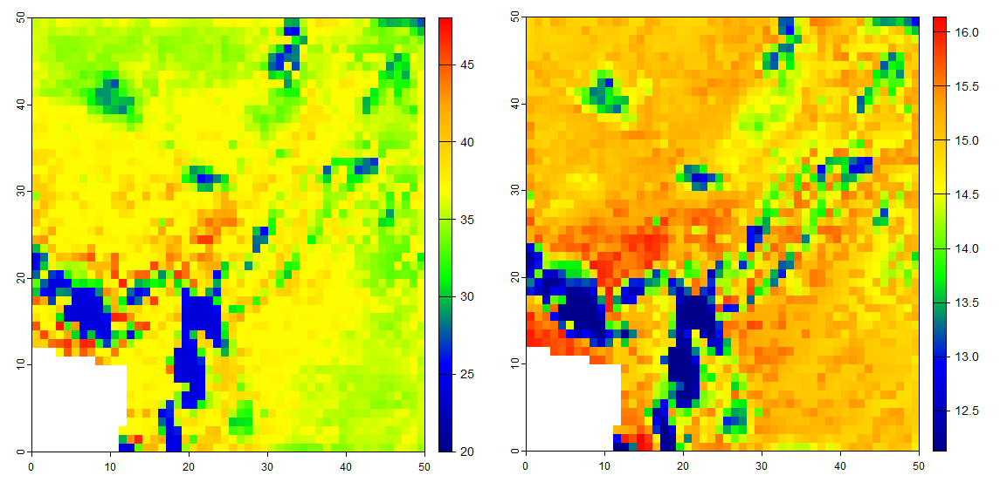\
Maximum (right) and mean (left) temperature 5 cm above ground. On warm sunny days, the temperature immediately above sunward facing slopes gets pretty hot. The colder areas are those that have shade cover.

## Model inputs
Three sets of parameters are needed to run the model: (i) standard hourly meterological climate-forcing variables representative of macroclimatic conditions across the study site, usually in the form of a data.frame with single values for each hour (though the option to include an array of coarse-gridded values is also available - see below). (ii) A suite of parameters describing properties of the canopy in the form of high-resolution gridded values. (iii) A suite of parameters describing properties of the soil in the form of high-resolution gridded values. A raster of digital elevation data is also required. Optionally, some additional parameters can be set when running the models, as detailed below.

Each set of parameters is described in turn. Obtaining the right data to drive the microclimate model is often one of the most challenging aspects of modelling microclimate. Users may wish to explore the `microclimdata` package for automated downloading and processing of various datasets available globally or regionally for doing so. The package is available on Github:  https://github.com/ilyamaclean/microclimdata


### Meteorological data
The inbuilt data,frame `climdata` gives an example of the hourly meteorological variables needed to run the model:

```{r}
library(microclimf)
head(climdata)
```

The data frame contains the following columns: `obs_time` – POSIXlt object of observation times for each climate variable, `temp` – temperatures (deg C), `relhum` - relative humidity (percentage), `pres` - atmospheric pressure (kPa), `swdown` - total downward shortwave radiation received by a horizontal surface (W/m^2), `difrad` - diffuse radiation (W/m^2), `lwdown` total downward longward radiation (W/m^2), `windspeed` - wind speed at reference height (m/s),  `winddir` - wind direction in degrees and `precip` - hourly precipitation (mm). Precipitation is used to compute soil moisture and sub-model for this actually runs in daily time-steps. Thus, if only daily precipitation data are available, hourly data can be provided as daily values / 24.   

Importantly, the entries of obs_time must all be in UTC (Coordinated Universal Time).

Any input weather dataset provided must use the same format, column names and units as in this example dataset. Most of these are standard meteorology variables that are readily available globally. If unknown for the study area, users may wish to explore the `mcera5` package on github (https://github.com/dklinges9/mcera5) or the `micorclimdata` package detailed above.  Diffuse radiation, is sometimes harder to come by as many standard weather stations only estimate total radiation. If unknown, it can be estimated using the `difprop` function in the microctools package (https://github.com/ilyamaclean/microctools). The microctools package, also contains a function `converthumidity`, for converting absolute or specific humidity or vapour pressure to relative humidity.


### Vegetation parameters
The inbuilt dataset `vegp` gives an example of the vegetation parameters needed to run the model. Here the attributes are shown and individual parameters plotted. Data are all stored as SpatRasters though in the inbuilt dataset these are `PackedSpatRasters` (see `terra::wrap`).

All vegetated data can be provided as either single layer SpatRasters, in which case they are assumed time-invariant, or as multi-layer SpatRasters, in which case they are assumed to vary seasonally. For example, in the inbuilt dataset `vegp$pai` is a 12 layer SpatRaster corresponding to approximately monthly values when the model is run over an entire year. Had the SpatRaster contained 365 values, vegetation would be assummed to vary daily. No more than one value per day can be provided. A mixture of single layer and multi-layer SpatRasters can be provided - the model takes care of things. Note, however, that the model does not `know` which layers correspond to which time-period. It is simply that if e.g. 12 layers are provided, the entire time-sequence over which the model is run is divided into 12 approximately equal sized chunks and separate vegetation data used for each chunk. Note that the data are matched to the time-sequence of the original climate date used to run the point model, not the values returned by sub-setting the point model.   

```{r, fig.show='hold'}
library(terra)
attributes(vegp)
# Plot spatial and temporal variation in pai
plot(rast(vegp$pai)[[1]], main = "Jan PAI")
paiarray <- as.array(rast(vegp$pai))
vegpmean<-apply(paiarray, 3, mean, na.rm = TRUE)
plot(vegpmean, type="l", ylim = c(0, 0.25), main = "Seasonal variation in PAI")
# Plot other variables
plot(rast(vegp$hgt), main="Vegetation height") 
plot(rast(vegp$x), main = "Leaf angle distribution") 
plot(rast(vegp$gsmax), main="Max. stomatal conductance") 
plot(rast(vegp$clump)[[1]], main = "Jan Canopy clumping factor") # set to 0 
plot(rast(vegp$leafr),col=gray(0:255/255), main = "Leaf reflectance")
plot(rast(vegp$leafd), main = "Mean leaf diameter") # set to 0.05
plot(rast(vegp$leaft),col=gray(0:255/255), main = "Leaf transmittance") # set equal to leafr
```

If users do know values of these vegetation parameters across their study area, they can be approximated from habitat type using the `vegpfromhab` function. This function takes as an input, a raster of habitat types numerically coded as follows:

(1) for Evergreen needleleaf forest,
(2) for Evergreen broadleaf forest,
(3) for Deciduous needleleaf forest,
(4) for Deciduous broadleaf forest,
(5) for Mixed forest,
(6) for Closed shrubland,
(7) for Open shrubland,
(8) for Woody savanna,
(9) for Savanna,
(10) for Short grassland,
(11) for Tall grassland,
(12) for Permanent wetland,
(13) for Cropland,
(14) for Urban and built-up,
(15) for Cropland / Natural vegetation mosaic and
(16) for Barren or sparsely vegetated


It returns an object of class vegparams as required by the model. Here this is illustrated using he inbuilt habitat SpatRast layer 

```{r, fig.show='hold'}
plot(rast(habitats), main = "Habitat types") # inbuilt habitat SpatRast layer
tme<-as.POSIXlt(c(0:8783)*3600,origin="2000-01-01 00:00", tz = "GMT")
# Create an object of class vegparams:
veg<-vegpfromhab(habitats,tme=tme)
```

Note however, that be doing so, all values for a habitat type will be identical, when in reality this is unlikely to be the case. If one is unable to quantify the main determinants of microclimatic variation then there is little prospect of being able to model microclimatic conditions accurately and any outputs form the model should be treated with a high-degree of skepticism. 

The model is most sensitive to `pai` (the total one sided area of both leaves and woody and dead vegetation per unit ground area) and `hgt` (vegetation height in metres). The former is needed primarily so that canopy cover can be estimated, but even for temperatures above canopy, `pai` partially determines the temperature profile. `hgt` is important as determines whether `reqhgt` is above or below vegetation and also dictates the shape of the temperature profile above vegetation. 

The most sensible use-case for the `vegpfromhab` function is thus when one has alternative data that could be used to estimate `pai` and `hgt` that can be slotted into the output returned by this function. This is straightforward as the vegetation inputs to the model as returned by `vegpfromhab` is just a list of SpatRasters.

The model is less sensitive to other parameters. The parameter `x` represents how vertically or horizontally the leaves of the canopy are orientated and controls how much direct radiation is transmitted through the canopy at a given solar angle (when the sun is low above the horizon, less radiation is transmitted through vertically orientated leaves). Users may refer to [Campbell (1986)](https://doi.org/10.1016/0168-1923(86)90010-9) for a detailed explanation. Values for deciduous woodland are typically around 1, but for grassland may be closer to 0.2. The parameter `gsmax` is the maximum stomatal conductance (mol / m^2 / s) of leaves and is needed for evapotranspiration calculations. Values typically range from 0.23 for deciduous broadleaf forest to 0.55 for wetland vegetation. [Körner (1995)](https://link.springer.com/chapter/10.1007/978-3-642-79354-7_22) gives values for major vegetation types of the world. The parameter ‘leafr’ is the leaf reflectance to shortwave radiation, with typical values around 0.4. 

The parameter `clump` dictates how much radiation passes through gaps in the canopy, and therefore represents the sub-pixel canopy clumpiness, with values ranging from 0 (uniform) to 1 (highly clumped). In general, it varies with vegetation height and plant area index. The function `clumpestimate` can be used to derive an approximate estimate. The parameter `leafd` is the mean diameter of leaves. 

The `vegpfromhab` function assigns approximate values for leaf reflectance accordance to habitat type. However, it can also be estimated from surface albedo using function `leafrfromalb`. In applying this function, leaf transmittance is assumed proportional to leaf reflectance and a proportionality coefficient can be specified. In general, model outputs are not sensitive to this coefficient,  


### Soil parameters
The inbuilt dataset `soilc` gives an example of the soil parameters needed to run the model. Here the attributes are shown and plotted:

```{r, fig.show='hold'}
attributes(soilc)
plot(rast(soilc$soiltype), main = "Soiltype") # Clay loam throughout
plot(rast(soilc$groundr), col=gray(0:255/255), main = "Soil reflectance")
```

* This is a list of the following:
    * `soiltype` - a PackedSpatRast object of integer soil types
    * `groundr` - a PackedSpatRast object of soil reflectance values for shortwave radiation (0 - 1)

Again, users in creating such a dataset, can store `soiltype` and `groundr` as either a PackedSpatRast or a SpatRast object.

Soil type 7 corresponds to Clay loam. A full list of which numeric values correspond to which soil types, along with parameters associated with these soil types is shown in the `soilparameters` table:

```{r}
soilparameters
```

The model also copes with these values being provided as individual data layers if these are added to the list of SpatRasters contained in `soilc`. Note that in all instances soil properties (apart from soil moisture, which is modelled explicitly) are assumed time-invariant. 

### Additional optional parameters
In addition to specifying `reqhgt` the height (m) above or below ground for which microclimate estimates are required, there are also a set of optional parameters that can be provided to the run functions that control model behaviour. 
For the point model, these are as follows:
* `runchecks` - logical indicating whether to call function `checkinputs` to run checks on format and units of input data (see details under model input functions). 
 * `windhgt` - height above ground of wind speed data in weather (see details under wind)
  * `soilm` - a vector of hourly soil moisture values in upper 10 cm of the soil (calculated using a simple soil model if not supplied - see details under running the point model)
  * `dTmx` - maximum amount by which canopy or ground surface temperatures can exceed air temperatures when running the point model (see details under running the point model).
  * `maxiter` - integer indicating the maximum number of iterations to use when running the point model (see details under running the point model)
Additionally, there are a number of options for internal use, which can generally be ignored by the user as they are calculated if not supplied, but in brief, these are: `yearG` - an option dictating whether or not to account for annual cycles in the ground flux when a year or more of data are provided, `lat` and `long` - the latitude and longitude of the location for which the point model is run, `vegp_p`, `ground_p` the vegetation and ground parameters used for running the point model, `soiltype` - the assumed soiltype at the location for which the model is run and `mxhgt` - the height to which weather data are adjusted, if not supplied calculated from vegetation height across the study area. 

For the grid model, the following additional parameters can be supplied

* `dtmc` - a coarse-resolution digital elevation dataset matching the resolution of climate data and used to perform elevation adjustments only if climate data are provided as multi-layer SpatRasters.
* `altcorrect` - a single numeric value indicating whether to apply an elevation lapse rate correction to temperatures and pressures (0 = no correction, 1 = fixed lapse rate correction, 2 = humidity-dependent variable lapse rate correction)
* `runchecks` - as for the point model.
 * `pai_a` an array of plant area index values above `reqhgt`. Estimated by assuming a plausible vertical distribution of leaf foliage density if left as 'NA` (see details under radiation).
* `tfact` an optional coefficient determining the sensitivity of spatial variation in soil moisture to variation in topographic wetness (see details under soil moisture).
* `out` an optional vector of logicals indicating which variables to return ordered as for the listed outputs when `rehgt > 0'` (e.g. `out[1] = TRUE` indicates that `Tz` is returned, `out[2] = TRUE` that `tleaf` is returned etc). By default all variables are returned, but if, for example, only temperature or humidity are required as outputs, setting relevant values to `FALSE` can save a lot of memory.
* `slr`, `apr` and `twi` - optional SpatRaster objects of slope, aspect, and topographic wetness. If not supplied, these are calculated from the provided `dtm`, but users may wish to provide their own values to avoid edge effects.
* `hor`, `svfa` and `wsa` - optional array of the tangent of the angle to the horizon in 24 directions (used for calculating terrain shading), skyview factors (used for adjusting diffuse and downward longwave radiation) and wind shelter coefficients in 8 directions (used for determining wind speed). If not supplied, these are calculated from the provided `dtm`, but users may wish to provide their own values to avoid edge effects.
* `method` - set either as `R` or by default as `Cpp`. If set to `Cpp` the entire model is run using c++ code, and is therefore optimized for speed and memory allocation. If set to `R` individual components of the model coded as R wrappers are run as described below. This is marginally slower and much more memory hungry, but affords users greater flexibility to e.g. interrogate individual model components or to swap their own functions in and out of the model for individual components.  

## Running the point microclimate model
To ensure the grid model can be run without iteration, the first stage of modelling is to run a point microclimate model iteratively for a flat surface at the centre of the study area using as inputs to the model, vegetation and soil characteristics that are broadly representative of the study area. This is achieved automatically using function `runpointmodel`, using as inputs to the model, the same inputs that are supplied to the grid model as follows:

```{r eval=FALSE}
# Run the point model
micropoint <- runpointmodel(climdata, reqhgt = 0.05, dtmcaerth, vegp, soilc)
```


Interrogating the attributes of `micropoint` allows us to see what the model returns:
```{r eval=FALSE}
attributes(micropoint)
```

The function essentially gathers various things into a single list object. These are as follows:

* `weather` - the original supplied weather data, but height adjusted if vegetation within the study area exceeds the height of temperature or wind speed measurements.
* `dfo` - this is a data.frame that stores all the useful stuff that the grid model needs. Most are not worth remaking on as they are essentially used to handle adjustments made to the grid model outputs to avoid the need to run it iteratively (e.g. umu scales wind speeds without and without diabatic correction coefficients included), but four variables are worth remaking on. These are `G` the rate of heat storage by the soil (W/m^2), `soilm` - soil water content expressed as a volumetric fraction, `Tg` - ground surface temperature and `Tc` - the average temperature of vegetation. Plots of `Tg` and `Tc` are shown below.
* `Tbz` if the model  is run above ground this is just set to NA, but if run below ground, this is a vector of soil temperatures at depth `reqhgt`.
* `lat` and `long` are the latitude and longitude of the centre of the study area, which is the location for which the point model was run.
* `zref` represents the height above ground to which weather data have been adjusted. If none of the vegetation is greater than two meters in height the output `zref` is set to 2 m and `windhgt` is also two meters, the returned weather dataset is identical to that provided the function. However, for the grid microclimate model to derive below-canopy wind and temperature profiles, the reference height must be higher than the tallest vegetation in the study area. For that reason, if the tallest vegetation exceeds two meters, `zref` is set to the maximum height of the vegetation and the wind speeds and temperatures are adjusted for height in the weather dataset. 
* ` subs` and `tmeorig` help the grid model handle sub-setting of the point model (see below). Prior to sub-setting, `tmeorig` is a POSIXlt object of dates and corresponding to dates and times in `weather` and `dfo` and `subs` is just a vector indicating which values have been returned (all prior to any sub-setting). 
Below, ground and vegetated surface temperatures are plotted to show what the outputs of the point model look like.

```{r eval=FALSE}
micropoint <- runpointmodel(climdata, reqhgt = 0.05, dtmcaerth, vegp, soilc)
microp <- micropoint$dfo
tme <- as.POSIXct(micropoint$tmeorig)
par(mar=c(5,5,3,3))
plot(microp$Tg ~ tme, type="l", ylim = c(-5, 50), col = rgb(1,0,0,0.5), xlab = "Month", ylab = "Temperature") # temperature of ground surface
par(new = TRUE)
plot(microp$Tc ~ tme, type="l", ylim = c(-5, 50), col = rgb(0,0.5,0.5,0.5), xlab = "", ylab = "")
```
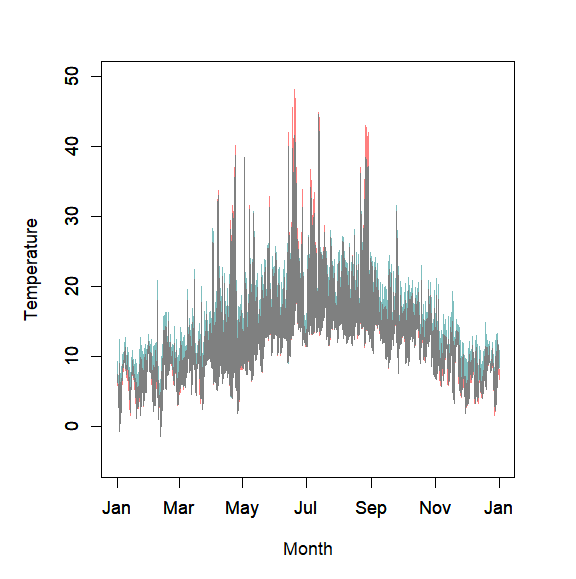\

The equivalent to the `runpointmodel` function when climate data are provided as arrays is ``runpointmodela`. An example of its use is shown below. 
  
## Subsetting the microclimate model
The point microclimate model is usually run in hourly time-increments using complete time sequences of weather data to fully allow for the diurnal cycles in ground heat fluxes to be accounted for, but if desired, the grid model can be run for just say the hottest days in each month to derive maximum temperatures. This is achieved using function `subsetpointmodel`. This function takes an object of class ‘pointmicro` as an input and also returns an object of class ‘pointmicro`, but with the request hours extracted from ‘pointmicro`
In the example below, the model is subset to return only those hours corresponding to the day in each month with the hottest temperature (as determined by the point model). The function has several inputs that control its behaviour. If 'tstep' is set to `year` the day in each year with the e.g. the hottest or coldest hourly temperature is identified, and if 'tstep' is set to `month` the days in each month in each year with e.g. the hottest or coldest hourly temperatures are returned. If `what` is set to `tmax` or `tmin` the hottest or coldest hour within each month or year are identified. If `what` is set to `tmedian` hourly temperatures within the month or year are ranked and the median hour identified. The final option is to provide a vector of the days in the time sequence to return data for using input `days`. If provided `tstep` is ignored. 
It is necessary that all hours of a given day are returned for two reasons. First, it ensures that the ground heat flux in the grid microclimate model can be estimated as it depends on the full diurnal cycle. Second because the hottest hour on a flat surface may not be the hottest hour on e.g. a steeply south-westerly facing slope - temperatures will typically peak later in the day when the slope is directly facing the sun. Returning hourly values for an entire day ensures that these terrain effects can be properly handled by the grid model. 

```{r eval=FALSE}
micropoint <- subsetpointmodel(micropoint, tstep = "month", what = "tmax")
```

## Preparing model inputs
The entire grid model is run using `runmicro`, but to illustrate its working, we here run each component of the model in stages. If running it in stages, the first stage is to gather the input variables and reformat them ready to run the model. There are two options for preparing the data for running the model. Firstly where the climate data are in the form of a data frame of hourly weather for a point location. Second, where the climate data are in the form of course-gridded SpatRasters of values. Both cases are handled flexibly by the function `modelin`. 

In the examples that follow, the inbuilt datasets of parameter values and a dtm for the study area, `dtmcaerth` are used and the model is run using a data.frame of weather data. Subsequently, the equivalent workflow for when weather data are in the form of course-gridded SpatRasters is shown.

```{r eval=FALSE}
micro <- modelin(micropoint, vegp, soilc, dtmcaerth)
```

By default `modelin` calls function `checkinputs`. This performs some basic checks on the vegetation and soil parameters data to check for consistency in extent to the dtm. It also ensure values in the climate datasets are typical of what would be expected, thereby helping to ensure the correct units are used.

In subsequent downscaling of wind, the drag effects of vegetation, determined by vegetation height and foliage area are accounted for and calculated at this stage. In so doing, it is necessary to accommodate the possibility that the wind speed is not just affected by the surface roughness in each pixel, but also by vegetation surrounding the location. This is accommodated for by applying `xyf` which effectively smooths the surface roughness coefficients using `terra::aggregate` where `xyf` is the aggregation factor. If `xyf` is set to `NA`, the roughness coefficients are averaged across the entire study area. In the example above, we do not specify a value for `xyf`, and the default of one is therefore applied, which means that no smoothing is performed. 

## Running the model

### Soil moisture
The first step of the microclimate model is to estimate soil moisture. This is handled in `microclimf`, by spatially distributing the soil moisture values returned by the point microclimate model for each time increment using the the Bevan and Kirkby (1979) topographic wetness index, such that valleys and flat areas are assumed to have higher water content. Values are adjusted such that the average for the study area in each time step is equivalent to the value obtained by running the point model. Users have the option to control the sensitivity of this topographic adjustment.  Irrespective of whether the model is run in hourly or daily time-increments, these calculations are performed using the `soilmdistribute` as in the example below.

```{r eval=FALSE}
micro<-soilmdistribute(micro)
par(mfrow = c(1,1)) # make sure output is a single panel figure
plot(rast(micro$soilm[,,134]), col = rev(mypal))
```
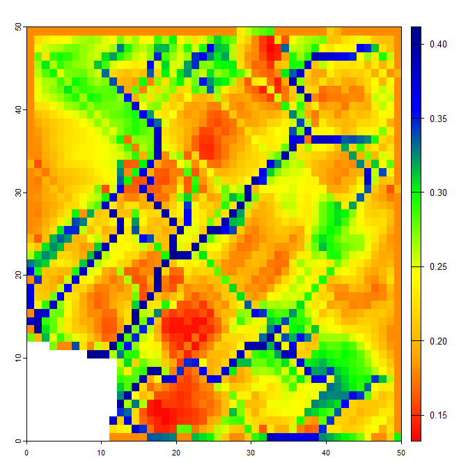\

### Radiation
The next stage, needed to calculate soil surface temperature, is to estimate radiation absorbed by the ground.  Because the ground lies below canopy in some instances, it is necessary also to consider the transmission of radiation through the canopy. The radiation fluxes are modelled using function `twostream`, which implements a variant of the Dickenson-Sellers two-stream radiation model described in Yuan et al. (2017) J Adv Model Earth Sy 9: 113–129 to model radiation interception by the canopy. It also varies from the Dickenson-Sellers model in more explicitly handing sloped ground surfaces beneath a canopy. 

Absorbed radiation is the total incoming radiation received by a surface less that transmitted or reflected. The total incoming radiation can be partitioned into three sources, each of which is modified by the environment in slightly different ways. The first is direct radiation from the sun. Here, absorption depends on the angle of the surface relative to perpendicular. This is the reason why equatorward-facing slopes are warmer than those that face poleward and is indeed the main reason why temperature increases with latitude. Here the solar beam is more concentrated, rather like shining a torch directly on a surface as opposed to obliquely. The second source is diffuse solar radiation: that scattered by particles and clouds in the atmosphere. The final source is longwave radiation emitted from surrounding surfaces and the sky. The latter two are isotropic (i.e. having the same value when measured in any direction). In consequence, for these sources, the direction of the surface is unimportant, and radiation interception is instead influenced by sky-view.

Function `twostream` calculates all of these fluxes. If `reqhgt > 0` it also calculates the fluxes at the height of interest, including the upward fluxes resulting from reflection by the ground surface and scattering by leaves within the canopy. Additionally, to aid with modelling of air temperatures, it also calculates the flux density of radiation absorbed by both the canopy and the ground surface.

To model radiation, the canopy as a turbid medium and the transmission of radiation by vegetation is thus described using an equation similar to Beer's law, in which flux density of radiation is assumed dependent on the total one-side lead area per unit ground area and by an extinction coefficient for the canopy. For direct radiation, the extinction coefficient is assumed to depend on the distribution of leaf angles (with more vertically orientated leaves transmitting less radiation at lower solar altitudes). This is where the model input `vegp$x` comes into play. For isotropic sources of radiation (i.e. diffuse and longwave), leaf angle is assumed unimportant. 

In the example below the flux density of shortwave and longwave radiation absorbed by the ground surface at 10:00 hours on 20th Jun 2017 is shown. Below that, the flux density of the upward and downward radiation streams 5 cm above the ground are shown (the downward flux comprises both direct and diffuse radiation, the upward flux is assumed entirely diffuse).


```{r eval=FALSE}
micro <- twostream(micro, reqhgt = 0.05)
par(mfrow=c(1,2))
plot(rast(micro$radGsw[,,131]), col = mypal, main = "Shortwave")
plot(rast(micro$radGlw[,,131]), col = mypal, main = "Longwave")
```
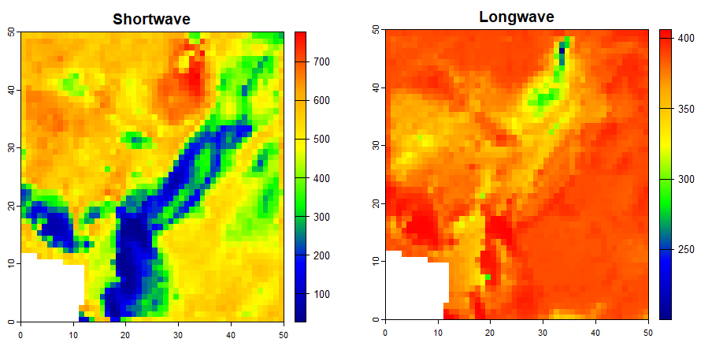\


```{r eval=FALSE}
plot(rast(micro$Rbdown[,,131]+micro$Rddown[,,131]), col = mypal, main = "Downward shortwave")
plot(rast(micro$Rdup[,,131]), col = mypal, main = "Upward shortwave")
```
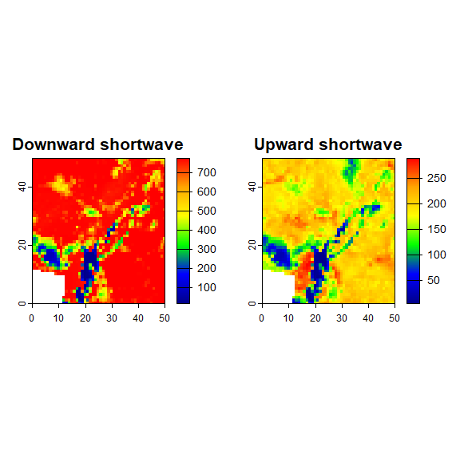\

### Sensible heat flux and wind
A surface heated by solar radiation will loose some of this heat to the surrounding air, and by virtue of the laws of energy conservation, the air gains this heat. The exchange of heat between a surface and the surrounding air is termed sensible heat exchange and is influenced strongly wind speed. The next stage of modelling is therefore to calculate wind speed.

The function `wind` models two processes. Firstly, direction-dependent terrain shelter coefficients are applied. Secondly, the effects of vegetation on wind speeds are determined. If `reqhgt` is above the vegetation, the shaped of the wind speed above vegetation is determined by the degree of surface drag, in turn contingent upon vegetation height and the plant area index of vegetation. If `reqhgt` is below canopy, the effects of vegetation is to attenuate wind speeds, but the shape of the wind-height profile below and above canopy differs. For a given `reqhgt` some pixels may lie below canopy and some above. This is all handled automatically by function `wind` as in the example below.    

```{r eval=FALSE}
micro <- wind(micro, reqhgt = 0.05)
par(mfrow=c(1,1))
plot(rast(micro$uz[,,100]), col = mypal, main = "Wind speed")
```
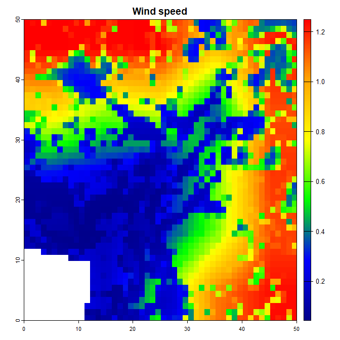\

The lower wind speeds in the valley caused by terrain sheltering are evident. The speckle in the figure is caused by vegetation. 

One minor additional point to note is that when calling any of the component functions after creating the model input using e.g. `modelin` there is no need to run the components prior to that. The function automatically checks whether these have been run, and if necessary does so.

### Ground surface temperature
Once radiation absorbed by the ground and wind speed have been calculated, ground surface temperature can be computed. This is done using either function `soiltemp_hr` or `soiltemp_dy` depending on whether the model input is daily or hourly. Whereas `twostream` and `wind` handle both hourly or daily data, because ground heat fluxes are calculated in different ways depending on whether inputs are hourly or daily, the functions used for each differ. In the example below, the ground surface temperature on the hottest hour of the year is calculated using `soiltemp_hr` and then plotted.

```{r eval=FALSE}
micropoint<-runpointmodel(climdata,0.05,dtmcaerth,vegp,soilc)
micropoint<-subsetpointmodel(micropoint, tstep = "month", what = "tmax")
micro <- modelin(micropoint, vegp, soilc, dtmcaerth)
micro <- soiltemp(micro, reqhgt = 0.05)
# Plot ground temperature of hottest hour
par(mfrow=c(1,1))
plot(rast(micro$Tg[,,134]), col = mypal, main = "Soil surface temperature")
```
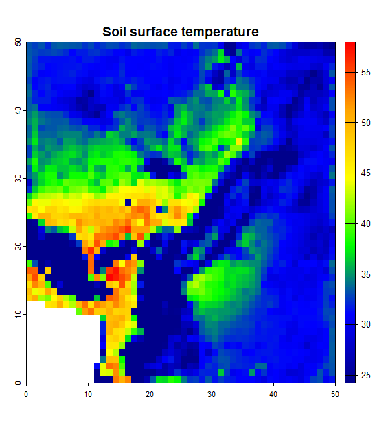\

As can be seen, the soil surface temperatures on bare, south-facing slopes get pretty hot

### Above ground
After calculating ground surface temperature, there are two pathways, depending on whether microclimatic conditions below or above ground are required. If `reqhgt > 0` then function `aboveground` is called as in the example below. This essentially runs the full microclimate model. Details of the model outputs are specified below.   

```{r eval=FALSE}
mout <- aboveground(micro, reqhgt = 0.05)
plot(rast(mout$Tz[,,134]), col = mypal, main = "Air temperature")
```
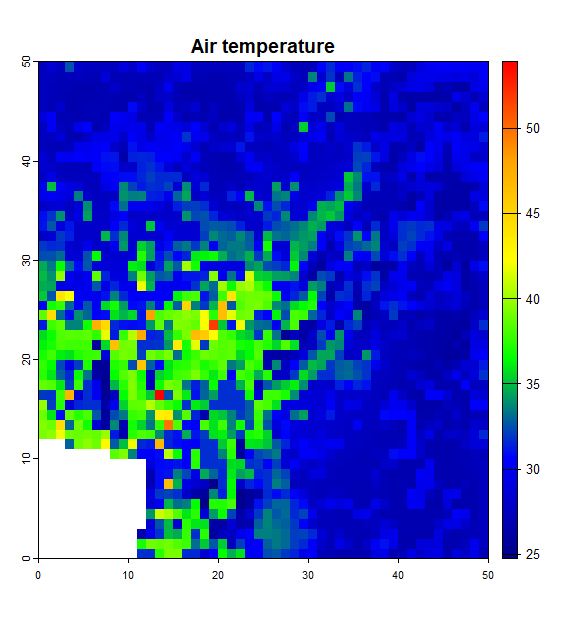\

In the example above air temperature in the hottest hour is plotted. Users are free to experiment with plotting other model outputs. The air temperature at 5 cm is somewhat lower than the ground surface temperature, but much higher than ambient temperature on south-facing slopes, as one would expect

#### Above canopy
The function `aboveground` automatically works out which pixels are below canopy, and which above, but the microclimate is modelled differs. To work out temperatures above canopy, the canopy (and soil surface) are treated as a single layer of homogeneous phytomass and the energy balance solved to derive the mean temperature of the canopy. The canopy is then assumed to exchange heat with the air above it such that close to the heat exchange surface of the canopy, air temperatures similar to canopy temperatures, but are increasingly close to air temperature at reference height (i.e. the at height of the input weather station data). The result is a logarithmic temperature-height (and humidity) profile as re-reproduced in the example below in which the model is run at multiple heights over a small area with spatially uniform, terrain, soil and vegetation properties.

```{r eval=FALSE}
dem <- aggregate(rast(dtmcaerth), 10) * 0
# Create spatially uniform vegetation and soil parameters  dataset
vegp2 <- list(pai = array(0.05, dim = c(5, 5, 12)),
              hgt = aggregate(rast(vegp$hgt), 10) * 0 + 0.005,
              x = aggregate(rast(vegp$x), 10) * 0 + 1,
              gsmax = aggregate(rast(vegp$x), 10) * 0 + 1,
              leafr = aggregate(rast(vegp$x), 10) * 0 + 0.3,
              clump = array(0, dim = c(5, 5, 12)),
              leafd = aggregate(rast(vegp$x), 10) * 0 + 0.05,
              leaft = aggregate(rast(vegp$x), 10) * 0 + 0.15)
soilc2 <- list(soiltype = aggregate(rast(soilc$soiltype), 10),
               groundr = aggregate(rast(soilc$groundr), 10) * 0 + 0.15)
# Run and subset point model
micropoint <- runpointmodel(climdata, reqhgt = 0.05, dem, vegp2, soilc2)
micropoint <- subsetpointmodel(micropoint, tstep = "month", what = "tmax")
# Create model input
micro <- modelin(micropoint, vegp2, soilc2, dem)
# Run model for multiple heights
reqhgts<-c(0.01,0.02,0.05,0.1,0.2,0.5,1)
temps <- 0
for (i in 1:length(reqhgts)) {
  mout <- aboveground(micro, reqhgt = reqhgts[i])     
  temps[i] <- mout$Tz[2, 2, 132] # Extract temperature for hottest hour   
}
par(mar = c (5, 5, 2, 2))
plot(reqhgts ~ temps, type = "l", lwd = 2, xlab = "Temperature", ylab = "Height")
```
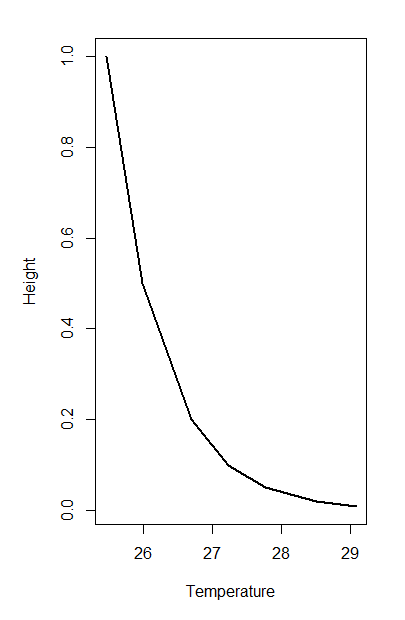\

One minor point worth noting is that when running the point model above ground, the input `reqhgt` is just used to determine whether to return the required variables for modelling microclimate above ground and the point model itself does not need to be run for separate heights as it just returns temperature and other microclimate variables for the heat exchange surface of the canopy. This is not the case below ground, as here the point model returns microclimate parameters specifically associated with the specified depth.   

#### Below canopy
Below canopy, variation in the energy budget within the canopy must be more explicitly handled. The `microclimf` package contains a theoretically-grounded model emulator of Raupach's localised near-field model. In this model, the temperature (or humidity) is assumed to comprise both a `near-field and 'far field' contribution. In essence, the canopy is assumed to comprise multiple layers and far-field contribution is result from heat (or vapour) emanating from the entire canopy downwind of the point of interest. When the net energy balance of the canopy is positive, the result is an approximately linear increase in temperature (or vapour) as one descends through the canopy because at lower heights. However, for far-field-height profile, the effects of ground surface temperature must be accounted for, and the air temperature close to the ground is thus close to ground surface temperature. An additional 'near-field' contribution is then calculated, in the effect determined by the energy budget and the foliage density close to the height of interest. To calculate the foliage density, plausible assumptions about the vertical distribution of foliage are made, such that foliage density is determined from the plant area index. The model is not unduly sensitive to assumptions about the vertical distribution of foliage.        
    
The net result is a more complex temperature-height (and humidity) profile as re-reproduced in the example below in which the model is run at multiple heights over a small area with spatially uniform, terrain, soil and vegetation properties. 

```{r eval=FALSE}
# Create spatially uniform vegetation a\nd soil parameters  dataset
vegp2 <- list(pai = array(3, dim = c(5, 5, 12)),
              hgt = aggregate(rast(vegp$hgt), 10) * 0 + 10,
              x = aggregate(rast(vegp$x), 10) * 0 + 1,
              gsmax = aggregate(rast(vegp$x), 10) * 0 + 1,
              leafr = aggregate(rast(vegp$x), 10) * 0 + 0.3,
              clump = array(0, dim = c(5, 5, 12)),
              leafd = aggregate(rast(vegp$x), 10) * 0 + 0.05,
              leaft = aggregate(rast(vegp$x), 10) * 0 + 0.15)
soilc2 <- list(soiltype = aggregate(rast(soilc$soiltype), 10),
               groundr = aggregate(rast(soilc$groundr), 10) * 0 + 0.15)
# Run and subset point model (reqhgt just used to determine whether above or below ground)
dem <- aggregate(rast(dtmcaerth), 10) * 0
micropoint <- runpointmodel(climdata, reqhgt = 10, dem, vegp2, soilc2)
micropoint <- subsetpointmodel(micropoint, tstep = "month", what = "tmax")
# Create model input
micro <- modelin(micropoint, vegp2, soilc2, dem)
# Run model for multiple heights
reqhgts<- 10^(c(-10:10) / 10)
temps <- 0
for (i in 1:length(reqhgts)) {
  mout <- aboveground(micro, reqhgt = reqhgts[i])     
  temps[i] <- mout$Tz[2, 2, 132] # Extract temperature for hottest hour   
}
par(mar = c (5, 5, 2, 2))
plot(reqhgts ~ temps, type = "l", lwd = 2, xlab = "Temperature", ylab = "Height")
```
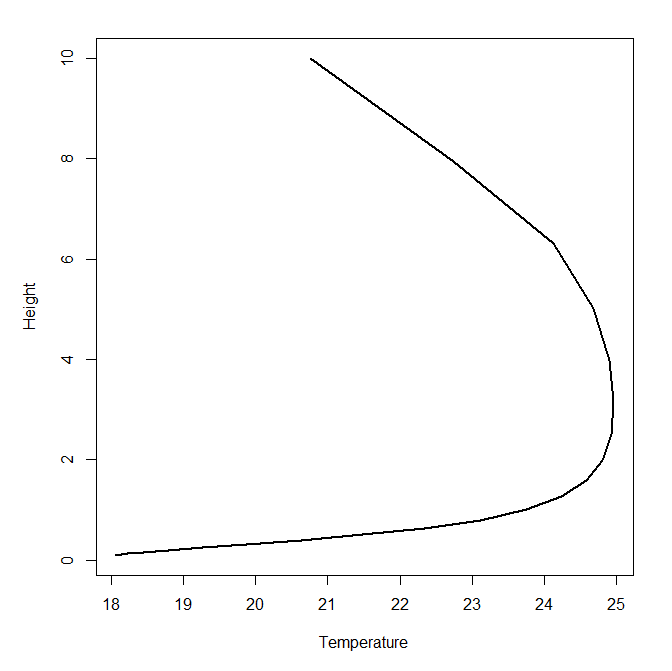\
 
#### Below ground
If `reqhgt` is negative, functions `below_hr` (hourly) or `below_dy` (daily) are used and it is assumed that microclimatic conditions below ground are needed. The way the model works is to assume, that once ground surface temperatures are calculated, that both the annual and diurnal temperatures cycle is dampened by the specific heat capacity and thermal conductivity of the soil, themselves contingent on soil physical characteristics and water content. There is also a phase shift  

This can be seen in the example below in which the model is run in hourly time-increments for the entire year at three different depths and time-series of soil temperature plotted.

```{r eval=FALSE}
# Run microclimate model for reqhgt = -0.05m
micropoint1 <- runpointmodel(climdata, reqhgt = -0.05, dem, vegp2, soilc2)
micro1 <- modelin(micropoint1, vegp2, soilc2, dem)
mout1 <- belowground(micro1, reqhgt = -0.05)
T1<-mout1$Tz[2,2,]
# Run microclimate model for reqhgt = -0.2m
micropoint2 <- runpointmodel(climdata, reqhgt = -0.2, dem, vegp2, soilc2)
micro2 <- modelin(micropoint2, vegp2, soilc2, dem)
mout2 <- belowground(micro2, reqhgt = -0.2)
T2<-mout2$Tz[2,2,]
# Run microclimate model for reqhgt = -1m 
micropoint3 <- runpointmodel(climdata, reqhgt = -1, dem, vegp2, soilc2)
micro3 <- modelin(micropoint3, vegp2, soilc2, dem)
mout3 <- belowground(micro3, reqhgt = -1)
T3<-mout3$Tz[2,2,]
# PLot soil temperature time-series
plot(T1, type="l", ylim = c(0, 25), col = "red", ylab = "Temperature", xlab = "Hour")
par(new = TRUE)
plot(T2, type="l", ylim = c(0, 25), ylab = "", xlab = "")
par(new = TRUE)
plot(T3, type="l", col = "darkgray", lwd = 2, ylim = c(0, 25), ylab = "", xlab = "")
```
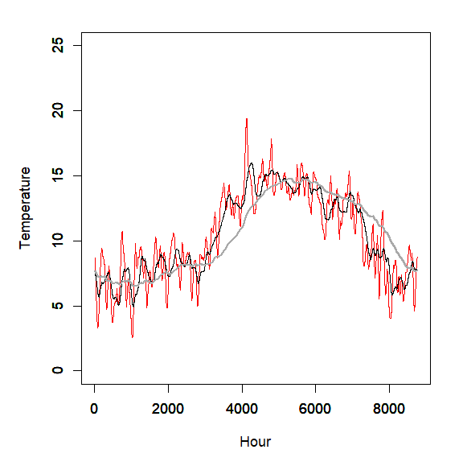\

It should be noted that the below ground microclimate model works best if the model is run over full time sequences. A simpler approximation method is used when running in the model with sub-set versions of the model.

### Running the whole model
The whole model is run using `runmicro`. With `method = "R"` this function is essentially a wrapper function that run the various component functions and the call either `aboveground` or `belowground`. With `method = "Cpp"` the full model is run using c++ code, which avoids the need to store full arrays of variables returned by model sub-components in internal memory. Code for running the model in entirety is presented in the quick start section above.

### Model output and formats
When running `runmicro` the model returns an an object off class `microout`. If `reqhgt > 0` then the following outputs are returned by default, though note that the user have the option to specify which model outputs are returned using parameter `out', which is a vector of logicals indicating which variables to return ordered as for the listed outputs when ‘reqhgt > 0’ as below.

* Model outputs:
    * `Tz` - an array of air temperatures at `reqhgt` (deg C) 
    * `tleaf` - an array of leaf temperatures at `reqhgt` (or average canopy temperatures for pixels where `reqhgt` is above vegetation (deg C)
    * `T0` - an array of ground surface temperatures (deg C)
       * `relhum` - an array of relative humidities at `reqhgt` (Percentage)
    * `soilm` - an array of soil moisture fractions in the top 10 cm of the soil (m^3 / m^3)
    * `windspeed` - an array of wind speeds at `reqhgt` (m/s)
    * `Rdirdown` - an array of downward direct (beam) radiation fluxes at `reqhgt` (W/m^2)
    * `Rdifdown` - an array of the downward diffuse radiation fluxes at `reqhgt` (W/m^2)
    * `Rlwdown` - an array of the downward longwave radiation fluxes at `reqhgt` (W/m^2)
    * `Rswup` - an array of upward shortwave radiation fluxes at `reqhgt` (W/m^2). Assumed to comprise entirely diffuse radiation.
    * `Rlwup` - an array of upward longwave radiation fluxes at `reqhgt` (W/m^2). 

If `reqhgt = 0` the same model outputs are returned, with the exception of wind speed, which is always 0 at the ground surface and relative humidity, where a value for the gorund surface in addition to a value for soil moisture is meaningless.

If `reqhgt < 0` then the same model outputs are return, but `tleaf`, `relhum`, `windspeed`, `Rdirdown`, `Rdifdown`, `Rlwdown`, `Rswup` and `Rlwup` are all set to `NA`.

The returned model object is a list with each of these variables returned as arrays. 


It is also possible to write the outputs as netCDF4 files using function `writetonc`. This function takes an object of class `microout` and writes the outputs to the working directory in netCDF4 format. To save disk space, the data are stored as integers and therefore e.g. temperature is mulitplied by 100 prior to writing the data out. To handle the observation times a POSIXlt object of times must be added to the model output prior to writing. In the following example, the model is run,the POSIXlt object added and data written out and then read back in using the terra package:

```{r eval=FALSE}
micropoint <- runpointmodel(climdata, reqhgt = 0.05, dtmcaerth, vegp, soilc)
micropoint <- subsetpointmodel(micropoint, tstep = "month", what = "tmax")
mout <- runmicro(micropoint, reqhgt = 0.05, vegp, soilc, dtmcaerth)
mout$tme <- as.POSIXlt(micropoint$weather$obs_time, tz = "UTC")
writetonc(mout, "modelout.nc", dtmcaerth, reqhgt = 0.05)
Tz<-rast("modelout.nc", "Tz")
par(mfrow=c(1,1))
plot(Tz[[12]]/100, col = mypal)
```
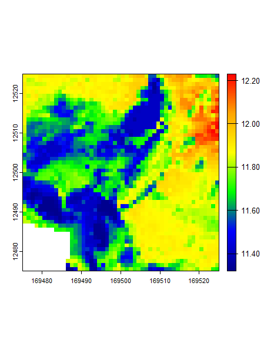\


### Running the model with arrays of climate data
In the examples above, the climate data provided as inputs to the model are provided as a data.frame. However, it may be the case that microclimate surfaces are required over larger areas over which the input climate varies. This situation is at the model input stage and when running the point microclimate model, and by converting the climate variables to multi-layer SpatRasters rather than vectors as in the example below. Here a dummy list of climate arrays is created. Functions `runpointmodela` and `subsetpointmodela` are then called. These functions run and subset the point microclimate model over every grid cell of the array. A coarse resolution dtm is then created that matches the extent, coordinate reference system and resolution of the climate arrays as this is used during the model input handling stage. The grid model can then be run as spreviously: the function checks the format of the data passed to it prior to running the model. HOwever, there are some additional inputs that need to be passed to the function to handle elevation adjustments to the coarse-resolution climate data. 

```{r eval=FALSE}
# Internal functions
.rast <- function(m,tem) {
  r<-rast(m)
  ext(r)<-ext(tem)
  crs(r)<-crs(tem)
  r
}
.ta<-function(x,dtm,xdim=5,ydim=5) {
   a<-array(rep(x,each=ydim*xdim),dim=c(ydim,xdim,length(x)))
   .rast(a,dtm)
}
# Create dummy array datasets
dtm <- rast(dtmcaerth) # unpack raster
climarrayr<-list(temp = .ta(climdata$temp, dtm),
  relhum = .ta(climdata$relhum, dtm),
  pres = .ta(climdata$pres, dtm),
  swdown = .ta(climdata$swdown, dtm),
  difrad = .ta(climdata$difrad, dtm),
  lwdown = .ta(climdata$lwdown, dtm),
  windspeed = .ta(climdata$windspeed, dtm),
  winddir = .ta(climdata$winddir, dtm),
  precip = .ta(climdata$precip, dtm))
tme <- as.POSIXlt(climdata$obs_time, tz="UTC")
# Run and subset point model array (using subset defaults)
micropointa <- runpointmodela(climarrayr, tme, reqhgt = 0.05, dtm, vegp, soilc)
micropointa <- subsetpointmodela(micropointa)
# Create coare-resolution dtm matching resolution of climate data
dtmc <- aggregate(dtm, 10, fun = "mean", na.rm = TRUE)
# Run model wiht no altitude correction
mout <- runmicro(micropointa, reqhgt = 0.05, vegp, soilc, dtm, dtmc, altcorrect = 0) 
```

The model takes a little longer to run this way, both because of the need to run the point model over multiple grid cells and because the point model outputs are resampled prior to running the grid model, but the code is still fairly efficient. 

If `altcorrect == 0', no elevation correction is performed. If `altcorrect > 0' difference between each pixel of dtm and dtmc are calculated and an elevation lapse rate correction is applied to the temperature and pressure data to account for these elevation differences. If `altcorrect`= 1, a fixed lapse rate of 5 degrees per 100m is applied to the temperature data. If `altcorrect`= 2, humidity-dependent lapse rates are calculated and applied.

## Running the model over large areas
R stores all data into internal memory and although, by using C++ code, memory requirements are substantially improved, the RAM requirements of the microclimate model can be pretty high if outputs are desired for numerous timesteps at high-resolution over large areas. To circumvent this issue the model can be run as tiles. However, the way that terrain shading effects and topographic wetness are calculated means that model outputs are prone to edge effects. To circumvent this issue, the function `runmicro_big` and `runmicro_biga` can be used, the former handling climate data provided as a data.frame and the latter as a list of arrays.  These functions calculated the wind shelter and topographic wetness over the entire study area before running the model in tiles,

In the example below, the application of `runmicro_big` is shown. First some example data are downloaded from Zenodo. These data are 10m resolution model inputs for the entire Lizard Peninsula in Cornwall, an area of approximately 400 square kilometers. 

In the first example, using `runmicro_big`, the model is run in tiles with the climate data provided as a data.frame. The code first runs the point microclimate model. The relevant terrain variables are then calculated over the whole study area and the model is then run in tiles. The example takes quite a while to run, but is included here for illustration purposes. Data are stored in a subfolder called `microut` in the directory specified by `pathout`. 

Some warnings are given when running the function to notify the user that direct radiation values in a few instances close to dawn and dusk are higher than expected clear-sky radiation values. This is taken care of by the model - the excess is assigned as diffuse radiation, so is nothing to worry about.

```{r eval=FALSE}
# Download example data from Zenodo
url <- "https://zenodo.org/records/15008936/files/runmicrobig.zip"
pathout<-"C:/Temp/tiles/"
dir.create(pathout)
setwd(pathout)
download.file(url, "modeldata.zip")
unzip("modeldata.zip")
# Read in spatial data
big_vegp <- readRDS("vegp_big.RDS")
big_soilc <-readRDS("soilc_big.RDS")
dtm<-rast("dem.tif")
# Read in climate dataframe
climdatadf <- readRDS("climdatapoint.RDS")
# Run and subset point model
micropoint <- runpointmodel(climdatadf, reqhgt = 0.05, dtm, big_vegp, big_soilc)
micropoint <- subsetpointmodel(micropoint, tstep = "month", what = "tmax")
# Run the model in tiles
runmicro_big(micropoint, reqhgt = 0.05, pathout = pathout, big_vegp, big_soilc, dtm)
```

The optimal tile size is automatically calculated. Entirely blank tiles (i.e anything with NA in the digital elevation dataset are skipped). Users have the option to specify the tile size or format of the data written to disk and there are quite a few other options for flexibly handling how the model is run. The help file associated with `runmicro_big` gives details. One useful feature is the ability to specify a tile overlap to avoid possible tiling effects. Model output variables for overlapping tiles can then, once converted to `terra::SpatRasters`, can be merged using function `mosaicblend`. This applies a distance weigting to the overlapping area so that sharp boundary effects are avoided. Another potentially useful option is to write the model outputs as compressed nc files. 

In the second example, using `runmicro_biga`, 1km resolution gridded climate data are used to drive the model. It is assumed that data have already been dowenloaded and unzipped. Again, the the code first runs the point microclimate model, but here the point model must be run for each of the ~400 1km grid cells, which itself takes a little while. Again, the relevant terrain variables are then calculated over the whole study area and the model is then run in tiles. As with `runmicro_big`, the size of tiles and the degree of overlap can be specified as user inputs. 

```{r eval=FALSE}
# Assumes data already downloaded from Zenodo - see above
pathout<-"C:/Temp/tiles/"
setwd(pathout)
big_vegp <- readRDS("vegp_big.RDS")
big_soilc <-readRDS("soilc_big.RDS")
dtm<-rast("dem.tif")
# Read in gridded climate data
climdatag <- readRDS("climdatagrid.RDS")
# Create other input variables
tme <- as.POSIXlt(c(0:8783) * 3600, origin = "2020-01-01 00:00", tz = "UTC")
dtmc <- aggregate(dtm, 100, fun = "mean", na.rm = TRUE)
# Run and subset point model over each 1km grid cell
micropointa <- runpointmodela(climdatag, tme, reqhgt = 0.05, dtm, big_vegp, big_soilc)
micropointa <- subsetpointmodela(micropointa, tstep = "month", what = "tmax")
# Run microclimate model in tiles (data saved to "C:/Temp/tiles2/")
runmicro_big(micropointa, reqhgt = 0.05, pathout = "C:/Temp/tiles2/", big_vegp, big_soilc, dtm, dtmc, altcorrect = 0)
```

Note that in contrast to when run using a point model input, altitudinal corrections can be handled using the control parameter `altcorrect`. 

## Bioclim variables
It is common practice to seek to model the distributions of species using bioclimate variables, and the most commonly used are those available from Worldclim. While it is far from the case that simply modelling species distributions using microclimate data will circumvent all the 
numerous issues associated with doing so using coarse-resolution macroclimate data, a function for modelling microclimate equivalents of the standard 19 bioclim variables is nonetheless provided.

Because rainfall typically does not vary that much at fine- spatial resolution, the function instead  calculates soil moisture equivalents for the rainfall-associated bioclim variables (in the top 10 cm of the soil).

To enhance computational efficiency the microclimate model is run for selected days only. Thus, to compute "mean annual temperature", the mean ambient temperature of each day in the input weather data is calculated, the day with median temperatures in each month selected and the mean across months calculated. This is not, strictly speaking, the same as the mean temperature, but differences are likely to be minor, and for each year of data supplied, there is an approximately 30-fold gain in computational efficiency by calculating e.g. BIO1 in this way. Similarly, to calculate maximum temperature (BIO1), the day of the year with the hottest ambient temperature is selected, and microclimate temperatures calculated on this day only. This ignores the possibility that on a slightly cooler, but sunnier day, microclimate temperatures may be hotter at certain locations. AS with the various runmodel options, If `hourly = TRUE` all hours within a given day are selected and calculations performed on hourly data. If If `hourly = FALSE` only the hours corresponding to times when hourly temperatures are at their daily maximum and minimum and selected. This results in a c. 10-fold increase in computational efficiency, but cannot pick out areas where terrain results in near-ground temperatures reaching a maximum later in the afternoon than the peak in ambient temperature. If weather data for more than one year are supplied, only one set of median, maximum and minimum monthly temperature data are selected representing an average across years. Resultantly, there is little computational penalty if providing data for multiple years in comparison to one year of data.

However, here we illustrate the function for one year of data only using the default inputs provided with the package. Note that this function flexibly handles the weather data being provided as either a data.frame or as a list of arrays. In the example below it is provided as a data.frame. The function takes ~20 seconds to run. The function returns a multilayer SpatRast of each of the bioclim variables

The input parameter `temp` indicates whether to return air or leaf temperature-derived bioclim variables. If `temp = leaf`, for grid cells where `reqhgt` is above vegetation, vertically averaged canopy temperature is used.
```{r eval=FALSE}
mypal <- colorRampPalette(c("darkblue", "blue", "green", "yellow", "orange",  "red"))(255)
# Set back to inbuilt datasets
vegp <- microclimf::vegp
soilc <- microclimf::soilc
bioclim <- runbioclim(climdata, 0.05, vegp, soilc, dtm, temp = "air")
plot(bioclim[[1]], col = mypal) # BIO1
```
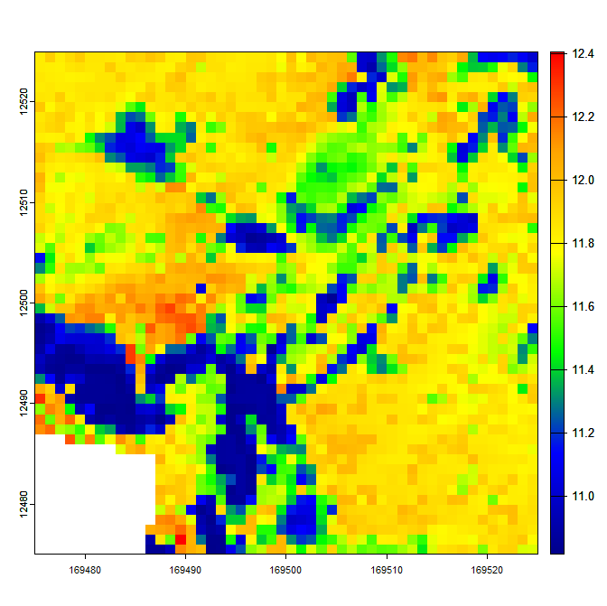\


## Snow
In all the examples above, no account of snow cover is taken, primarily because the location used for the examples, being nearly sub-tropical, is snow free. However, the same may not be true of other places, and the option to account for snow cover is included. This is handled by setting `snow = TRUE` in the input of `runmicro` and then also passing the outputs of the snow depth model. There are two options for running the snow model: a quick and  slower method. The distinction between the only matters when microclimate is modelling for a subset of days. Using the slow method a full  hourly model is run for each grid cell and snow depth, as one would expect, is partially contingent on snow depth in the previous time-step. The resulting output is then subset if required.  Using the quick method, a point snow model is run for every hour, but the full grid model is only run for the subset of days for which snow depths
are required. To ensure a sensible snow budget the point model is used to calculate hourly melt, and the nature of the terrain and vegetation used to calculate a melt factor by which to multiply snow melt derived form the point model. The application of both approaches is shown below. 

```{r eval=FALSE}
# Run and subset micropoint model using inbuilt datasets
climdata$temp <- climdata$temp - 8 # Make it colder so there is snow
micropoint <- runpointmodel(climdata, reqhgt = 0.05, dtmcaerth, vegp, soilc) 
micropoint <- subsetpointmodel(micropoint, tstep = "month", what = "tmin")
# Run the snow model using the quick method
smod1 <- runsnowmodel(climdata, micropoint, vegp, soilc, dtmcaerth, method = "fast")
# Run the snow model using the slow method
smod2 <- runsnowmodel(climdata, micropoint, vegp, soilc, dtmcaerth, method = "slow")
# Compare mean ground snow depths through time
sdepth1 <- apply(smod1$groundsnowdepth, 3, mean, na.rm = TRUE)
sdepth2 <- apply(smod2$groundsnowdepth, 3, mean, na.rm = TRUE)
plot(sdepth1, type = "l", ylim = c(0, 0.2))
par(new = TRUE)
plot(sdepth2, type = "l", ylim = c(0, 0.2), col = "blue")
```
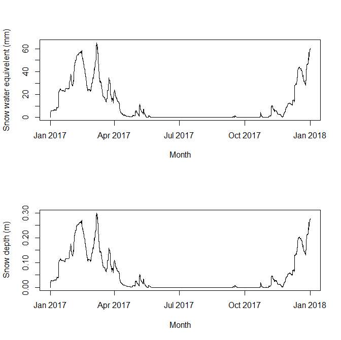\

In addition to ground snow depth, total snow water equivalent and average snowpack and ground snow temperature are returned. Though the quick method is a bit crude, the resulting microclimate outputs are very similar to those obtained using the slow method, only really deviating when the two methjods give different estimates of snow cover. Here we demonstrate this by running and comparing the microclimate model using both snow outputs.

```{r eval=FALSE}
# Run microclimate model with snow using outputs from the quick model
mout1 <- runmicro(micropoint, reqhgt = 0.05, vegp, soilc, dtmcaerth, snow = TRUE, snowmod = smod1)
# Run microclimate model with snow using outputs from the quick model
mout2 <- runmicro(micropoint, reqhgt = 0.05, vegp, soilc, dtmcaerth, snow = TRUE, snowmod = smod2)
Tz1 <- apply(mout1$Tz, 3, mean, na.rm = TRUE)
Tz2 <- apply(mout2$Tz, 3, mean, na.rm = TRUE)
plot(Tz1, type = "l", ylim = c(-10, 25), ylab = "Temperature")
par(new = T)
plot(Tz2, type = "l", ylim = c(-10, 25), col = "blue", ylab = "")
```
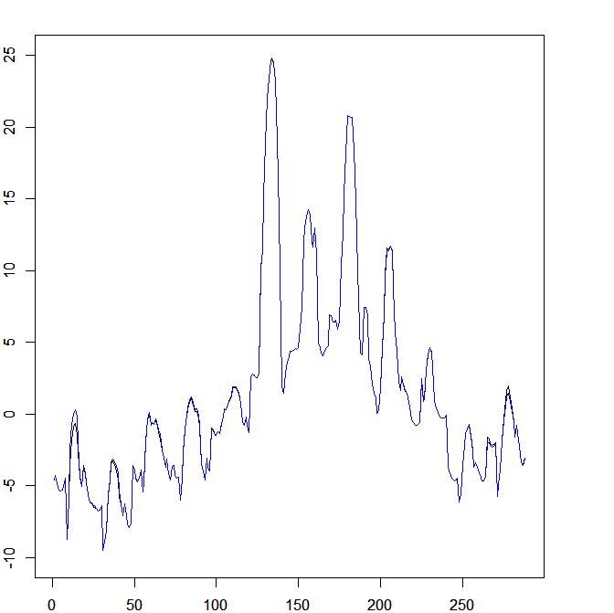\
