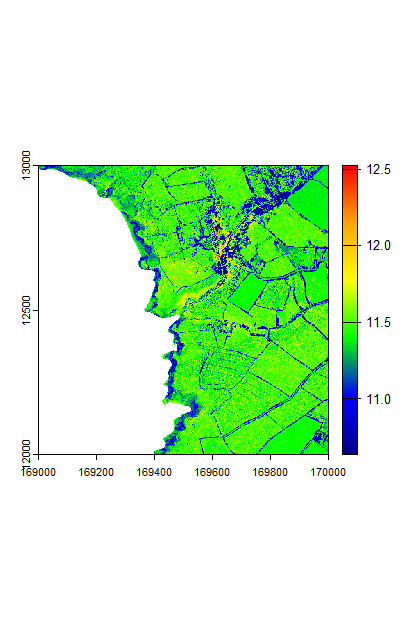
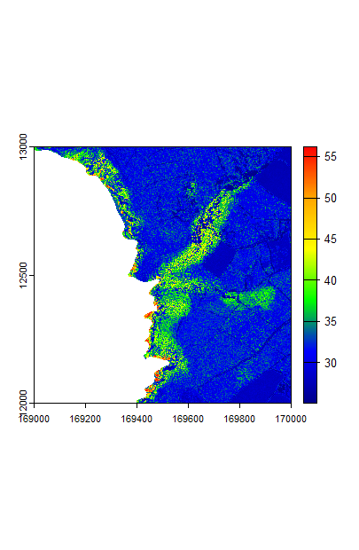
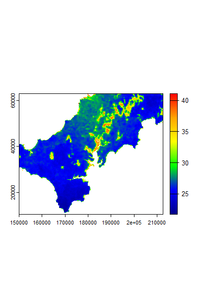

```{r setup, include = FALSE}
knitr::opts_chunk$set(
  collapse = TRUE,
  comment = "#>"
)
```
* [Overview](#overview)
* [Quick start](#quick-start)
* [Model inputs](#model-inputs)
  + [Meteorological data](#meteorological-data)
  + [Vegetation parameters](#vegetation-parameters)
  + [Soil parameters](#soil-parameters)
  + [Additional optional parameters](#additional-optional-parameters)
* [Running the point microclimate model](#running-the-point-microclimate-model)
* [Subsetting the microclimate model](#subsetting-the-microclimate-model)
* [Preparing model inputs](#preparing-model-inputs)
* [Running the model](#running-the-model)
  + [Soil moisture](#soil-moisture)
  + [Radiation](#radiation)
  + [Sensible heat flux and wind](#sensible-heat-flux-and-wind)
  + [Ground surface temperature](#ground-surface-temperature)
  + [Latent heat](#latent-heat)
  + [Above ground](#above-ground)
    + [Above canopy](#above-canopy)
    + [Below canopy](#below-canopy)
  + [Below ground](#below-ground)
  + [Running the whole model](#running-the-whole-model)
  + [Model output and formats](#model-output-and-formats)
  + [Running the model with arrays of climate data](#running-the-model-with-arrays-of-climate-data)
* [Running the model over large areas](#running-the-model-over-large-areas)
* [Bioclim variables](#bioclim-variables)


## Overview
This vignette describes the R package ‘microclimf’. The package contains a series of functions for modelling above and below canopy or below-ground microclimatic conditions across real landscapes, thereby providing gridded outputs.

In line with standard approaches for mechanistic microclimate modelling, the model is founded on the principles of energy conservation: it is assumed that energy cannot be destroyed or created through ordinary means. Opaque surfaces in the environment, namely the canopy and the ground, absorb radiation from the sun, but also emit radiation as thermal energy. These surfaces also exchange sensible heat with the surrounding air and undergo latent heat fluxes, namely evaporative and evapotranspirative cooling. Some of the energy is also stored or released by the ground. Because the various components of the energy budget have a dependence on temperature, the temperature of the environment is calculated by assuming that energy budget always remain in balance. However, because of various interdependencies, e.g. between the degree of surface heating and the exchange of sensible heat, and the temperature of the ground surface and the rate of storage by the ground, a closed-form mathematical solution to the energy budget equations cannot be derived. Rather the model must be solved iteratively, which is computational expensive if modelling over multiple grid cells. 

A key aim if microclimf is to ensure computational efficiency, which is achieved in four ways. First, it is assumed that the energy budget can be  solved mathematically using the Penman-Monteith method (Penman 1948; Monteith 1965) if these interdependencies are ignored, resulting in only modest errors. If doing so for a single point location, the ratio of the temperature offset from ambient air temperature for that location relative to that for any other location is preserved when solving the model iteratively. Thus, running the model iteratively for a single point location and solving the model mathematically for all grid cells, provides a route to estimating the iterative solution for the entire landscape in a computationally efficient manner. Second, and a further advantage of running a point model separately is that one can subset outputs from the point model. While the point model must be run in hourly time-increments there is no need to do so for the grid model: one can instead opt to select from the point model, only those hours that correspond to e.g. the monthly maximum, minimum or median temperature. Thirdly, when running the grid model, the calculations are essentially vectorised and are thus relatively computationally efficient in R. I.e. all calculations are performed simultaneously for each grid cell and time period. Lastly, some simplifying assumptions are about the nature of vegetated canopies to avoid the need to describe vertical variation in leaf foliage density in detail when characterising below-canopy microclimates. This eliminates the need to evoke a multi-layer canopy model. 


## Quick start
Here I provide brief instructions for how to run `microclimf`. More in-depth instructions are provided below. Five sets of input variables are needed: (1) a dataset of hourly weather, (2) a vector of daily rainfall, (3) a digital elevation dataset, (4) a dataset of vegetation parameters and (5) a dataset of soil properties. The datasets should have exactly the same format and units as the example datasets included with the package. The spatial resolution and extent of outputs is determined by the spatial resolution of the digital elevation dataset, and the spatial datasets of vegetation parameters and soil properties should also match the digital elevation dataset in terms of resolution and extent. It is important also that the x, y dimensions of the digital elevation dataset are equivalent – i.e. an equal area projection is used rather than say latitude and longitude, with  units of x, y and height all identical and typically in metres.

The first step to run the point model in hourly time increments, which is contained within the stand-alone package `microiter`, but called in `microclimf` using function `runpointmodel`. One then has the option to subset the point model to say return monthly values and pass these as inputs to the grid model. The grid model can be run in two modes: either in hourly time increments or, more computationally efficiently but less accurately, in daily time increments (for hours corresponding to the maximum and minimum daily temperatures). If run in the latter mode, there is also the also the option to return hourly values, derived by fitting the same diurnal cycle to temperatures and radiation as are present in the input climate dataset. 

In the code below, the point microclimate model is first run and then subset to return only those hours corresponding to the day in each month with the hottest and coldest temperature (as determined by the point model). These are then passed to `modelin` and and object of class `microin` is created, in effect combining the datasets needed to drive the model into the right format for running the grid model. Function `runmicro_hr` then runs the grid model in hourly time-steps, deriving microclimatic conditions 5 cm above ground. The model returns temperatures (leaf, ground and air), relative humidity, wind speed, and components of the radiation budget, all as 3D arrays, representing values for each pixel and time-period. In the final lines of codes, selected outputs are plotted


```{r eval=FALSE}
library(microclimf)
library(terra)
library(zoo)
library(abind)
# Runs point microclimate model with inbuilt datasets (takes ~ 6 seconds)
micropoint <- runpointmodel(climdata, rainfall, reqhgt = 0.05, vegp, soilc)
# Subset point model outputs
micropoint_mx <- subsetpointmodel(micropoint, tstep = "month", what = "tmax")
micropoint_mn <- subsetpointmodel(micropoint, tstep = "month", what = "tmin")
# Create model inputs with subset values and inbuilt datasets
micro_mx <- modelin(micropoint_mx, vegp, soilc, dtmcaerth)
micro_mn <- modelin(micropoint_mn, vegp, soilc, dtmcaerth)
# Run model 5 cm above ground (takes ~ 10 seconds to run on 50 x 50 x 288 values)
mout_mx<-runmicro_hr(micro_mx, reqhgt = 0.05)
mout_mn<-runmicro_hr(micro_mn, reqhgt = 0.05)
attributes(mout_mx)
# Plot air temperatures on hottest hour in micropoint (2017-06-20 11:00:00 UTC)
mypal <- colorRampPalette(c("darkblue", "blue", "green", "yellow", "orange",  "red"))(255)
plot(rast(mout_mx$Tz[,,132]), col = mypal, range = c(25, 48))
# Plot mean of monthly max and min
mairt<-apply((mout_mn$Tz + mout_mx$Tz) / 2, c(1,2),mean)
plot(rast(mairt), col = mypal)
```

The model can also be run in daily time increments. The default when so doing, as in the example, below, is to use the diurnal cycles in the hourly input data to expand the daily outputs to hourly values. Alternatively, the expand option in `runmicro_dy` can be set to FALSE. 

```{r eval=FALSE}
microd_mx<-modelin_dy(micropoint_mx,vegp,soilc,dtmcaerth)
moutd_mx<-runmicro_dy(microd_mx, 0.05)
plot(rast(moutd_mx$Tz[,,132]), col = mypal, range = c(25, 48))
```
In this instance, the results are near-identical similar to those produced using runmicro_hr (though see below). 

\
Comparison of maximum temperature estimated by running the model in hourly mode (left) and daily mode (right) at 11:00am

## Model inputs
Three sets of parameters are needed to run the model: (i) standard hourly meterological climate-forcing variables representative of macroclimatic conditions across the study site, usually in the form of a data.frame with single values for each hour (though the option to include an array of coarse-gridded values is also available - see below). (ii) A suite of parameters describing properties of the canopy in the form of high-resolution gridded values. (iii) A suite of parameters describing properties of the soil in the form of high-resolution gridded values. A raster of digital elevation data is also required. Optionally, some additional parameters can be set when running the models, as detailed below.

Each of set of parameters is described in turn. 

### Meteorological data
The inbuilt data,frame `climdata` gives an example of the hourly meteorological variables needed to run the model:

```{r}
library(microclimf)
head(climdata)
```

The data frame contains the following columns: `obs_time` – POSIXlt object of observation times for each climate variable, `temp` – temperatures (deg C), `relhum` - relative humidity (percentage), `pres` - atmospheric pressure (kPa), `swrad` - total shortwave radiation received by a horizontal surface (W/m^2), `difrad` - diffuse radiation (W/m^2), `skyem` sky emissivity (range 0 to 1), `windspeed` - wind speed at reference height (m/s) and `winddir` - wind direction in degrees. 

Any input weather dataset provided must use the same format, column names and units as in this example dataset. Most of these are standard meteorology variables that are readily available globally. If unknown for the study area, users may wish to explore the `mcera5` package on github (https://github.com/dklinges9/mcera5) or the `hourlyNCEP` function available in the microclima package (https://github.com/ilyamaclean/microclima).  Diffuse radiation, is sometimes harder to come by as many standard weather stations only estimate total radiation. If unknown, it can be estimated using the `difprop` function in the microctools package (https://github.com/ilyamaclean/microctools). The microctools package, also contains a function `converthumidity`, for converting absolute or specific humidity or vapour pressure to relative humidity.  

In addition to the above data frame of hourly weather variables, a vector of daily precipitation values is also required. 

### Vegetation parameters
The inbuilt dataset `vegp` gives an example of the vegetation parameters needed to run the model. Here the attributes are shown and individual parameters plotted:

```{r, fig.show='hold'}
library(terra)
attributes(vegp)
# Plot spatial and temporal variation in pai
plot(rast(vegp$pai[,,1]), main = "Jan PAI")
vegpmean<-apply(vegp$pai,3,mean,na.rm=T)
plot(vegpmean, type="l", main = "Seasonal variation in PAI")
# Plot other variables
plot(rast(vegp$hgt), main="Vegetation height") 
plot(rast(vegp$x), main = "Leaf angle distribution") 
plot(rast(vegp$gsmax), main="Max. stomatal conductance") 
plot(rast(vegp$clump[,,1]), main = "Jan Canopy clumping factor") # set to 0 
plot(rast(vegp$leafr),col=gray(0:255/255), main = "Leaf reflectance")
plot(rast(vegp$leafd), main = "Mean leaf diameter") # set to 0.05
plot(rast(vegp$leaft),col=gray(0:255/255), main = "Leaf transmittance") # set equal to leafr
```

If users do know values of these vegetation parameters across their study area, they can be approximated from habitat type using the `vegpfromhab` function. This function takes as an input, a raster of habitat types numerically coded as follows:

(1) for Evergreen needleleaf forest,
(2) for Evergreen broadleaf forest,
(3) for Deciduous needleleaf forest,
(4) for Deciduous broadleaf forest,
(5) for Mixed forest,
(6) for Closed shrubland,
(7) for Open shrubland,
(8) for Woody savanna,
(9) for Savanna,
(10) for Short grassland,
(11) for Tall grassland,
(12) for Permanent wetland,
(13) for Cropland,
(14) for Urban and built-up,
(15) for Cropland / Natural vegetation mosaic and
(16) for Barren or sparsely vegetated


It returns an object of class vegparams as required by the model. Here this is illustrated using he inbuilt habitat SpatRast layer 

```{r, fig.show='hold'}
plot(rast(habitats), main = "Habitat types") # inbuilt habitat SpatRast layer
tme<-as.POSIXlt(c(0:8783)*3600,origin="2000-01-01 00:00", tz = "GMT")
# Create an object of class vegparams:
veg<-vegpfromhab(habitats,lat=50,long=-5,tme=tme)
```

Note however, that be doing so, all values for a habitat type will be identical, when in reality this is unlikely to be the case. If one is unable to quantify the main determinants of microclimatic variation then there is little prospect of being able to model microclimatic conditions accurately and any outputs form the model should be treated with a high-degree of skepticism. 

The model is most sensitive to `pai`. The plant area index is the total one sided area of both leaves and woody and dead vegetation per unit ground area. It is needed primarily so that canopy cover can be estimated, but even for temperatures above canopy, `pai` partially determines the temperature profile. The first two dimensions of the array must correspond with those of the various SpatRast objects (as well as the resolution and extent of the input raster elevation dataset). The third dimension is included to account for potential seasonal variation in `pai`. The clumping factor is also assumed to vary seasonally as it is likely to be affected by pai. All other vegetation variables are assumed time-invariant. Any number of replicate `pai` and `clump` values can be provided up to the number of climate observations. If fewer than the number of climate observation are provided, then data are interpolated. In `vegp` 12 replicates are provided - representing approximately monthly values across the year. The model is also sensitive to `hgt`, primarily as this dictates whether the temperature at a given height is above or below canopy, but it also has an important bearing on temperature profiles above canopy. 

The model is less sensitive to other parameters. The parameter `x` represents how vertically or horizontally the leaves of the canopy are orientated and controls how much direct radiation is transmitted through the canopy at a given solar angle (when the sun is low above the horizon, less radiation is transmitted through vertically orientated leaves). Users may refer to Campbell (1986) Agric For Meteorol, 36: 317-321 for a detailed explanation. Values for deciduous woodland are typically around 1, but for grassland may be closer to 0.2. The parameter `gsmax` is the maximum stomatal conductance (mol / m^2 / s) of leaves and is needed for evapotranspiration calculations. Values typically range from 0.23 for deciduous broadleaf forest to 0.55 for wetland vegetation. Körner (1995) https://link.springer.com/chapter/10.1007/978-3-642-79354-7_22 gives values for major vegetation types of the world. The parameter ‘leafr’ is the leaf reflectance to shortwave radiation, with typical values around 0.4. 

The parameter `clump` dictates how much radiation passes through gaps in the canopy, and therefore represents the sub-pixel canopy clumpiness, with values ranging from 0 (uniform) to 1 (highly clumped). In general, it varies with vegetation height and plant area index. The function `clumpestimate` can be used to derive an approximate estimate. The parameter `leafd` is the mean diameter of leaves. 

The `vegpfromhab` function assigns approximate values for leaf reflectance accordance to habitat type. However, it can also be estimated from surface albedo using function `leafrfromalb`. In applying this function, leaf transmittance is assumed proportional to leaf reflectance and a proportionality coefficient can be specified. In general, model outputs are not sensitive to this coefficient,  

### Soil parameters
The inbuilt dataset `soilc` gives an example of the soil parameters needed to run the model. Here the attributes are shown and plotted:

```{r, fig.show='hold'}
attributes(soilc)
plot(rast(soilc$soiltype), main = "Soiltype") # Clay loam throughout
plot(rast(soilc$groundr), col=gray(0:255/255), main = "Soil reflectivity")
```

* This is a list of the following:
    * `soiltype` - a PackedSpatRast object of integer soil types
    * `groundr` - a PackedSpatRast object of soil reflectance values for shortwave radiation (0 - 1)

Again, users in creating such a dataset, can store `soiltype` and `groundr` as either a PackedSpatRast or a SpatRast object.

Soil type 7 corresponds to Clay loam. A full list of which numeric values correspond to which soil types, along with parameters associated with these soil types is shown in the `soilparameters` table:

```{r}
soilparameters
```

### Additional optional parameters
In addition to specifying `reqhgt` the required height (m) above (positive) or below (negative) for which microclimate estimates are required, there are also a set of optional parameters that can be provided to the run functions that control model behaviour. 

* These are detailed below where various component functions are described, but in brief, these are:
  * `windhgt` - height above ground of wind speed data in weather (see details under wind)
  * `soilm` - a vector of hourly soil moisture values in upper 10 cm of the soil (calculated using a simple soil model if not supplied - see details under running the point model)
  * `dTmx` - maximum amount by which canopy or ground surface temperatures can exceed air temperatures when running the point model (see details under running the point model).
  * `maxiter` - integer indicating the maximum number of iterations to use when running the point model (see details under running the point model)
  * `runchecks` - logical indicating whether to call function `checkinputs` to run checks on format and units of input data (see details under model input functions).
  * `xyf` an optional input that controls how the wind profile is calculated (see details under wind).
  * `tfact` - a coefficient determining the sensitivity of soil moisture to variation in topographic wetness (see details under soil moisture).
  * `pai_a` an array of plant area index values above `reqhgt`. Estimated by assuming a plausible vertical distribution of leaf foliage density if left as 'NA` (see details under radiation)
  * `surfwet` - the fraction of the vegetation surface acting as a saturated water surface (controls evapotranspiration). Calculated using a simple model if not supplied (see details under temperatures above canopy)
  * `slr`, `apr` and `twi` - optional SpatRaster objects of slope, aspect, and topographic wetness. If not supplied, these are calculated from the provided `dtm`, but users may wish to provide their own values to avoid edge effects.
  * `hor` and `wsa` - optional array of the tangent of the angle to the horizon in 24 directions (used for calculating terrain shading) and wind shelter coefficients in 8 directions (used for determining wind speed). As for (10), if not supplied, these are calculated from the provided `dtm`, but users may wish to provide their own values to avoid edge effects.

## Running the point microclimate model
To ensure the grid model can be run without iteration, the first stage of modelling is to run a point microclimate model iteratively for a flat surface at the centre of the study area using as inputs to the model, vegetation and soil characteristics that are broadly representative of the study area. This is achieved automatically using function `runpointmodel`, using as inputs to the model, the same inputs that are supplied to the grid model as follows:

```{r eval=FALSE}
micropoint <- runpointmodel(climdata, rainfall, reqhgt = 0.05, vegp, soilc)
```

Note that here, several optional inputs to the point model are ignored. These are:

* `soilm` - a vector of hourly soil moisture values in upper 10 cm of the soil. If not provided, a simple soil moisture model is run, but users may prefer instead to use aoutputs form a more complex soil moisture model such as that included with the 'NicheMapR package.
* `dTmx` - maximum amount by which canopy or ground surface temperatures in degrees C can exceed air temperatures when running the point model. Setting this to ~20-30 degrees in most environments is realistic and helps to ensure that the model can converge. 
* `maxiter` - integer indicating the maximum number of iterations to use when running the point model. The higher the number of iterations, the lower the error, but the greater the run time.
* `yearG` - optional logical indicating whether or not to account for annual variation in the ground heat flux. By default this should be set to `TRUE`, but setting it to false enables the model to be run sensibly on subsets of data of less than a year or to select particular days of the year over which to run the point model. 
* `lat` and `long` - calaculated from the dtm if not supplied, but passed to the function to avoid minor tiling effects when running the model over large areas (see below)  


Interrogating the attributes of `micropoint` allows us to see what the model returns:
```{r}
attributes(micropoint)
```

The function essentially gathers the supplied weather and precipitation datasets into a single list object. If none of the vegetation is greater than two meters in height the output `zref` is set to 2 m and `windhgt` is also two meters, the returned weather dataset is identical to that provided the function. However, for the grid microclimate model to derive below-canopy wind and temperature profiles, the reference height must be higher than the tallest vegetation in the study area. For that reason, if the tallest vegetation exceeds two meters, `zref` is set to the maximum height of the vegetation and the wind speeds and temperatures are adjusted for height in the weather dataset. 

The vector of hourly soil moisture values is contained in `soilm`. `Tbz` and `DD` are the temperature below ground and damping depths both used for modelling temperatures below ground, but are here set to `NA` here as when running the model `reqhgt` was set as 0.05 (above ground). `vegp_p`, `groundp_p` and `soiltype` are the calculated vegetation, soil and ground parameters for the point location at the centre of the study area (essentially average values, or in the case of soil type, the modal value calculated from inputs supplied to the model. The parameters `lat` and `long` are the latitude and longitude of the centre of the study area (calculated from the supplied SpatRast `dtm`, which must have its coordinate reference system specified), `tstep` is here set to hourly to remind the user the model was run in hourly time increments.

The model outputs themselves are stored in `microp`:

```{r}
attributes(micropoint$microp)
```

* This is an object of class `pointmicro`, namely a list of the following: 
  * `tme` - POSIXlt object of times and dates corresponding to model outputs.
  * `Tc` - a vector of hourly canopy heat exchange surface temperatures, in effect, approximately the average temperature of the canopy. 
  * `Tg` - a vector of hourly ground surface temperatures. 
  * `H` - a vector of hourly sensible heat fluxes from the canopy. 
  * `G` - a vector of hourly ground heat fluxes
  * `psih`, `psim`, `phih` and `OL` - vectors of hourly diabatic correction factors for (i) heat and (ii) momentum, (iii) diabatic influencing factor for heat and (iv) Obukhov lengths – these are essentially measures of the degree of thermally-induced turbulence above the ground surface.
  * `uf` - a vector of hourly the wind fraction velocities - these, relative to the wind speed at reference height control the shape of the wind profile.
  * `RabsG` - a vector of hourly radiation fluxes absorbed by the ground surface
  * `error.mar` - the maximum temperature difference between the ultimate and penultimate iteration of model.
  
## Subsetting the microclimate model
The point microclimate model is usually run in hourly time-increments to fully allow for the diurnal cycles in ground heat fluxes to be accounted for, but if desired, the grid model can be run in longer time intervals. This is achieved using function `subsetpointmodel`. This function takes an object of class ‘pointmicro` as an input and also returns an object of class ‘pointmicro`, but with the request hours extracted from ‘pointmicro`

In the example below, the model is subset to return only those hours corresponding to the day in each month with the hottest temperature (as determined by the point model). The function has several inputs that control its behaviour. If 'tstep' is set to `year` the day in each year with the e.g. the hottest or coldest hourly temperature is identified, and if 'tstep' is set to `month` the days in each month in each year with e.g. the hottest or coldest hourly temperatures are returned. By default, values for all hours of that day are returned, as this ensures that the ground heat flux in the grid microclimate model can be estimated more accurately. If `what` is set to `tmax` or `tmin` the hottest or coldest hour within each month or year are identified. If `what` is set to `tmedian` hourly temperatures within the month or year are ranked and the median hour identified. The final option is to provide a vector of the days in the time sequence to return data for using input `days`. If provided `tstep` is ignored.

```{r}
micropoint <- subsetpointmodel(micropoint, tstep = "month", what = "tmax")
```

## Preparing model inputs
The microclimate model of `microclimf` can be run either in hourly time-steps (more accurate, but less computationally efficient) or in daily time-steps in which calculates are performed for time-periods corresponding to maximum and minimum temperatures only (less accurate, but faster). If run in daily time-steps, there is also the option to expand data back out to hourly based on diurnal temperature variations reflected in the input climate data.

There are four options for preparing the data for running the model. Firstly where the climate data are in the form of a data frame of hourly weather for a point location and the model is to be run in hourly time-steps. Secondly, where the climate data are in the form of a data frame of hourly weather for a point location and the model is to be run in daily time-steps. Thirdly, where the climate data are in the form of course-gridded array of values and the model is to be run in hourly time-steps. Lastly, where the climate data are in the form of course-gridded array of values and the model is to be run in daily time-steps. 

For the first case, the function `modelin` is used. In the example below, the inbuilt datasets of parameter values and a dtm for the study area, `dtmcaerth` are used. 

```{r, fig.show='hold'}
plot(rast(dtmcaerth))
micro <- modelin(micropoint, vegp, soilc, dtmcaerth)
```

In the second case, the function `modelin_dy` is used in place of `modelin` and in the third and fourth cases `modelina` and `modelina_dy` are used. 

By default `modelin` (and the equivalents for daily data and arrays) call function `checkinputs`. This performs some basic checks on the vegetation and soil parameters data to check for consistency in extent to the dtm. It also ensure values in the climate datasets are typical of what would be expected, thereby helping to ensure the correct units are used.

In subsequent downscaling of wind, the drag effects of vegetation, determined by vegetation height and foliage area are accounted for and calculated at this stage. In so doing, it is necessary to accommodate the possibility that the wind speed is not just affected by the surface roughness in each pixel, but also by vegetation surrounding the location. This is accommodated for by applying `xyf` which effectively smooths the surface roughness coefficients using `terra::aggregate` where `xyf` is the aggregation factor. If `xyf` is set to `NA`, the roughness coefficients are averaged across the entire study area.

## Running the model
The model can be run in its entirety using functions `runmicro_hr` or `runmicro_dy` as in quick start examples above. However, a  bi-product if performing calculations on all grid cells and time-periods is that all datasets are loaded into internal memory, meaning that the model cannot be run over large areas in one go. The functions `runmicro_big` (weather data provided as a data,frame) and `runmicro_biga` (weather data provided as arrays) aid with this, by automatically running the microclimate models in tiles. Prior to doing so, datasets such as slope, aspect, topographic wetness are automatically calculated for the the entire area to avoid edge effects within each tile. 

The more computationally efficient `runmicro_dy` works well for hours corresponding 
to those for which a flat surface is warmest (as in the example under Quick start above) or in relatively flat terrain, where vegetation drives most of the variation in microclimate. It works significantly less well on sunny days in areas with varied topography, where the timing of peak temperatures on e.g. SW-facing slopes (in the northern hemisphere) may occur later in the afternoon. This is because the daily method (with `expand = TRUE`) assumes that temperatures peak at the same time of day across the entire study area, and then adjusts them downward if say, a flat surface, is cooler in the afternoon. This can be seen by cycling through an entire day`s worth of hourly temperatures as in the example below.

```{r eval=FALSE}
par(mfrow=c(1,2))
for (hr in 121:144) {
  plot(rast(mout_mx$Tz[,,hr]), col = mypal, range = c(16, 48),main = as.character(mout_mx$tme[hr]))
  plot(rast(moutd_mx$Tz[,,hr]), col = mypal, range = c(16, 48),main="Daily")
  Sys.sleep(1)   
}
```

\
Comparison of maximum temperature estimated by running the model in hourly mode (left) and daily mode (right) later in the afternoon.

As can be seen discrepancies are large on this particular afternoon as fraction of radiation is direct and terrain therefore has a strong bearing on temperatures. This is the main reason why both `runmicro_hr` and `runmicro_dy` are available as options to the user. The latter, should be used with caution. 


To illustrate the workings of the model, we here run each component of the model in stages. The process is illustrated for the model run in hourly time-increments, and in the majority of instances the functions called are the same if running the model in daily time-increments. Where this is not the case, the equivalent functions for running components of the model in daily time increments are referred to.

### Soil moisture
The first step of the microclimate model is to estimate soil moisture. This is handled in `microclimf`, by spatially distributing the soil moisture values returned by the point microclimate model for each time increment using the the Bevan and Kirkby (1979) topographic wetness index, such that valleys and flat areas are assumed to have higher water content. Values are adjusted such that the average for the study area in each time step is equivalent to the value obtained by running the point model. Users have the option to control the sensitivity of this topographic adjustment.  Irrespective of whether the model is run in hourly or daily time-increments, these calculations are performed using the `soilmdistribute` as in the example below.

```{r eval=FALSE}
micro<-soilmdistribute(micro)
par(mfrow = c(1,1)) # make sure output is a single panel figure
plot(rast(micro$soild[,,132]), col = rev(mypal))
```
\

### Radiation
The next stage, needed to calculate soil surface temperature, is to estimate radiation absorbed by the ground.  Because the ground lies below canopy in some instances, it is necessary also to consider the transmission of radiation through the canopy. The radiation fluxes are modelled using function `twostream`, which implements a variant of the Dickenson-Sellers two-stream radiation model described in Yuan et al. (2017) J Adv Model Earth Sy 9: 113–129 to model radiation interception by the canopy. It also varies from the Dickenson-Sellers model in more explicitly handing sloped ground surfaces beneath a canopy. 

Absorbed radiation is the total incoming radiation received by a surface less that transmitted or reflected. The total incoming radiation can be partitioned into three sources, each of which is modified by the environment in slightly different ways. The first is direct radiation from the sun. Here, absorption depends on the angle of the surface relative to perpendicular. This is the reason why equatorward-facing slopes are warmer than those that face poleward and is indeed the main reason why temperature increases with latitude. Here the solar beam is more concentrated, rather like shining a torch directly on a surface as opposed to obliquely. The second source is diffuse solar radiation: that scattered by particles and clouds in the atmosphere. The final source is longwave radiation emitted from surrounding surfaces and the sky. The latter two are isotropic (i.e. having the same value when measured in any direction). In consequence, for these sources, the direction of the surface is unimportant, and radiation interception is instead influenced by sky-view.

Function `twostream` calculates all of these fluxes. If `reqhgt > 0` it also calculates the fluxes at the height of interest, including the upward fluxes resulting from reflection by the ground surface and scattering by leaves within the canopy. Additionally, to aid with modelling of air temperatures, it also calculates the flux density of radiation absorbed by both the canopy and the ground surface.

To model radiation, the canopy as a turbid medium and the transmission of radiation by vegetation is thus described using an equation similar to Beer's law, in which flux density of radiation is assumed dependent on the total one-side lead area per unit ground area and by an extinction coefficient for the canopy. For direct radiation, the extinction coefficient is assumed to depend on the distribution of leaf angles (with more vertically orientated leaves transmitting less radiation at lower solar altitudes). This is where the model input `vegp$x` comes into play. For isotropic sources of radiation (i.e. diffuse and longwave), leaf angle is assumed unimportant. 

In the example below the flux density of shortwave and longwave radiation absorbed by the ground surface at 17:00 hours on 20th Jun 2017 is shown. Below that, the flux density of the upward and downward radiation streams 5 cm above the ground are shown (the downward flux comprises both direct and diffuse radiation, the upward flux is assumed entirely diffuse).


```{r eval=FALSE}
micro <- twostream(micro, reqhgt = 0.05)
par(mfrow=c(1,2))
plot(rast(micro$radGsw[,,138]), col = mypal, main = "Shortwave")
plot(rast(micro$radGlw[,,138]), col = mypal, main = "Longwave")
```
\


```{r eval=FALSE}
plot(rast(micro$Rbdown[,,138]+micro$Rddown[,,138]), col = mypal, main = "Downward shortwave")
plot(rast(micro$Rdup[,,138]), col = mypal, main = "Upward shortwave")
```
\

### Sensible heat flux and wind
A surface heated by solar radiation will loose some of this heat to the surrounding air, and by virtue of the laws of energy conservation, the air gains this heat. The exchange of heat between a surface and the surrounding air is termed sensible heat exchange and is influenced strongly wind speed. The next stage of modelling is therefore to calculate wind speed.

The function `wind` models two processes. Firstly, direction-dependent terrain shelter coefficients are applied. Secondly, the effects of vegetation on wind speeds are determined. If `reqhgt` is above the vegetation, the shaped of the wind speed above vegetation is determined by the degree of surface drag, in turn contingent upon vegetation height and the plant area index of vegetation. If `reqhgt` is below canopy, the effects of vegetation is to attenuate wind speeds, but the shape of the wind-height profile below and above canopy differs. For a given `reqhgt` some pixels may lie below canopy and some above. This is all handled automatically by function `wind` as in the example below.    

```{r eval=FALSE}
micro <- wind(micro, reqhgt = 0.05)
par(mfrow=c(1,1))
plot(rast(micro$uz[,,100]), col = mypal, main = "Wind speed")
```
\

The lower wind speeds in the valley caused by terrain sheltering are evident. The speckle in the figure is caused by vegetation. 

One additional complexity is that above canopy, although the wind-height profile is determined by the degree of surface roughness, it is necessary to accommodate the possibility that the wind speed is not just affected by the surface roughness in each pixel,  but also by vegetation surrounding the location. This is handled by specifying `xyf` in the model input (it is handled at this stage for computation reasons), which essentially smooths
the surface roughness coefficients using `terra::aggregate` where `xyf` is the aggregation factor. If `xyf` is set to `NA`, the roughness coefficients are averaged across the study area. In the example below, the effects of this can be seen. The model is run from scratch and the wind function run using three different options for handing surface roughness 

```{r eval=FALSE}
micropoint<-microclimf::micropoint 
micropoint<-subsetpointmodel(micropoint, tstep = "month", what = "tmax")
# Default xyf = 1:
micro1 <- modelin(micropoint, vegp, soilc, dtmcaerth)
# Smoothed by a factor of 10: 
micro2 <- modelin(micropoint, vegp, soilc, dtmcaerth, xyf = 10)  
# Averaged across the entire study area
micro3 <- modelin(micropoint, vegp, soilc, dtmcaerth, xyf = NA)  
micro1<-wind(micro1, reqhgt = 0.1)
micro2<-wind(micro2, reqhgt = 0.1)
micro3<-wind(micro3, reqhgt = 0.1)
mypal <- colorRampPalette(c("darkblue", "blue", "green", "yellow", "orange",  "red"))(255)
par(mfrow=c(1,3))
plot(rast(micro1$uz[,,100]), col = mypal, main = "Option 1")
plot(rast(micro2$uz[,,100]), col = mypal, main = "Option 2")
plot(rast(micro3$uz[,,100]), col = mypal, main = "Option 3")
```
\

One minor additional point to note is that when calling any of the component functions after creating the model input using e.g. `modelin` there is no need to run the components prior to that. The function automatically checks whether these have been run, and if necessary does so.

### Ground surface temperature
Once radiation absorbed by the ground and wind speed have been calculated, ground surface temperature can be computed. This is done using either function `soiltemp_hr` or `soiltemp_dy` depending on whether the model input is daily or hourly. Whereas `twostream` and `wind` handle both hourly or daily data, because ground heat fluxes are calculated in different ways depending on whether inputs are hourly or daily, the functions used for each differ. In the example below, the ground surface temperature on the hottest hour of the year is calculated using `soiltemp_hr` and then plotted.

```{r eval=FALSE}
micropoint<-microclimf::micropoint
micropoint<-subsetpointmodel(micropoint, tstep = "month", what = "tmax")
micro <- modelin(micropoint, vegp, soilc, dtmcaerth)
micro <- soiltemp_hr(micro, reqhgt = 0.05)
par(mfrow=c(1,1))
plot(rast(micro$T0[,,132]), col = mypal, main = "Soil surface temperature")
```
\

As can be seen, the soil surface temperatures on south-facing slopes get pretty hot

### Above ground
After calculating ground surface temperature, there are two pathways, depending on whether microclimatic conditions below or above ground are required. If `reqhgt > 0` then function `temphumE` is called as in the example below. This essentially runs the full microclimate model. Details of the model outputs are specified below.   

```{r eval=FALSE}
mout <- temphumE(micro, reqhgt = 0.05)
plot(rast(mout$Tz[,,132]), col = mypal, main = "Air temperature")
```
\

In the example above air temperature in the hottest hour is plotted. Users are free to experiment with plotting other model outputs. The air temperature at 5 cm is significantly lower than the ground surface temperature, but much higher than ambient temperature on south-facing slopes, as one would expect

#### Above canopy
The function `temphumE` automatically works out which pixels are below canopy, and which above, but the microclimate is modelled differs. To work out temperatures above canopy, the canopy (and soil surface) are treated as a single layer of homogeneous phytomass and the energy balance solved to derive the mean temperature of the canopy. The canopy is then assumed to exchange heat with the air above it such that close to the heat exchange surface of the canopy, air temperatures similar to canopy temperatures, but are increasingly close to air temperature at reference height (i.e. the at height of the input weather station data). The result is a logarithmic temperature-height (and humidity) profile as re-reproduced in the example below in which the model is run at multiple heights over a small area with spatially uniform, terrain, soil and vegetation properties.

```{r eval=FALSE}
micropoint <- microclimf::micropoint
micropoint <- subsetpointmodel(micropoint, tstep = "month", what = "tmax")
dem <- aggregate(rast(dtmcaerth), 10) * 0
# Create spatially uniform vegetation a\nd soil parameters  dataset
vegp2 <- list(pai = array(0.05, dim = c(5, 5, 12)),
              hgt = aggregate(rast(vegp$hgt), 10) * 0 + 0.005,
              x = aggregate(rast(vegp$x), 10) * 0 + 1,
              gsmax = aggregate(rast(vegp$x), 10) * 0 + 1,
              leafr = aggregate(rast(vegp$x), 10) * 0 + 0.3,
              clump = array(0, dim = c(5, 5, 12)),
              leafd = aggregate(rast(vegp$x), 10) * 0 + 0.05,
              leaft = aggregate(rast(vegp$x), 10) * 0 + 0.15)
soilc2 <- list(soiltype = aggregate(rast(soilc$soiltype), 10),
               groundr = aggregate(rast(soilc$groundr), 10) * 0 + 0.15)
# Create model input
micro <- modelin(micropoint, vegp2, soilc2, dem)
# Run model for multiple heights
reqhgts<-c(0.01,0.02,0.05,0.1,0.2,0.5,1)
temps <- 0
for (i in 1:length(reqhgts)) {
  mout <- temphumE(micro, reqhgt = reqhgts[i])     
  temps[i] <- mout$Tz[2, 2, 132] # Extract temperature for hottest hour   
}
par(mar = c (5, 5, 2, 2))
plot(reqhgts ~ temps, type = "l", lwd = 2, xlab = "Temperature", ylab = "Height")
```
\

One minor point worth noting is that when running the point model above ground, the input `reqhgt` is just used to determine whether to return the required variables for modelling microclimate above ground and the point model itself does not need to be run for separate heights as it just returns temperature and other microclimate variables for the heat exchange surface of the canopy. This is not the case below ground, as here the point model returns microclimate parameters specifically associated with the specified depth.   

#### Below canopy
Below canopy, variation in the energy budget within the canopy must be more explicitly handled. The `microclimf` package contains a theoretically-grounded model emulator of Raupach's localised near-field model. In this model, the temperature (or humidity) is assumed to comprise both a `near-field and 'far field' contribution. In essence, the canopy is assumed to comprise multiple layers and far-field contribution is result from heat (or vapour) emanating from the entire canopy downwind of the point of interest. When the net energy balance of the canopy is positive, the result is an approximately linear increase in temperature (or vapour) as one descends through the canopy because at lower heights. However, for far-field-height profile, the effects of ground surface temperature must be accounted for, and the air temperature close to the ground is thus close to ground surface temperature. An additional 'near-field' contribution is then calculated, in the effect determined by the energy budget and the foliage density close to the height of interest. To calculate the foliage density, plausible assumptions about the vertical distribution of foliage are made, such that foliage density is determined from the plant area index. The model is not unduly sensitive to assumptions about the vertical distribution of foliage.        
    
The net result is a more complex temperature-height (and humidity) profile as re-reproduced in the example below in which the model is run at multiple heights over a small area with spatially uniform, terrain, soil and vegetation properties. 

```{r eval=FALSE}
# Create spatially uniform vegetation a\nd soil parameters  dataset
vegp2 <- list(pai = array(3, dim = c(5, 5, 12)),
              hgt = aggregate(rast(vegp$hgt), 10) * 0 + 10,
              x = aggregate(rast(vegp$x), 10) * 0 + 1,
              gsmax = aggregate(rast(vegp$x), 10) * 0 + 1,
              leafr = aggregate(rast(vegp$x), 10) * 0 + 0.3,
              clump = array(0, dim = c(5, 5, 12)),
              leafd = aggregate(rast(vegp$x), 10) * 0 + 0.05,
              leaft = aggregate(rast(vegp$x), 10) * 0 + 0.15)
soilc2 <- list(soiltype = aggregate(rast(soilc$soiltype), 10),
               groundr = aggregate(rast(soilc$groundr), 10) * 0 + 0.15)
# Run and subset point model (reqhgt just used to determine whether above or below ground)
micropoint <- runpointmodel(climdata, rainfall, vegp2, soilc2, reqhgt = 10)
micropoint <- subsetpointmodel(micropoint, tstep = "month", what = "tmax")
# Create model input
micro <- modelin(micropoint, vegp2, soilc2, dem)
# Run model for multiple heights
reqhgts<-c(0.01, 1, 2, 3, 4, 5, 6, 7, 8, 9, 10)
temps <- 0
for (i in 1:length(reqhgts)) {
  mout <- temphumE(micro, reqhgt = reqhgts[i])     
  temps[i] <- mout$Tz[2, 2, 132] # Extract temperature for hottest hour   
}
par(mar = c (5, 5, 2, 2))
plot(reqhgts ~ temps, type = "l", lwd = 2, xlab = "Temperature", ylab = "Height")
```
\
 
#### Below ground
If `reqhgt` is negative, functions `below_hr` (hourly) or `below_dy` (daily) are used and it is assumed that microclimatic conditions below ground are needed. The way the model works is to assume, that once ground surface temperatures are calculated, that both the annual and diurnal temperatures cycle is dampened by the specific heat capacity and thermal conductivity of the soil, themselves contingent on soil physical characteristics and water content. There is also a phase shift  

This can be seen in the example below in which the model is run in hourly time-increments for the entire year at three different depths and time-series of soil temperature plotted.

```{r eval=FALSE}
# Run microclimate model for reqhgt = -0.05m
micropoint1 <- runpointmodel(climdata, rainfall, reqhgt = -0.05, vegp2, soilc2)
micro1 <- modelin(micropoint1, vegp2, soilc2, dem)
mout1 <- below_hr(micro1, reqhgt = -0.05)
T1<-mout1$Tz[2,2,]
# Run microclimate model for reqhgt = -0.2m
micropoint2 <- runpointmodel(climdata, rainfall, reqhgt = -0.2, vegp2, soilc2)
micro2 <- modelin(micropoint2, vegp2, soilc2, dem)
mout2 <- below_hr(micro2, reqhgt = -0.2)
T2<-mout2$Tz[2,2,]
# Run microclimate model for reqhgt = -1m 
micropoint3 <- runpointmodel(climdata, rainfall, reqhgt = -1, vegp2, soilc2)
micro3 <- modelin(micropoint3, vegp2, soilc2, dem)
mout3 <- below_hr(micro3, reqhgt = -1)
T3<-mout3$Tz[2,2,]
# PLot soil temperature time-series
plot(T1, type="l", ylim = c(0, 25), col = "red", ylab = "Temperature", xlab = "Hour")
par(new = TRUE)
plot(T2, type="l", ylim = c(0, 25), ylab = "", xlab = "")
par(new = TRUE)
plot(T3, type="l", col = "darkgray", lwd = 2, ylim = c(0, 25), ylab = "", xlab = "")
```
\

It should be noted that the below ground microclimate model works best if the model is run in hourly rather than daily time increments and when the model is not subset to select specific days. A simpler approximation method is used when running in the model in daily time-steps or sub-setting the model.

### Running the whole model
The whole model is run using `runmicro_hr` and `runmicro_dy`. These functions are essentially wrapper functions that run the various component functions and the call either `temphumE` or `below_hr` or `below_dy` as in the Quick start section above. 

However, here it is worth elaborating on the essential differences between `runmicro_hr` and `runmicro_dy`. The `runmicro_hr` function runs the microclimate model for all 24 hours within days (including selected days specified when e.g. calling `subsetpointmodel`). The function `runmicro_dy` runs the model just for the hours with the maximum and minimum canopy heat exchange surface temperatures as (determined from the output of `runpointmodel`. The function `runmicro_dy` is, in essence, 12 times faster than `runmicro_hr` as only two rather than 24 hours are modelled within each day. `runmicro_dy` also contains the option to specify `expand = TRUE` in which case the daily data are expanded back out to hourly based on diurnal cycles in the hourly microclimate data returned by `runpointmodel`

The two methods compare favourably at night and for the particular hour of the day in which the microclimate temperatures over flat terrain are highest. The daily model does not perform well and predicting when temperatures on steep slopes are hottest. This is because, e.g. on a south-west facing slope in the northern hemisphere, temperatures will peak in the afternoon several hours after the peak in temperatures on a flat surface. However, the daily model with expand set to TRUE calculates the temperature at the time temperatures peak on a flat surface, and then assume that temperatures later in the afternoon will be colder than this. The following example illustrates this well. Whereas, in the example in Quick start temperatures are plotted close to solar noon on the hottest day, and temperatures match quite closely, here temperatures are plotted two hours later. In this particularly extreme example, tt can be seen that the hourly model accurately predicts that temperatures on south-west facing slopes are very hot, whereas the daily model does not reveal this phenomenon. Users should therefore take great care if using the daily model, and preferably use the hourly model over regions with complex terrain.

```{r eval=FALSE}
# Runs point microclimate model with inbuilt datasets (takes ~ 6 seconds)
micropoint <- microclimf::micropoint
# Subset point model outputs
micropoint <- subsetpointmodel(micropoint, tstep = "month", what = "tmax")
# Create model inputs with subset values and inbuilt datasets
micro_hr <- modelin(micropoint, vegp, soilc, dtmcaerth)
micro_dy <- modelin_dy(micropoint, vegp, soilc, dtmcaerth)
# Run model 5 cm above ground (takes ~ 10 seconds to run on 50 x 50 x 288 values)
mout_hr<-runmicro_hr(micro_hr, 0.05)  # Hourly
mout_dy<-runmicro_dy(micro_dy, 0.05)  # Daily
mypal <- colorRampPalette(c("darkblue", "blue", "green", "yellow", "orange",  "red"))(255)
par(mfrow = c(1, 2))
plot(rast(mout_hr$Tz[,,134]), col = mypal, range = c(20, 45), main = as.character(mout_hr$tme[134]))
plot(rast(mout_dy$Tz[,,134]), col = mypal, range = c(20, 45), main = "Daily")
```
\

### Model output and formats
When running `runmicro_hr` or `runmicro_dy` with `expand = TRUE` (the default) the model returns an an object off class `microout`. If `reqhgt > 0` then the following outputs are returned:

* Model outputs:
    * `Tz` - an array of air temperatures at `reqhgt` (deg C) 
    * `tleaf` - an array of leaf temperatures at `reqhgt` (or average canopy temperatures for pixels where `reqhgt` is above vegetation (deg C)
    * `T0` - an array of ground surface temperatures (deg C)
    * `soilm` - an array of soil moisture fractions in the top 10 cm of the soil (m^3 / m^3)
    * `relhum` - an array of relative humidities at `reqhgt` (Percentage)
    * `uz` - an array of wind speeds at `reqhgt` (m/s)
    * `Rdirdown` - an array of downward direct (beam) radiation fluxes at `reqhgt` (W/m^2)
    * `Rdifdown` - an array of the downward diffuse radiation fluxes at `reqhgt` (W/m^2)
    * `Rlwdown` - an array of the downward longwave radiation fluxes at `reqhgt` (W/m^2)
    * `Rswup` - an array of upward shortwave radiation fluxes at `reqhgt` (W/m^2). Assumed to comprise entirely diffuse radiation.
    * `Rlwup` - an array of upward longwave radiation fluxes at `reqhgt` (W/m^2). 

If `reqhgt = 0` the same model outputs are returned, with the exception of wind speed, which is always 0 at the ground surface.

If `reqhgt < 0` then the same model outputs are return, but `tleaf`, `relhum`, `windspeed`, `Rdirdown`, `Rdifdown`, `Rlwdown`, `Rswup` and `Rlwup` are all set to `NA`.

The returned model object is a list with each of these variables returned as arrays. 

When running `runmicro_dy` with `expand = FALSE` the function returns an object of class `microoutdaily`, which is is a list with comprising two further lists: `mout_mn` and `mout_mx`. Both these lists have each of the microclimate variables returned as arrays. 

It is also possible to write the outputs as netCDF4 files using function `writetonc`. This function takes an object of class `microout` and writes the outputs to the working directory in netCDF4 format as in the following example in which the data are written out and then read back in using the terra package:

```{r eval=FALSE}
writetonc(mout_hr, "modelout.nc", dtmcaerth, reqhgt = 0.05)
Tz<-rast("modelout.nc", "Tz")
par(mfrow=c(1,1))
plot(Tz[[12]]/100, col = mypal)
```
\


### Running the model with arrays of climate data
In the examples above, the climate data provided as inputs to the model are
provided as a data.frame. However, it may be the case that microclimate surfaces are required over larger areas over which the input climate varies. This situation is at the model input stage and when running the point microclimate model, and by converting the climate variables to 3D arrays rather than vectors as in the example below. Here a dummy list of climate arrays is created. Functions `runpointmodela` and `subsetpointmodela` are then called. These functions run and subset the point microclimate model over every grid cell of the array. A coarse resolution dtm is then created that matches the extent, coordinate reference system and resolution of the climate arrays as this is used during the model input handling stage. Function `modelina` is then used to convert these data to the required format and then `runmicro_hr` is run as would be the case when supplying climate data as a data,frame. 

```{r eval=FALSE}
# ==================== Create dummy array datasets ===================== #
ta <- function(x, xdim = 5, ydim = 5) {
   array(rep(x, each = ydim * xdim), dim = c(ydim, xdim, length(x)))
}
# ~~ Create list of climate variable arrays ~~ #
climarray <- list(temp = ta(climdata$temp),
                  relhum = ta(climdata$relhum),
                  pres = ta(climdata$pres),
                  swrad = ta(climdata$swrad),
                  difrad = ta(climdata$difrad),
                  skyem = ta(climdata$skyem),
                  windspeed = ta(climdata$windspeed),
                  winddir = ta(climdata$winddir))
# ~~ Create precipitation array ~~ #
precarray <- ta(rainfall)
# =========== Run point microclimate model for each grid cell ========= #
tme <- as.POSIXlt(climdata$obs_time, tz="UTC")
micropointa <- runpointmodela(climarray, precarray, tme, reqhgt = 0.05, vegp, soilc)
micropointa<-subsetpointmodela(micropointa, tstep = "month", what = "tmax")
# ================= Run model input function  ======================== #
dtmc <- aggregate(rast(dtmcaerth), 10) # Coarse resolution dtm
micro <- modelina(micropointa, vegp, soilc, dtmcaerth, dtmc)
mout <- runmicro_hr(micro, 0.05)
```

Alternatively, the function `modelina_dy` handles the case where daily data are required. One point worth noting is that when climate data are provided as arrays, it is possible also to perform an altitude correction to the output climate data using the model input `altcorrect`. 
If `altcorrect == 0', no elevation correction is performed. If `altcorrect > 0' difference between each pixel of dtm and dtmc are calculated and an elevation lapse rate correction is applied to the temperature and pressure data to account for these elevation differences. If `altcorrect`= 1, a fixed lapse rate of 5 degrees per 100m is applied to the temperature data. If `altcorrect`= 2, humidity-dependent lapse rates are calculated and applied.

## Running the model over large areas
R reads all data into internal memory and consequently, the RAM requirements of the microclimate model are very high if outputs are desired at high-resolution over large areas. To circumvent this issue the model can be run as tiles. However, the way that terrain shading effects and topographic wetness are calculated means that model outputs are prone to edge effects. To circumvent this issue, the functions `runmicro_big` and `runmicro_biga` can be used, the former handling climate data provided as a data.frame and the latter as a list of arrays.  These functions calculated the wind shelter and topographic wetness over the entire study area before running the model in tiles,

In the example below, the application of `runmicro_big` is shown. First some example data are downloaded from Zenodo. These data are a one km^2 one meter resolution digital elevation dataset for Caerthillian Cove and the corresponding soil and vegetation datasets required for running the model. This area is essentially encompasses a larger area than the example datasets used before but is for the same location, hence the inbuilt climate datasets included with the package can be used. These data are then run in and the `runmicro_big`. The function first runs the point microclimate model. The relevant terrain variables are then calaculated over the whole study area and the model is then run over 100, 100 x 100 pixel tiles. The example takes quite a while to run as included here for illustration purposes. Users may not wish to wait for the code to finish running. Data are stored in a subfolder called `microut` in the working directory. 

```{r eval=FALSE}
# Download example data form Zenodo
url <- "https://zenodo.org/record/8338612/files/runmicrobig.zip"
path<-"C:/Temp/tiles/"
dir.create(path)
setwd(path)
download.file(url, "modeldata.zip")
unzip("modeldata.zip")
# Read in data
vegp<-readRDS("vegp.RDS")
soilc<-readRDS("soilc.RDS")
dtm<-rast("dem.tif")
# Run the model
runmicro_big(climdata, rainfall, reqhgt = 0.05, vegp, soilc, dtm, pathout = path,
             hourly = TRUE, writeasnc = TRUE, subsetmodel = TRUE, tstep = "month", 
             what = "tmax")
```

The optimal tile size is automatically calculated. Entirely blank tiles (i.e anything with NA in the digital elevation dataset are skipped). Users have the option to specify the tile size or format of the data written to disk and there are quite a few other options for flexibly handling how the model is run. The help file associated with `runmicro_big` gives details.

In the example below, the application of `runmicro_biga` is shown. First some example data are downloaded from Zenodo. These data are a 25m grid resolution digital elevation dataset of west Cornwall, UK and the corresponding soil and vegetation datasets required for running the model. Here arrays of climate data formatted for use with the model are also downloaded. The datasets are all derived from open source data available globally, and an annotated example of how the datasets were derived is included at the end of the vignette. 

The function first runs the point microclimate model over each grid cell of the array of climate data. The relevant terrain variables are then calculated over the whole study area and the model is then run for each of 600 tiles, skipping those that are blank. Again, the example takes quite a while to run as included here for illustration purposes. Users may not wish to wait for the code to finish running. Again data are stored in a subfolder called `microut` in the working directory.

```{r eval=FALSE}
# Download example data form Zenodo
url <- "https://zenodo.org/record/8338612/files/runmicrobiga.zip"
pathout<-"C:/Temp/tiles/"
dir.create(pathout)
setwd(pathout)
download.file(url, "modeldata.zip")
unzip("modeldata.zip")
# Read in spatial data
vegp<-readRDS("vegp_big.RDS")
soilc<-readRDS("soilc_big.RDS")
dtm<-rast("dem.tif")
plot(dtm)
# Read in climate data
climatedata<-readRDS("climdataarray.RDS")
climarray<-climatedata$climarray
precarray<-climatedata$precarray
dtmc<-rast(climatedata$dtmc)
tme<-as.POSIXlt(climatedata$tme,tz="UTC")
runmicro_biga(climarray, precarray, tme, reqhgt = 0.05, vegp, soilc, dtm, dtmc, 
              pathout = pathout, hourly = TRUE, subsetmodel = TRUE, tstep = "month", 
              what = "tmax", altcorrect = 1, writeasnc = TRUE)
```

Some warnings are given when running the function to notify the user that direct radiation values in a few instances close to dawn and dusk are higher than expected clear-sky radiation values. This is taken care of by the model - the excess is assigned as diffuse radiation, so is nothing to worry about.

Note that in contrast to `runmicro_big` altitudinal corrections can be handled when running `runmicro_biga`.

## Bioclim variables
It is common practice to seek to model the distributions of species using bioclimate variables,
and the most commonly used are those available from Worldclim. While it is far from the case that simply modelling species distributions using microclimate data will circumvent all the 
numerous issues associated with doing so using coarse-resolution macroclimate data, a function for modelling microclimate equivalents of the standard 19 bioclim variables is nonetheless provided.

Because rainfall typically does not vary that much at fine- spatial resolution, the function instead  calculates soil moisture equivalents for the rainfall-associated bioclim variables (in the top 10 cm of the soil).

To enhance computational efficiency the microclimate model is run for selected days only. Thus, to compute "mean annual temperature", the mean ambient temperature of each day in the input weather data is calculated, the day with median temperatures in each month selected and the mean across months calculated. This is not, strictly speaking, the same as the mean temperature, but differences are likely to be minor, and for each year of data supplied, there is an approximately 30-fold gain in computational efficiency by calculating e.g. BIO1 in this way. Similarly, to calculate maximum temperature (BIO1), the day of the year with the hottest ambient temperature is selected, and microclimate temperatures calculated on this day only. This ignores the possibility that on a slightly cooler, but sunnier day, microclimate temperatures may be hotter at certain locations. AS with the various runmodel options, If `hourly = TRUE` all hours within a given day are selected and calculations performed on hourly data. If If `hourly = FALSE` only the hours corresponding to times when hourly temperatures are at their daily maximum and minimum and selected. This results in a c. 10-fold increase in computational efficiency, but cannot pick out areas where terrain results in near-ground temperatures reaching a maximum later in the afternoon than the peak in ambient temperature. If weather data for more than one year are supplied, only one set of median, maximum and minimum monthly temperature data are selected representing an average across years. Resultantly, there is little computational penalty if providing data for multiple years in comparison to one year of data.

However, here we illustrate the function for one year of data only using the default inputs provided with the package. Note that this function flexibly handles the weather data being provided as either a data.frame or as a list of arrays. In the example below it is provided as a data.frame. The function takes ~20 seconds to run. The function returns a multilayer SpatRast of each of the bioclim variables

The input parameter `temp` indicates whether to return air or leaf temperature-derived bioclim variables. If `temp = leaf`, for grid cells where `reqhgt` is above vegetation, vertically averaged canopy temperature is used.
```{r eval=FALSE}
mypal <- colorRampPalette(c("darkblue", "blue", "green", "yellow", "orange",  "red"))(255)
# Set back to inbuilt datasets
vegp <- microclimf::vegp
soilc <- microclimf::soilc
bioclim <- runbioclim(climdata, rainfall, tme = NA, reqhgt = 0.05, micropoint = NA, 
                      vegp, soilc, dtmcaerth, dtmc = NA, temp = "air")
plot(bioclim[[1]], col = mypal) # BIO1
```
\


Over large areas, the underlying microclimate model must be run in tiles to avoid memory issues. As with [runmicro_big()], a function has been included for automatically doing this. However, because only a stack of 19 SpatRasts are returned, the function automatically returns a single mosaiced output. One therefore needs to be a little careful with regards to how big the area is to avoid maxing out your internal memory.

As with the runmicro_big examples above, examples are provided for the case where weather data are provided as a single data,frame and for the case where the input climate dataset is itself gridded, but for simplicity this is all handled by a single function. 

The function `runmicro_big` essentially calls `runbioclim` repeatedly for each tile, but passing only a single point model input to the function, hence the reason why 'micropoint` is included as a function input. If just running `runbioclim` in isolation, as in the example above, users are advised to set 'micropoint = NA` the point model is then called and subset as required.  

Below we run the model using climate data supplied as a data.frame and a point to note as that when so doing `tme` and `dtmc` are set to `NA`. The model takes a while to run 
```{r eval=FALSE}
# Download example data form Zenodo (if not already downloaded)
url <- "https://zenodo.org/record/8338612/files/runmicrobig.zip"
path<-"C:/Temp/bioclim/"
dir.create(path)
setwd(path)
download.file(url, "modeldata.zip")
unzip("modeldata.zip")
# Read in data
vegp<-readRDS("vegp.RDS")
soilc<-readRDS("soilc.RDS")
dtm<-rast("dem.tif")
# Run the model
bioclim <- runbioclim_big(climdata, rainfall,  tme = NA, reqhgt = 0.05, vegp, soilc, dtm, dtmc = NA, temp = "air")
# Plot BIO1 (Mean temperature)
plot(bioclim[[1]], col = mypal)
# Plot BIO5 (Maximum temperature)
plot(bioclim[[5]], col = mypal)
```
\
\

Here we run the model using data supplied as arrays. Here `tme` and `dtmc` are derived and provided as inputs to the model.

```{r eval=FALSE}
# Download data if not already downloaded
url <- "https://zenodo.org/record/8338612/files/runmicrobiga.zip"
path<-"C:/Temp/bioclim2/"
dir.create(path)
setwd(path)
download.file(url, "modeldata.zip")
unzip("modeldata.zip")
# Read in data
vegp<-readRDS("vegp.RDS")
soilc<-readRDS("soilc.RDS")
dtm<-rast("dem.tif")
# Read in climate data
climatedata<-readRDS("climdataarray.RDS")
climarray<-climatedata$climarray
precarray<-climatedata$precarray
dtmc<-rast(climatedata$dtmc)
tme<-as.POSIXlt(climatedata$tme,tz="UTC")
# Produce bioclim variables
bioclim<-runbioclim_big(climarray, precarray, tme, reqhgt = 0.05, vegp, soilc, dtm, dtmc)
# Plot BIO1 (Mean temperature)
plot(bioclim[[1]], col = mypal)
# Plot BIO5 (Maximum temperature)
plot(bioclim[[5]], col = mypal)
```
\
\
