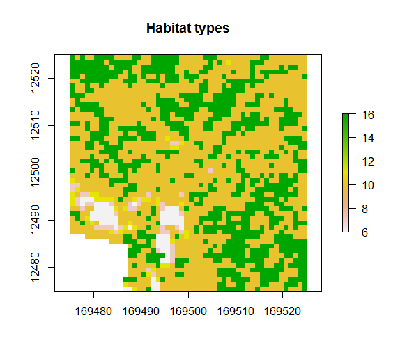
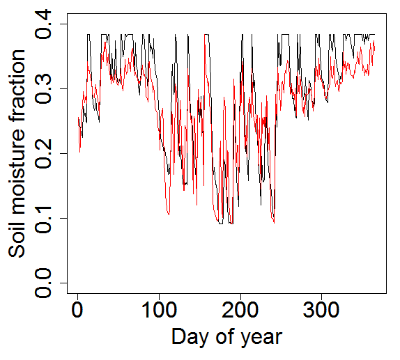
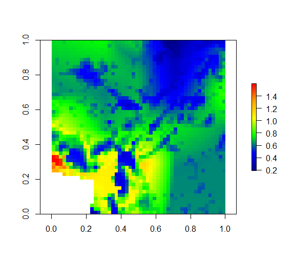
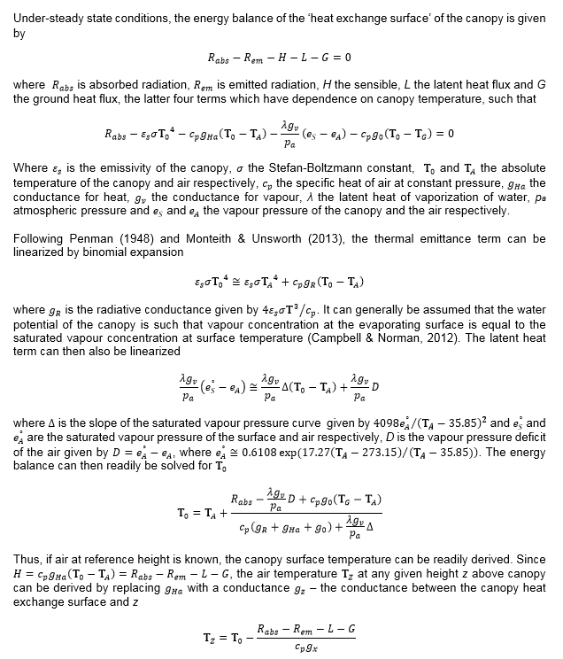
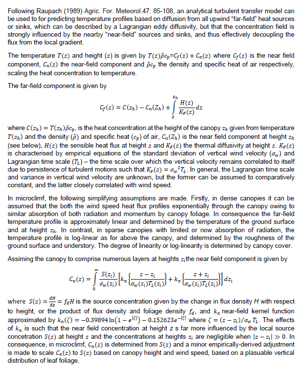
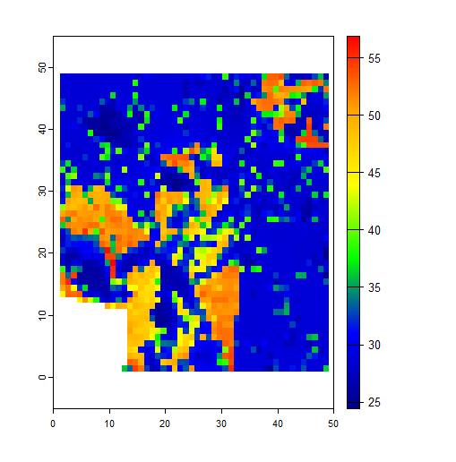
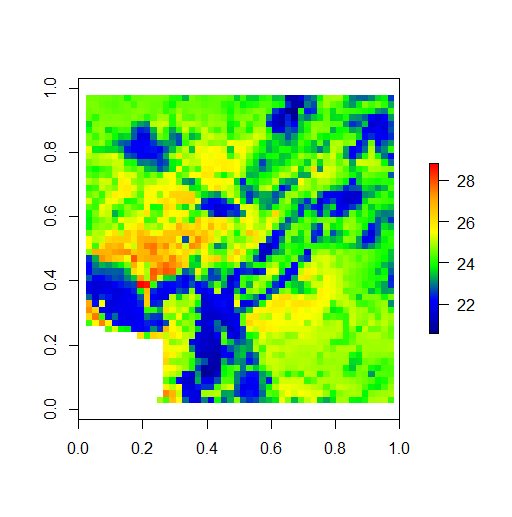

```{r setup, include = FALSE}
knitr::opts_chunk$set(
  collapse = TRUE,
  comment = "#>"
)
```
* [Overview](#overview)
* [Quick start](#quick-start)
* [Model inputs](#model-inputs)
  + [Meteorological data](#meteorological-data)
  + [Vegetation parameters](#vegetation-parameters)
  + [Soil parameters](#soil-parameters)
  + [Additional optional parameters](#additional-optional-parameters)
* [Fitting soil temperature and moisture data](#fitting-soil-temperature-and-moisture-data)
  + [Fitting soil moisture](#fitting-soil-moisture)
  + [Fitting soil temperature](#fitting-soil-temperature)
* [Preparing model inputs](#preparing-model-inputs)
* [Running the model](#running-the-model)
  + [Soil moisture](#soil-moisture)
  + [Radiation](#radiation)
  + [Ground surface temperature](#ground-surface-temperature)
  + [Sensible heat flux and wind](#sensible-heat-flux-and-wind)
  + [Latent heat](#latent-heat)
  + [Air temperature](#air-temperature)
    + [Below canopy air and leaf temperatures](#below-canopy-air-and-leaf-temperatures)
    + [Below ground temperature](#below-ground-temperature)
  + [Running the whole model](#running-the-whole-model)
  + [Running the model with arrays of climate data](#running-the-model-with-arrays-of-climate-data)
  + [Running the model over large areas](#running-the-model-over-large-areas)

## Overview
This vignette describes the R package ‘microclimf’. The package contains a series of functions for predicting above and below canopy or below-ground microclimatic conditions, founded on the principles of energy conservation. In line with standard approaches for mechanistic microclimate modelling, it is assumed that energy cannot be destroyed or created through ordinary means. Opaque surfaces in the environment, namely the canopy and the ground, absorb radiation from the sun, but also emit radiation as thermal energy. These surfaces also exchange sensible heat with the surrounding air and undergo latent heat fluxes, namely evaporative and evapotranspirative cooling. The temperature of the environment is calculated by assuming that these various components of the energy budget always remain in balance, such that: 

$R - H - L = G$

where R is the net flux density of radiation absorbed by the surface (the total absorbed, less that emitted), H is the rate of sensible heat exchange, L is the rate of latent heat exchange and G is the rate of heat storage by the ground. 

These terms all have a dependence on temperature. The computational efficiency of microclimf is founded on the principle that these fluxes are in steady-state such that temperatures can be estimated by rearranging the equations to solve for temperature using the Penman-Monteith method (Penman 1948; Monteith 1965), with calculations performed simultaneously on all grid cells and for all-periods, thus circumventing need for a model that is run in time-steps. This necessitates some simplifying assumptions about the rate of heat storage in the soil, as described below. It also necessitates some simplifying assumptions about the nature of vegetated canopies to avoid the need to describe vertical variation in leaf foliage density in detail. Each of the terms is also assumed to be determined by properties of the environment, as described below.

## Quick start
Here I provide brief instructions for how to run `microclimf` for those broadly familiar with microclimate modelling. Five sets of input variables are needed: (1) a dataset of hourly weather, (2) a vector of daily rainfall, (3) a digital elevation dataset, (4) a dataset of vegetation parameters and (5) a dataset of soil properties. The datasets should have exactly the same format and units as the example datasets included with the package. The spatial resolution and extent of outputs is determined by the spatial resolution of the digital elevation dataset, and the spatial datasets of vegetation parameters and soil properties should also match the digital elevation dataset in terms of resolution and extent. 
The model can be run in two modes: either in hourly time increments or, more computationally efficiently, in daily time increments (for hours corresponding to the maximum and minimum daily temperatures). If run in the latter mode, there is also the also the option to return hourly values, derived by fitting the same diurnal cycle to temperatures and radiation as are present in the input climate dataset.

In the code below, the model is run in hourly time increments. An object of class `microin` is first created using function `modelin`, in effect combining the datasets needed to drive the model into the right format for running the model. Function `runmicro_hr` then runs the model in hourly time-steps, deriving microclimatic conditions 5 cm above ground. The model returns temperatures (leaf, ground and air), relative humidity, wind speed, and components of the radiation budget, all as 3D arrays, representing values for each pixel and time-period. In the final lines of codes, selected outputs are plotted

```{r eval=FALSE}
library(microclimf)
library(terra)
library(zoo)
library(abind)
# Create model input with inbuilt datasets
micro<-modelin(climdata,rainfall,vegp,soilc,dtmcaerth)
# Run model 5 cm above ground (takes ~ 3 mins to run on 50 x 50 x 8760 values)
mout<-runmicro_hr(micro, 0.05)
attributes(mout)
# Plot air temperatures on hottest hour
plot(rast(mout$Tz[,,4094]))
# Plot mean air temperatures
mairt<-apply(mout$Tz,c(1,2),mean)
plot(rast(mairt))
# Plot ground temperatures on hottest and coldest hour
plot(rast(mout$T0[,,991])) # coldest hour
plot(rast(mout$T0[,,4094])) # hottest hour
```

The model takes a few minutes to run. Locations with the highest maximum temperatures are south-facing slopes  where the vegetation surface lies just above below 5cm. The locations with the lowest maximum temperatures are those shaded topographically or by vegetation, but inline with physical reality, the model caps minimum temperatures at dewpoint so there is not much spatial variability (when temperaturs drop below dewpoint, the latent heat of condensation warms the surface).


The model can also be run in daily  time increments. The default when so doing, as in the example, below, is to use the diurnal cycles in the hourly input data to expand the daily outputs to hourly values. Alternatively, the expand option in `runmicro_dy` can be set to FALSE. 

```{r eval=FALSE}
# Create model input with inbuilt datasets
microd<-modelin_dy(climdata,rainfall,vegp,soilc,dtmcaerth)
# Run model 5 cm above ground  performing hourly expansion (takes ~38 seconds to run)
mout<-runmicro_dy(microd, 0.05)
# Plot air temperatures on hottest hour
plot(rast(mout$Tz[,,4094]))
# Plot mean air temperatures
mairt<-apply(mout$Tz,c(1,2),mean)
plot(rast(mairt))
```

## Model inputs
Three sets of parameters are needed to run the model: (i) standard hourly meterological climate-forcing variables representative of macroclimatic conditions across the study site, usually in the form of a data.frame with single values for each hour (though the option to include an array of coarse-gridded values is also available - see below). (ii) A suite of parameters describing properties of the canopy in the form of high-resolution gridded values. (iii) A suite of parameters describing properties of the soil in the form of high-resolution gridded values. A raster of digital elevation data is also required. Optionally, some additional parameters can be set when running the models, as detailed below.

### Meteorological data
The inbuilt data,frame `climdata` gives an example of the hourly meteorological variables needed to run the model:

```{r}
library(microclimf)
head(climdata)
```
The data frame contains the following columns: `obs_time` – POSIXlt object of observation times for each climate variable, `temp` – temperatures (deg C), `relhum` - relative humidity (percentage), `pres` - atmospheric pressure (kPa), `swrad` - total shortwave radiation received by a horizontal surface (W/m^2), `difrad` - diffuse radiation (W/m^2), `skyem` sky emissivity (range 0 to 1), `windspeed` - wind speed at reference height (m/s) and `winddir` - wind direction in degrees. 

Any input weather dataset provided must use the same format, column names and units as in this example dataset. Most of these are standard meteorology variables that are readily available globally. If unknown for the study area, users may wish to explore the `mcera5` package on github (https://github.com/dklinges9/mcera5) or the `hourlyNCEP` function available in the microclima package (https://github.com/ilyamaclean/microclima).  Diffuse radiation, is sometimes harder to come by as many standard weather stations only estimate total radiation. If unknown, it can be estimated using the `difprop` function in the microctools package (https://github.com/ilyamaclean/microctools). The microctools package, also contains a function `converthumidity`, for converting absolute or specific humidity or vapour pressure to relative humidity.  

In addition to the above data frame of hourly weather variables, a vector of daily precipitation values is also required. 

### Vegetation parameters
The inbuilt dataset `vegp` gives an example of the vegetation parameters needed to run the model. Here the attributes are shown and individual parameters plotted:

```{r, fig.show='hold'}
library(terra)
attributes(vegp)
# Plot spatial and temporal variation in pai
plot(rast(vegp$pai[,,1]), main = "Jan PAI")
vegpmean<-apply(vegp$pai,3,mean,na.rm=T)
plot(vegpmean, type="l", main = "Seasonal variation in PAI")
# Plot other variables
plot(rast(vegp$hgt), main="Vegetation height") 
plot(rast(vegp$x), main = "Leaf angle distribution") 
plot(rast(vegp$gsmax), main="Max. stomatal conductance") 
plot(rast(vegp$clump[,,1]), main = "Jan Canopy clumping factor") # set to 0 
plot(rast(vegp$leafr),col=gray(0:255/255), main = "Leaf reflectance")
plot(rast(vegp$leafd), main = "Mean leaf diameter") # set to 0.05
plot(rast(vegp$leaft),col=gray(0:255/255), main = "Leaf transmittance") # set equal to leafr
```

* The `vegp` dataset is a list of the following:
    * `pai` - a 3D array of plant area index values 
    * `hgt` - a a PackedSpatRast object of vegetation heights (m)
    * `x` - a PackedSpatRast object of ratios of vertical to horizontal projections of leaf foliage
    * `gsmax` - a PackedSpatRast object maximum stomatal conductances (mol/m^2/s)
    * `clump` - a 3D array of values between 0 and 1 indicating the degree of canopy clumpiness (0 - even, 1 = highly clumped)
    * `leafr` - a PackedSpatRast object of leaf reflectance values for shortwave radiation (0 - 1)
    * `leafd` - a PackedSpatRast object of leaf diameters (m)
    * `leaft` - a PackedSpatRast object of leaf transmittance values for shortwave radiation (0 - 1)
    
The inbuilt raster layers in microclimf are stored as PackedSpatRast so that they can be stored as lists (see ?terra::wrap). To convert them to normal SpatRast objects the rast function is used as follows mySpatRast<-rast(myPackedSpatRast). In all instances, the model can be run with objects stored in either format. However, to plot a PackedSpatRast object, one must first unpack it. 

If users do know values of these vegetation parameters across their study area, they can be approximated from habitat type using the `vegpfromhab` function. This function takes as an input, a raster of habitat types numerically coded as follows:

(1) for Evergreen needleleaf forest,
(2) for Evergreen broadleaf forest,
(3) for Deciduous needleleaf forest,
(4) for Deciduous broadleaf forest,
(5) for Mixed forest,
(6) for Closed shrubland,
(7) for Open shrubland,
(8) for Woody savanna,
(9) for Savanna,
(10) for Short grassland,
(11) for Tall grassland,
(12) for Permanent wetland,
(13) for Cropland,
(14) for Urban and built-up,
(15) for Cropland / Natural vegetation mosaic and
(16) for Barren or sparsely vegetated


It returns an object of class vegparams as required by the model.Here this is illustrated using he inbuilt habitat SpatRast layer 

```{r eval=FALSE}
plot(rast(habitats), main = "Habitat types") # inbuilt habitat SpatRast layer
tme<-as.POSIXlt(c(0:8783)*3600,origin="2000-01-01 00:00", tz = "GMT")
# Create an object of class vegparams:
veg<-vegpfromhab(habitats,lat=50,long=-5,tme=tme)
```
\


Note however, that be doing so, all values for a habitat type will be identical, when in reality this is unlikely to be the case. If one is unable to quantify the main determinants of microclimatic variation then there is little prospect of being able to model microclimatic conditions accurately and any outputs form the model should be treated with a high-degree of skepticism. 

The model is most sensitive to `pai`. The plant area index is the total one sided area of both leaves and woody and dead vegetation per unit ground area. It is needed primarily so that canopy cover can be estimated, but even for temperatures above canopy, `pai` partially determines the temperature profile. The first two dimensions of the array must correspond with those of the various SpatRast objects (as well as the resolution and extent of the input raster elevation dataset). The third dimension is included to account for potential seasonal variation in `pai`. The clumping factor is also assumed to vary seasonally as it is likely to be affected by pai. All other vegetation variables are assumed time-invariant. Any number of replicate `pai` and `clump` values can be provided up to the number of climate observations. If fewer than the number of climate observation are provided, then data are interpolated. In `vegp` 12 replicates are provided - representing approximately monthly values across the year. The model is also sensitive to `hgt`, primarily as this dictates whether the temperature at a given height is above or below canopy, but it also has an important bearing on temperature profiles above canopy. 

The model is less sensitive to other parameters. The parameter `x` represents how vertically or horizontally the leaves of the canopy are orientated and controls how much direct radiation is transmitted through the canopy at a given solar angle (when the sun is low above the horizon, less radiation is transmitted through vertically orientated leaves). Users may refer to Campbell (1986) Agric For Meteorol, 36: 317-321 for a detailed explanation. Values for deciduous woodland are typically around 1, but for grassland may be closer to 0.2. The parameter ‘gsmax’ is the maximum stomatal conductance (mol / m^2 / s) of leaves and is needed for evapotranspiration calculations. Values typically range from 0.23 for deciduous broadleaf forest to 0.55 for wetland vegetation. Körner (1995) https://link.springer.com/chapter/10.1007/978-3-642-79354-7_22 gives values for major vegetation types of the world. The parameter ‘leafr’ is the leaf reflectance to shortwave radiation, with typical values around 0.4. 

The parameter ‘clump’ dictates how much radiation passes through gaps in the canopy, and therefore represents the sub-pixel canopy clumpiness, with values ranging from 0 (uniform) to 1 (highly clumped). In general, it varies with vegetation height and plant area index. The function `clumpestimate` can be used to derive an approximate estimate. The parameter ‘leafd’ is the mean diameter of leaves. 

The vegpfromhab function assigns approximate values for leaf reflectance accordance to habitat type. However, it can also be estimated from surface albedo using function `leafrfromalb`. In applying this function, leaf transmittance is assumed proportional to leaf reflectance and a proportionality coefficient can be specified. In general, model outputs are not sensitive to this coefficient,  

### Soil parameters
The inbuilt dataset `soilc` gives an example of the soil parameters needed to run the model. Here the attributes are shown and plotted:

```{r, fig.show='hold'}
attributes(soilc)
plot(rast(soilc$soiltype), main = "Soiltype") # Clay loam throughout
plot(rast(soilc$groundr), col=gray(0:255/255), main = "Soil reflectivity")
```

* This is a list of the following:
    * `soiltype` - a PackedSpatRast object of integer soil types
    * `groundr` - a PackedSpatRast object of soil reflectance values for shortwave radiation (0 - 1)

Again, users in creating such a dataset, can store `soiltype` and `groundr` as either a PackedSpatRast or a SpatRast object.

Soil type 7 corresponds to Clay loam. A full list of which numeric values correspond to which soil types, along with parameters associated with these soil types is shown in the `soilparameters` table:

```{r}
soilparameters
```

### Additional optional parameters
In addition to specifying `reqhgt` the required height (m) above (positive) or below (negative) for which microclimate estimates are required, there are also a set of optional parameters that can be provided to the run functions that control model behaviour. These are detailed below where various component functions are described, but in brief, these are:

(1) `pai_a` an array of plant area index values above `reqhgt`. Estimated by assuming a plausible vertical distribution of leaf foliage density if lefts as 'NA`
(2) `xyf` an optional input for that controls how the wind profile is calculated (see details under wind).
(3) 'zf' optional integer used to calculate how frequently to sample the plant area index array when calculating smoothed wind speed (see details under wind)
(4) `soilinit - initial soil moisture fractions in surface and subsurface layer (see details under soil moisture).
(5) `tfact` - a coefficient determining the sensitivity of soil moisture to variation in topographic wetness (see details under soil moisture).
(6) `surfwet` - the fraction of the vegetation surface acting as a saturated water surface (controls evapotranspiration).
(7) `slr`, `apr` and `twi` - optional SpatRaster objects of slope, aspect, and topographic wetness. If not supplied, these are calculated from the provided `dtm`, but users may wish to provide their own values to avoid edge effects.
(8) `hor` and `wsa` - optional array of the tangent of the angle to the horizon in 24 directions (used for calculating terrain shading) and wind shelter coefficients in 8 directions (used for determining wind speed). As for (7), if not supplied, these are calculated from the provided `dtm`, but users may wish to provide their own values to avoid edge effects.
(9) `soilmcoefs` and `soiltcoefs` a set of parameters derived by fitting the soil temperature and moisture models (see below). If not supplied the values from the `soilparameters` table are used.
(10) `backweight`, `maxiter` and `gmn` a set of parameters that control the behaviour of the iteratively-fitted point microclimate model (see details under wind below).

## Fitting soil temperature and moisture data
If users do not have their own empirical soil temperature and moisture data, and wish instead to use relationships inbuilt into `microclimf` then they can skip straight to the preparing model inputs section. 

To ensure computational efficiency, calculations in `microclimf` are performed simultaneously on all grid cells and for all-periods, thus circumventing need for a model that is run in time-steps. This necessitates some simplifying assumptions to be made about the influence of heat storage in the soil, as one would normally need to use a set of time-dependent differential equation that describes soil temperatures as a function of depth and time. This is the type of approach used in other packages such as `NicheMapR` and `microclimc`. 

The starting point of `microclimf` is thus to estimate ground surface temperatures, and in lieu of explicit first-principles calculations of soil temperatures, it is assumed that, for a given soil type, a reasonable empirical approximation of the difference between soil surface temperature and air temperature at reference height can be derived from soil moisture, net radiation and wind speed. Thus, prior to computing temperatures, the fractional soil moisture content of the must be estimated. This is achieved using a simple, computationally efficient two-layer soil model run for a point location, in which the volumetric soil moisture fraction at each daily time-increment in a top shallow soil layer is computed from precipitation and net radiation, and the exchange of with an underlying deeper soil layer, with hydraulic conductivity between layers assumed to be dependent on the mean fractional water content of the soil in the antecedent time step. Derived parameters of this relationship for given soil types, empirically calibrated for Cornwall, UK, are provided in the `soilparameters` table. However, users may prefer instead to fit their own relationships for a study area using empirical data, or alternatively using a more complex model. 

### Fitting soil moisture
In the example below, the `microclimc` wrapper function for the `NicheMapR` package is used to run a complex 15-layer soil moisture model. The parameters for fitting a relationship with the simpler soil model are then estimated by iteration and the final relationship and outputs shown.

```{r eval=FALSE}
require(NicheMapR) # - see https://github.com/mrke/NicheMapR
require(microclimc) # - see https://github.com/ilyamaclean/microclimc
# Run NicheMapR complex multilayer soil model
microout<-runNMR(climdata, rainfall, 50.2178, -5.32656, 0.05, 0.01, PAI = 0.001, soiltype="Clay loam")
# Extract surface soil moisture and covert to daily
sm<-microout$soilmoist
soilm<-sm[,3]
soilm<-matrix(soilm,ncol=24,byrow=T)
soilm<-apply(soilm,1,mean)
# Fit simple model
soilmcoefs<-fitsoilm(weather, rainfall, soilm, "Clay loam")
soilmcoefs
```

Here, the red lines are values from NicheMapR and the black lines those from the simple model. As can be seen, the simple two-layer soil model approximates near surface soil moisture relatively well.

\

### Fitting soil temperature
In lieu of explicit first-principles calculations of soil temperatures, it is assumed that, for a given soil type, a reasonable empirical approximation of the difference between hourly soil surface temperature and air temperature at reference height can be approximated from soil moisture and net radiation. In the example below, the `microclimc` wrapper function for the `NicheMapR` package is again used, this time to run a complex first principles multi-layer soil temperature model. The parameters for fitting a relationship with the simpler soil moisture model are then estimated by linear regression and the final relationship and outputs shown. 

```{r eval=FALSE}
require(NicheMapR) # - see https://github.com/mrke/NicheMapR
require(microclimc) # - see https://github.com/ilyamaclean/microclimc
# Run NicheMapR complex multilayer soil model
microout<-runNMR(climdata, rainfall, 50.2178, -5.32656, 0.05, 0.01, PAI = 0.001, soiltype="Clay loam")
# Extract surface soil temperature
st<-microout$soiltemps
soiltemp<-st$D0cm
# Fit simple model
soiltcoefs<-fitsoilt(climdata, rainfall, soiltemp, "Clay loam")
soiltcoefs
```

Here again, the red lines are values from `NicheMapR` and the black lines those from the simple model. As can be seen, the simple soil model approximates soil surface temperature relatively well, though the extremes are not always perfectly captured.

\

## Preparing model inputs
The microclimate model of `microclimf` can be run either in hourly time-steps (more accurate, but less computationally efficient) or in daily time-steps in which calculates are performed for time-periods corresponding to maximum and minimum temperatures only (less accurate, but faster). If run in daily time-steps, there is also the option to expand data back out to hourly based on diurnal temperature variations reflected in the input climate data.

There are four options for preparing the data for running the model. Firstly where the climate data are in the form of a data frame of hourly weather for a point location and the model is to be run in hourly time-steps. Secondly, where the climate data are in the form of a data frame of hourly weather for a point location and the model is to be run in daily time-steps. Thirdly, where the climate data are in the form of course-gridded array of values and the model is to be run in hourly time-steps. Lastly, where the climate data are in the form of course-gridded array of values and the model is to be run in daily time-steps. 

For the first case, the function `modelin` is used. In the example below, the inbuilt datasets of parameter values and a dtm for the study area, `dtmcaerth` are used. 

```{r, fig.show='hold'}
plot(rast(dtmcaerth))
```


```{r eval=FALSE}
micro<-modelin(climdata,rainfall,vegp,soilc,dtmcaerth)
```

By default `modelin` calls function `checkinputs`. This performs some basic checks on the vegetation and soil parameters data to check for consistency in extent to the dtm. It also ensure values in the climate datasets are typical of what would be expected, thereby helping to ensure the correct units are used.

In the second case, the function `modelin_dy` is used in place of `modelin` and in the third and fourth cases `modelina` and `modelina_dy` are used. The help files associated with these functions give examples of their use.

## Running the model
The model can be run in its entirety using functions `runmicro_hr` or `runmicro_dy` as in quick start examples above. However, a  bi-product if performing calculations on all grid cells and time-periods is that all datasets are loaded into internal memory, meaning that the model cannot be run over large areas in one go. The functions `runmicro_big` (weather data provided as a data,frame) and `runmicro_biga` (weather data provided as arrays) aid with this, by automatically running the microclimate models in tiles. Prior to doing so, datasets such as slope, aspect, topographic wetness are automatically calculated for the the entire area to avoid edge effects within each tile.    

To illustrate the workings of the model, we here run each component of the model in stages. The process is illustrated for the model run in hourly time-increments. However, the equivalent functions for running components of the model in daily time increments are referred to.

### Soil moisture
The first step is to measure temporal changes in average soil moisture across the study area. This is achieved using function `soilmpredict`, either with inbuilt coefficients as in the example below, or using outputs from ` fitsoilm`

```{r, fig.show='hold'}
# Calculate net radiation from inbuilt climate dataset
swrad <- (1 - 0.15) * climdata$swrad
lwout <- 5.67e-8 * 0.95 * (climdata$temp + 273.15)^4
lwnet <- (1 - climdata$skyem) * lwout
rnet <- swrad - lwnet
# Run soil moisture model using inbuilt rainfall dataset
sm<-soilmpredict(rainfall, rnet, "Loam", c(0.4, 0.4))
# Plot results
plot(sm$soilm1, type="l", ylim=c(0.1, 0.5), xlab="Day",
     ylab="Soil moisture fraction")
par(new = TRUE)
plot(sm$soilm2, type="l", ylim=c(0.1,0.5), col="blue", lwd=2,
     xlab="", ylab="")
```

In the example above, net radiation is first computed using the inbuilt climate dataset (see section below on radiation). The model is then applied using this dataset and rainfall. The plot shows soil moisture in the shallow surface layer (black) and deeper sub-surface layer (blue). 

However, soil moisture, is usually quite spatially variable. This is handled in `microclimf`, by spatially distributing the soil moisture values for each time increment using the the Bevan and Kirkby (1979) topographic wetness index, such that valleys and flat areas are assumed to have higher water content. Values are adjusted such that the average for the study area in each time step is equivalent to the value obtained by running the point model (as shown above). Users have the option to control the sensitivity of this topographic adjustment.  These calculations are performed using the `soilmdistribute` as in the example below.

```{r, fig.show='hold'}
sma<- soilmdistribute(sm$soilm1, dtmcaerth)
mypal <- colorRampPalette(c("red","orange","yellow","green","blue","darkblue"))(255)
plot(rast(sma[,,188]),col=mypal,range=c(0,0.5)) # soil moisture on driest day of year
plot(rast(sma[,,2]),col=mypal,range=c(0,0.5)) # soil moisture on 2nd day of year
```

### Radiation
The next stage, needed to calculate soil surface temperature, is to estimate radiation absorbed by the ground.  Opaque surfaces, such as the ground or canopy absorb solar radiation, whereas the air, which is almost transparent, absorbs relatively little. In consequence, these surfaces, when exposed to sunlight will typically heat up by more than the surrounding air. Net radiation, R, is the radiation absorbed by an object, less that emitted. All objects emit radiation as a function of their absolute temperature to the power of 4 in accordance with the Stefan–Boltzmann law. Thus, as an object heats up it emits more radiation, which in turn affects the energy balance.

Absorbed radiation is the total incoming radiation received by a surface less that transmitted or reflected. The total incoming radiation can be partitioned into three sources, each of which is modified by the environment in slightly different ways. The first is direct radiation from the sun. Here, absorption depends on the angle of the surface relative to perpendicular. This is the reason why equatorward-facing slopes are warmer than those that face poleward and is indeed the main reason why temperature increases with latitude. Here the solar beam is more concentrated, rather like shining a torch directly on a surface as opposed to obliquely. The second source is diffuse solar radiation: that scattered by particles and clouds in the atmosphere. The final source is longwave radiation emitted from surrounding surfaces and the sky. The latter two are isotropic (i.e. having the same value when measured in any direction). In consequence, for these sources, the direction of the surface is unimportant, and radiation interception is instead influenced by sky-view.

Below the canopy, radiation transmission through the canopy must be considered. Here the canopy as a turbid medium and the transmission of radiation by vegetation is thus described using an equation similar to Beer's law, in which flux density of radiation is assumed dependent on the total one-side lead area per unit ground area and by an extinction coefficient for the canopy. For direct radiation, the extinction coefficient is assumed to depend on leaf angle (with more vertically orientated leaves transmitting less radiation at lower solar altitudes). For isotropic sources of radiation, leaf angle is assumed unimportant.

The transmission of radiation is modelled using function `twostream`, which implements a variant of the Dickenson-Sellers two-stream radiation model described in Yuan et al. (2017) J Adv Model Earth Sy 9: 113–129 to model radiation interception by the canopy. 

### Ground surface temperature
Once radiation absorbed by the ground has been calculated, ground surface temperature can be computed. In the example below, the inbuilt soil moisture and temperature model coefficients are used. The output for the hottest hour of the year is plotted.

```{r eval=FALSE}
#' # Create model input if not run already
micro<-modelin(climdata,rainfall,vegp,soilc,dtmcaerth)
micro<-soiltemp_hr(micro)
# Plot temperature of hottest hour
mypal <- colorRampPalette(c("darkblue","blue","green","yellow","orange","red"))(255)
plot(rast(micro$T0[,,4094]),col=mypal)
```
\

One can see that the model predicts that ground surface temperatures can get much hotter than air temperatures. This is as expected. It is not particularly unusual for dark surfaces such as asphalt to attain temperatures in excess of 60 degrees C on sunny days with low wind speed. However, places with significant tall vegetation cover are much cooler.

The equivalent function when the model is run is daily time-steps is `soiltemp_dy`. The daily model gives very similar results to the hourly model in this instance.

### Sensible heat flux and wind
Sensible heat is the form of heat exchanged between the ground surface or the canopy and the air above it. Sensible heat fluxes can be derived from Fourier’s law of heat transport in which the flux is determined by temperature gradient multiplied by the degree of thermal conductance between the surface and the air. In everyday language, the term conductance is usually used to describe the heat exchanged between objects that are in direct physical contact, but the same principles can be extended to describe the process of conduction by convective currents in the air. 

In still air, such as within the stomatal cavities of leaves, heat is transferred by a process of molecular diffusion. Immediately adjacent to the object, at the so-called boundary layer, surface drag results in slow and smooth layered movement of fluid particles in which layers slide past one another rather like playing cards. In this so called ‘laminar’ flow, conduction between the surface and the air is simultaneously accompanied by heat transfer across streamlines in the air by molecular diffusion. The orderly nature of these laminar flows depends on the length of surface in the direction of flow. Thus convective conductance between the leaves of a canopy the air surrounding the leaf typically diminishes as leaf size increases. As one moves further away from the object, the orderly layered movement breaks down and flow regimes are characterized by turbulent movements, and rapidly fluctuating eddies. These small whirlpools or vortices transport heat efficiently across the fluid in proportion to the size of the eddies. Higher wind speeds result in larger eddies. However, vegetation can itself affect wind speeds – immediately adjacent to the surface, wind speeds are lower. Below canopy, the wind profile is assumed in ‘microclimf’ to be affected foliage density (determined from plant area and vegetation height). Above canopy, the wind profile is assumed to be governed as the roughness of the surface, in turn dependent on vegetation height and leaf area. 

The key step in computing the sensible heat flux is thus computing wind speeds. In `microclimf`, the effects of terrain on wind speed is also accounted for by applying a topographic shelter coefficient. Wind calculations are performed using function `wind`. Since the wind profile at any given location may not just depend on the surface roughness at a point location, but also on surface upwind, the function contains an optional input parameter `xyf` controlling the number of pixels, and hence the distance over which surface roughness is averaged. By setting this parameter to `NA` the wind profile is averaged across the entire study area. The degree of averaging has a moderate influence on the outputs of the model. 

In the example below wind speed is calculated for 5 cm above ground. As our study area is quite small, `xyf` is set to NA, so that wind profiles are averaged across the study area and variation is thus caused by terrain and vegetation sheltering. Users can explore the influence that changing `xyf` has.

```{r eval=FALSE}
rm(list = ls()) # so that inbuilt vegp etc are used
library(microclimf)
micro<-modelin(climdata,rainfall,vegp,soilc,dtmcaerth)
micro<-wind(micro, micro$climdata, reqhgt = 0.05, xyf = NA)
mypal <- colorRampPalette(c("darkblue","blue","green","yellow","orange","red"))(255)
plot(rast(micro$uz[,,1]),col=mypal)
```
\

A complexity of wind and heat-exchange modelling is that the degree of turbulence controlling heat exchange is strongly influenced by the degree of surface heating, but to appropriately quantify this, one must also know the degree of turbulence. The is handled in 'microclimf' by iteratively running a point microclimate model to convergence to derive so called diabatic correction coefficients. Hourly data are needed for this irrespective of whether the model is run in daily mode, and in consequence a data.frame of hourly weather is supplied as an input separately. The input parameters `backweight`, `maxiter` and `gmn` control the behaviour of this iteration process. Higher values of `backweight` improve the likelihood of convergence, but more iterations are required for convergence to be achieved. Convergence is most likely with `gmn`, the minimum conductance, set to a value greater than zero, though values of less than >0.5 are physically unrealistic. 

The calculation of wind profiles within and above canopies, assumes that the height at which wind is measured is higher than the height at which wind is modelled. Typically standard meteorological datasets provide data for 2 m above ground, and this is the default assumption in in the `modelin` function where `windhgt` is set to 2. In `microclimf' this issue is handled automatically by adjusting the wind speed to derive values for 2 m above the tallest vegetation in the study area. This is achieved by assuming the wind measurement is obtained, in accordance with standard WMO guidelines, over a short grass surface not subject to topographic sheltering. It is therefore height-adjusted assuming a  surface roughness equivalent to that of a short grass surface.  

### Latent heat
Latent heat is the form of heat energy released or absorbed by a surface as a result of evaporation, transpiration, condensation or sublimation or deposition. Latent heat exchange can be quantified using an equation analogous to Fourier’s law of heat transport, except that instead of being determined by a temperature gradient, latent heat is controlled by a water vapour concentration gradient. As water evaporates from a wet surface, the concentration of water molecules in the gas increases until an equilibrium is reached such that the number of molecules escaping equals the number being recaptured. When the temperature of the surface increases, the random kinetic energy of the molecules increases and more water escapes. The equilibrium reached in a closed system is known as the saturated vapour pressure and follows a predictable relationship with temperature. The water potential of leaves and the soil surface, except under strong drought conditions, is generally such that they can be treated as wet surfaces, and the vapour concentration at the evaporating surface is thus equal to the saturated vapour concentration at surface temperature. The air, however, is not necessarily saturated, and the term ‘relative humidity’ is used to describe the vapour pressure of the air relative to saturated.

For a leaf, the water vapour conductance depends both on stomatal and boundary layer conductance, with the latter generally assumed identical to that for heat exchange. Under optimal conditions, stomatal conductance varies through the canopy only in response to photosynthetically active radiation, and in `microclimf` is thus be estimated from a specified maximal stomatal conductance for a given vegetation type and from estimates of radiation transmission through the canopy.

### Air temperature

#### Above canopy
Air temperatures above canopy are derived by solving the energy budget equation for canopy surface temperature using function `PenMont` as described below. 

\

This method is used to derive the temperature of the `heat exchange surface` of the canopy ($T(h)$). The temperature ($T(z)$) at  any height above canopy is then computed as:


$T(z) = T(h) - {H/c_{p}g_{Ha}}$

where $H$ is the sensible heat flux, $c_{p}$ the specific heat of air (~29.3) and $g_{Ha}$ the molar conductivity from the canopy heat exchange determined from canopy height, plant area and wind speed.

#### Below canopy air and leaf temperatures
Below canopy, latent and sensible heat emanate from the entire canopy and a detailed model of below-canopy microclimate thus requires detailed knowledge of the vertical distribution of foliage density. Furthermore, while above canopy it can be assumed that simple relationship exists between heat fluxes,  temperature and eddy diffusivity, the same is not true below canopy. To model below canopy microclimates, one must draw upon the principles of Langrangian fluid mechanics:

\

The air temperature at any specified height `reqhgt`, whether below or above canopy, can be derived using function `temphumE`, which also derives the relative humidity in a similar fashion to temperature.  

```{r eval=FALSE}
micro<-temphumE(micro, mico$climdata, reqhgt = 0.05)
# Plot temperature of hottest hour
mypal <- colorRampPalette(c("darkblue","blue","green","yellow","orange","red"))(255)
plot(rast(micro$Tz[,,4094]),col=mypal)
```
\

Leaf temperatures are also derived using function `temphumE`. It can be seen that air temperatures close the ground, get pretty hot, sometimes close to the same temperature as the ground surface. This is particularly the case for heights close to the top of  short vegetation, where the influenced by high heat exchange with surface of the vegetation where much of the radiation is absorbed.   

### Below ground temperature
The amount of heat stored in the air is small compared to amount of heat transferred though it, but this is not the case with soil. Here, heat storage must be considered. The assumption in `microclimf` is that fluctuations in surface temperature are increasing dampened at greater depths, but that there is also a phase shift in temperature fluctuations, with heat storage resulting in time-delays in timing of maximal temperatures, as follows. 

From Campbell & Norman (2012), the effective periodicity (in seconds) of the temperature cycle, $\rho$, at depth z is given by $2\pi z^2/7200\kappa$ where $\kappa$ is the soil thermal diffusivity given by $\kappa=k/p_sc_s$, where k is the thermal conductivity and $p_sc_s$ is the volumetric specific heat capacity of the soil, in `microclimf`, estimated from soil type.

The phase shift, $t_s$, is given by $t_s=24z/2\pi D$ where where D is the damping depth, given by $D=\sqrt{2\kappa/\omega}$, where $\omega$ is the angular frequency given by $\omega=2\pi/(24\times3600s)$

Thus, temperatures at user-specified depths are calculated by first computing the computing a difference between surface temperatures and the annual mean temperature. The phase shift applied to these temperature differences, and a rolling mean then calculated, with duration over which this mean is computed, contingent on the periodicity of the expected temperature cycle. Computations are performed using functions `below_hr` and `below_dy` as in the example below:

```{r eval=FALSE}
micro<-modelin(climdata,rainfall,vegp,soilc,dtmcaerth)
T10cm<-below_hr(micro, reqhgt = -0.1)
# Plot temperature of hottest hour
mypal <- colorRampPalette(c("darkblue","blue","green","yellow","orange","red"))(255)
plot(rast(T10cm[,,4094]),col=mypal)
```
\

### Running the whole model
Using functions `runmicro_hr` or `runmicro_dy`, there is no need run the model for each component separately. The entire workflow is evoked by this single function as in the following example:

```{r eval=FALSE}
# Run model 5 cm above ground
mout<-runmicro_hr(micro, 0.05)
# Plot air temperature on hottest hour
plot(rast(mout$Tz[,,4094]))
# Run model 10 cm below ground
mout<-runmicro_hr(micro, -0.1)
# Plot ground temperatures on hottest hour
plot(rast(mout$Tz[,,4094]))
attributes(mout)
```

In addition to air temperatures, the model returns leaf (`tleaf`) and ground-surface (`T0`) temperatures, the soil moisture fraction in the upper soil layer (`soilm`), relative humidity (`relhum`), wind speed (`windspeed`) and direct (`raddir`), diffuse (`raddif`) and longwave (`radlw`) all at user specified height `reqhgt`.

### Running the model with arrays of climate data
In the examples above, the climate forcing data used to drive the model are assumed to be uniform over the entire study area, an assumption best made when the model is run at high resolution, and thus over limited spatial extents. However, `microclimf` also has the functionality to supply climate forcing datasets as arrays of climate data using `modelina` (model run in hourly time-steps) or `modelina_dy` (model run in daily time-steps). In so doing, the arrays of climate forcing data are automatically resampled to match the resolution of the digital elevation and vegetation data, which ultimately dictate the resolution at which the microclimate outputs are provided. MOre details are provided in the associated help files.    

### Running the model over large areas
R reads all datasets into internal memory, and in consequence the physical memory requirements of `microclimf` are very high, in practice limiting model runs to areas of ~2500 pixels at hourly time intervals for the duration of a year. To circumvent this issue, `microclimf` has the functionality to run the model in tiles using functions `runmicro_big` (climate data supplied as a data.frame) or `runmimicro_biga` (climate data supplied as arrays). Here terrain-shading and topographic wetness are first calculated over the entire study area as here it is necessary account for terrain effects that extend beyond the boundaries of a single tile. Subsequently, the study area is automatically tiled and the model run over each tile in turn, saving the outputs to a specified directory. By default, the model is run in daily time-increments and results saved as .R data files. Function `expandtonc` has the functionality to expand daily to daily and save the outputs as netcdf4 files. MOre details are provided in the associated help files. 
